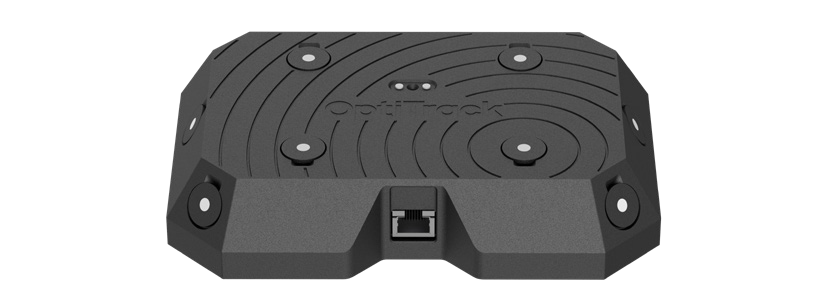
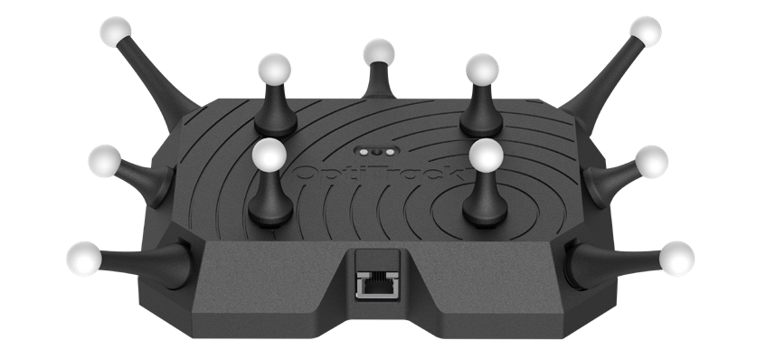

# Wired CinePuck

## Overview

The Wired CinePuck is OptiTrack’s purpose-built tracking tool for Virtual Production and Broadcast studios. An Ethernet-connected device, the Wired CinePuck allows extended detection ranges and increased positional precision while eliminating dropped frames caused by external RF noise. Additionally, OptiTrack’s Motive software allows you to fuse the Wired CinePuck’s IMU data with its optical data to provide the highest quality object tracking possible.

* For more information on how to use CinePucks for Virtual Production, please see our [InCamera VFX page](../../virtual-production/unreal-engine-optitrack-incamera-vfx.md) for detailed instructions.&#x20;
* For information on the CinePuck, please visit the [CinePuck](cinepuck.md) page. &#x20;

## Quick Start Guide

### Mount the Wired CinePuck

Attach the Wired CinePuck to the movie camera using either:

* 1/4"-20 threads 6X for standard tripod mounts
* 3/8"-16 threads 1X for optional ARRI-style anti-twist mount

<figure><figcaption></figcaption></figure>

### Connect to the Camera Network

Connect the Wired CinePuck to a PoE or PoE+ switch on the camera system network using a shielded Cat 6 or Cat 6a Ethernet cable.&#x20;

<figure><figcaption></figcaption></figure>

Once connected, the Wired CinePuck will receive power from the switch.

## Wired CinePuck in Motive

When connected to the OptiTrack system, the Wired CinePuck IMU is shown in the [Devices Pane](../../motive-ui-panes/devices-pane.md). Select it to view its properties in the Properties pane.&#x20;

<figure><figcaption>
Devices Pane with an unpaired Wired CinePuck.
</figcaption></figure>

#### Create Rigid Body

To use a Wired CinePuck in Motive, it must first be an asset. Please see the [Builder pane](../../motive-ui-panes/builder-pane.md) page for instructions on creating a [rigid body asset](../../motive-ui-panes/builder-pane.md#rigid-body-create), and the [IMU Sensor Fusion](../../motive/imu-sensor-fusion.md) page for detailed instructions on pairing the IMU.&#x20;


Use the [Auto-Configure](../../motive/imu-sensor-fusion.md#auto-configure-active-tag) feature to automatically pair and align a Wired CinePuck to its associated IMU.&#x20;


Once the Wired CinePuck rigid body is created, it will be available in the [Assets pane](../../motive-ui-panes/assets-pane.md), where you can also select it to view the IMU-related properties in the Sensor Fusion section of the [Properties pane](../../motive-ui-panes/properties-pane/properties-pane-rigid-body.md).&#x20;

<figure><figcaption>
Wired CinePuck in the Assets pane (top) and the Properties pane (bottom).
</figcaption></figure>

## Install Optional Diffuser Posts

Diffuser Posts are optional accessories that improve the trackability of the Wired CinePuck in situations where the built-in flat markers may become occluded.&#x20;

The Diffuser Post kit includes 1" and 2" posts, eleven of each, along with a spudger tool for removing the flat markers.&#x20;

<figure><figcaption>
A Wired CinePuck with a mix of 1" and 2" Diffuser Posts attached. 
</figcaption></figure>

### Remove the Flat Marker

The Wired CinePuck has a small slot next to each flat marker, as shown in the image, below.&#x20;

<figure><figcaption>
A Flat Marker.
</figcaption></figure>

* Gently insert the corner of the spudger into the slot of the flat marker you wish to remove and pry the marker from the Wired CinePuck casing.&#x20;
* Once the flat marker is removed, place the marker post you wish to attach over the LED until you feel the magnet snap it into place.  &#x20;

<figure><figcaption></figcaption></figure>

## Product Specifications

### Active Marker LED Specifications

The following specifications apply for active IR LEDs on the Wired CinePuck:

* 850 nm IR spectrum
* 11 LEDs
* LED Output Standard
* Illuminations synchronized with camera exposures
* Optical Detection Distance:&#x20;
  * Top Diffusers (only): 24m
  * All Diffusers: 18m

### Basic Specs

Wired CinePuck Body Dimension

* Length:  180mm (7.09”)
* Width:  125mm (4.92”)
* Height:  35.6mm (1.40”)

Weight

* 0.68Kg (1.5lbs)

Attachment

There are two methods for mounting the Wired CinePuck:&#x20;

* 1/4"-20 threads 6X for standard tripod mounts
* 3/8"-16 threads 1X for optional ARRI-style anti-twist mount

Power

* The Wired CinePuck requires 9W of power through a Cat 6 or Cat 6a Ethernet cable attached to a PoE or PoE+ switch.&#x20;
* The device does not include or require a battery.


Use only fully-shielded Cat 6 or Cat 6a cables. Please see the [Ethernet Cabling Requirements](../../hardware/cabling-and-wiring/cabling-and-load-balancing.md#ethernet-cable-requirements) section of the [Cabling and Load Balancing](../../hardware/cabling-and-wiring/cabling-and-load-balancing.md) page for more information on Ethernet cables and network configuration.&#x20;


IMU

* **Type:** Pro

Gyroscope

**Dynamic Range**

* 500 +/- °/sec

