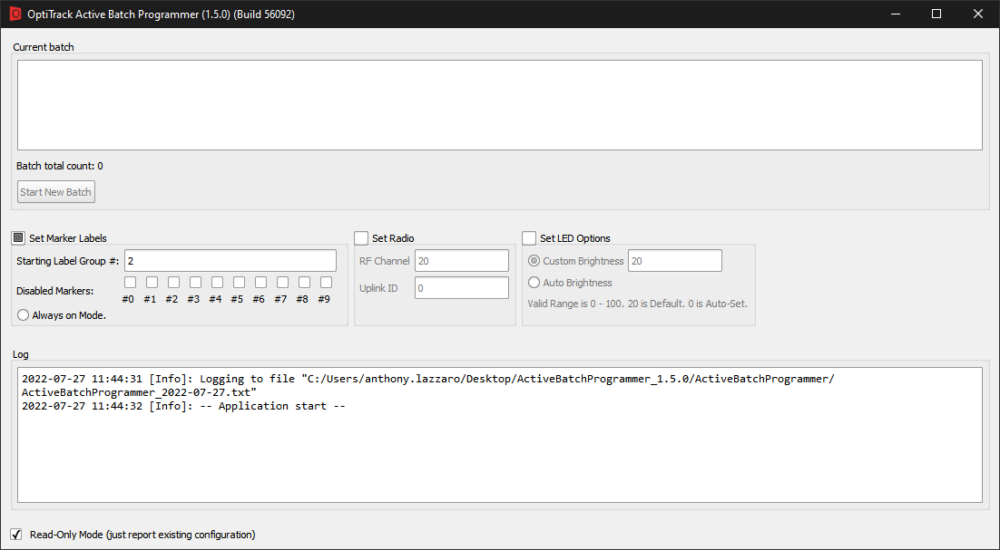
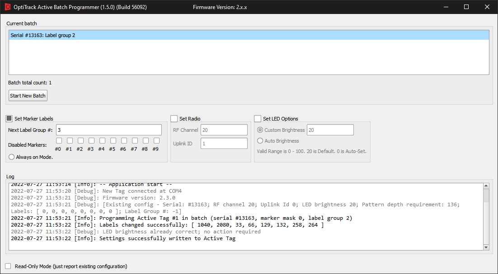

# Active Batch Programmer

The Active Tag Batch Programmer provides a convenient way of programming multiple OptiTrack components including the Tags, Pucks, and the Base Stations. This page provides instructions on how to use this program to configure the components.

## Download

You can download the active batch programmer from the following link: [Active Batch Programmer](https://optitrack.com/support/downloads/developer-tools.html).

## Configuration Steps

#### **Step 1) Extract all the files from the ZIP file.**

The batch programmer ships in ZIP format. Extract the ZIP file to access the contents.

#### **Step 2) Launch the batch programmer**

Without any of the active components connected to the computer, yet, start the batch programmer. When it loads up, you should see the following window:

**Step 3) Configure the settings**


The RF Channel and Uplink ID fields in the IMU section of the Properties pane are IMU specific. These are currently only compatible with Motive 2.3.1. You will still need to make sure that your BaseStation and Active Tags/Pucks are on the same RF Channel, however, you will not need to record this in Motive 3.0 in the asset's IMU Properties.


Before connecting anything, you will want to configure the settings first:

* Radio Frequency Channel (RF Channel)
  * Select the **Set Radio** checkbox and type in the RF Channel you wish to use (applicable range 11-26). The RF Channel for any Active Tag/Puck should match the RF Channel of the BaseStation you are using.
* Disabled Markers
  * You can disable specific markers for each of the active components if needed.
* Set LED Options
  * Custom Brightness
    * Select Set LED Options checkbox
    * If custom Brightness is selected you can enter any value between 0 and 100. The Default is 20.
  * Auto Brightness
    * If Auto Brightness is selected the value is 0.


Unless there is a specific need for a change, you will typically not need to make any changes here outside of changing the RF Channel.



**Active labels on a batch of active components.**

* One _batch_ of active components contain one Base Station and one or more sets of active markers; whether the markers are on the active Tags or the Pucks.
* To each active Tags or Pucks, a _labeling group_ will be assigned. A labeling group is a set of unique active marker labels that gets programmed to the active IR LEDs on either the Tag or the Puck.

As long as none of the active components are assigned with an overlapping labeling group number, the batch programmer will make sure a unique active label gets assigned to each marker in the batch. Once all of the settings are configured, we can now start programming the labeling groups.


#### **Step 4) Connect the components**


If you want the configuration above to be applied to your Active Tag or Puck, you first must deselect **Read-Only Mode (just report existing configuration)**

***


.png>)

While they are powered off, connect a Tag or a Puck to the computer via a USB cable.

#### **Step 5) Power on the component**

Once connected, power on the Puck or the Tag. Wait until it gets recognized in the batch programmer. Once it connects, it will be listed under the current batch section, and configured settings will get programmed automatically. Monitor the Log while connecting the component to make sure the configuration gets applied successfully.

**Step 6) Unplug and plug another component**

Unplug the Tag/Puck that was connected on step 5, and connect a new Tag instead. You will have to repeat step 4 and 5 for each of the active components in the batch.

**Step 7) Check to make sure all Tags/Pucks have been programmed**

At the end, you should see all of the components in your batch listed in the programmer with unique labeling group number assigned to each of them.

## Firmware Compatibility

**Firmware Compatibility Chart**

Below is a chart to see which versions are compatible with which BaseStations and Active Tags/Pucks. Essentially, it is a one-to-one correlation between Active hardware and firmware versions with some exceptions. For Active Tags specifically, it boils down to: if it doesn't have an IMU then it's compatible with 1.x. If it has the first version of an IMU, then it is compatible with 2.x. And, if it has an upgraded IMU, then it is compatible with 3.x.



.png>)



.png>)




**BaseStation and Active Tag compatibility Simplified**

If you have a 1.x BaseStation you would use it with a 1.x Active Tag/Puck, if you have a 2.x Active Tag/Puck you would use it with a 2.x BaseStation and so on. The exception being that a 2.x BaseStation is compatible with both 2.x and 3.x Active Tags/Pucks.

