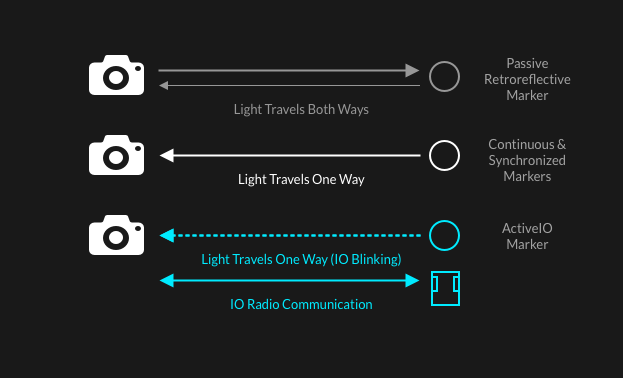

# ActiveIO Configuration

## Overview

The OptiTrack ActiveIO product line allows cameras to track synchronized uniquely identifying powered LED markers, otherwise called **ActiveIO markers**. ActiveIO hardware requires either a Wired ActiveIO device (such as a Wired AnchorPuck) or a BaseStation and one or more wireless ActiveIO devices, such as the Tag-8, Puck, Wand, and Square.

The BaseStation emits radio frequency (RF) signals to the ActiveIO devices, allowing precise synchronization between camera exposure and illumination of the LEDs. Each ActiveIO marker is uniquely labeled in Motive, providing more stable rigid body tracking since ActiveIO markers will never be mislabeled. With ActiveIO markers having a unique configuration of marker placements is no longer required for distinguishing multiple rigid bodies.

To further configure assets that contain ActiveIO Markers and an Inertial Measurement Unit (IMU), please refer to the [IMU Sensor Fusion](https://docs.optitrack.com/motive/imu-sensor-fusion) page.

## Connect to the Camera Network

#### Connect Wired ActiveIO Devices

BaseStations and Wired ActiveIO devices, such as the Wired AnchorPuck, each require a physical connection to the camera network switch through a Cat 6 or Cat 6a Ethernet cable. The switch also provides power to the device.&#x20;

The table below shows the power requirements for each Wired ActiveIO device type and the switch type that provides sufficient power to each port. Refer to the [Cabling and Load Balancing](../hardware/cabling-and-wiring/cabling-and-load-balancing.md) page for information on configuring the switch layout to accommodate all the power requirements of the camera network.&#x20;

| ActiveIO Device  | Minimum Switch Requirements |
| ---------------- | --------------------------- |
| BaseStation      | PoE (15W per port)          |
| Wired AnchorPuck | PoE+ (30W per port)         |
| Wired CinePuck   | PoE (15W per port)          |

Once connected, the Wired ActiveIO device will appear in the [Devices pane](../motive-ui-panes/devices-pane.md) in Motive:

<figure><figcaption></figcaption></figure>

#### Connect Wireless ActiveIO Devices

Wireless ActiveIO devices, such as the wand, are powered by an an on-board battery and connect to Motive through the BaseStation. These devices do not require a physical connection to or additional power resources from the camera network switches.&#x20;

Make sure the ActiveIO BaseStation is connected and recognized in Motive first before attempting to connect any wireless ActiveIO devices.&#x20;


Wireless ActiveIO devices rely on battery power, and are equipped with a standard USB-C port for charging. Make sure each device is fully charged before use.


Once the ActiveIO device is charged, power it on with a single button click.&#x20;


#### Can I use ActiveIO and Active Classic hardware together?

You can use both ActiveIO and Active Classic devices in a single instance of Motive, with the ActiveIO devices connected to an ActiveIO BaseStation and the Active Classic devices connected to an Active Classic BaseStation.&#x20;


## Claim a Wireless ActiveIO Device

The first time a Wireless ActiveIO device is powered up, it will advertise to be claimed by an instance of Motive. The LED on the device will flash <mark style="color:purple;">**purple**</mark> to indicate it is in the Advertising state.&#x20;


If its LED is not flashing purple, triple click the power button to put the device into Advertising mode.


The device will display in the In the Devices pane in Motive in Advertising mode:

<figure><figcaption></figcaption></figure>

To Claim a device, right click it in the Devices pane and select Claim.

<figure><figcaption></figcaption></figure>

The device state will change to **Claiming** while Motive connects:&#x20;

<figure><figcaption></figcaption></figure>

The state will change to **Claimed** once the connection is complete.&#x20;

<figure><figcaption></figcaption></figure>


Once a device is Claimed, it will stay connected to that instance of Motive. You should only need to go through the Claiming process again if you wish to move the device to a different instance of Motive, or if you have reset your Motive profile.&#x20;


#### ActiveIO Firmware Updates

The Claiming process checks the firmware on the device and updates it, if necessary. When this occurs, the State in the Devices pane will change to **Updating...**&#x20;

<figure><figcaption></figcaption></figure>

The device will visually indicate that it’s going through a firmware update with rainbow flashing LEDs.

## Device Configuration

Once the device is claimed in Motive and the firmware is updated, it should be available and ready for use without requiring additional configuration. The following are device properties that you may need or wish to change before using the device in a capture.&#x20;

<figure><figcaption>
General Properties for an ActiveIO device.
</figcaption></figure>

### Pattern Groups

Each device is automatically assigned a Pattern Group when it connects to Motive. The Pattern Group controls which grouping of ActiveIO ID values are assigned to the device. In other words, the Pattern Group assigns the ID values that the associated markers will show.

Each Pattern Group consists of 8 ActiveIO ID values. Devices with 8 or fewer markers will consume 1 Pattern Group and devices with more than 8 will consume 2 Pattern Groups.&#x20;


#### What if I have both ActiveIO and Active Classic hardware in my volume?

Pattern groups are the same for both ActiveIO and Active Classic. Make sure you know which pattern groups are assigned to your Active Classic devices and assign alternate pattern groups to the ActiveIO devices. Use the Auto-Pattern button to ensure the best configuration.&#x20;


#### Auto-Pattern

The Auto-Pattern button  in the Devices pane will reset the patterns for the claimed ActiveIO devices. Click this to have Motive reset the pattern groups to ensure there are no conflicts.&#x20;

### Marker Types



Motion Capture systems use different marker types to track the position and orientation of an object in space. There are two main types of markers: passive and active.&#x20;

[Passive markers](../motive/markers.md#retroreflective-markers) do not emit any light. These markers have a retroreflective coating that appears  bright white in infrared (IR) light. When used in Motion Capture, the cameras require an IR ring light, which sends IR light that bounces from the marker back to the camera to be recorded.&#x20;

[Active markers](../motive/markers.md#active-markers) are equipped with powered LEDs that emit light, eliminating the need for the IR ring light on the camera. There are 3 types:&#x20;

* **Continuous** active markers have an LED light that is always illuminated, with no pulsing of the light.&#x20;
* **Synchronized** active markers (or Sync'd) have LEDs that strobe in sync with the exposure of the cameras. Synchronized LEDs do not include patterns and in Motive appear the same way a passive marker might.
* **ActiveIO markers** use powered LEDs that are synchronized with the camera system to blink to a unique pattern, which is set by the [Pattern Group](activeio-configuration.md#pattern-groups) or Groups assigned to the device. Bidirectional radio communication between the ActiveIO device and Motive allows the user to easily update the device's configuration without separate software or the need to remove it from its location in the capture volume.&#x20;

<figure><figcaption>
Light and data transmission between cameras and various marker types.
</figcaption></figure>

Please see the [Markers](../motive/markers.md) page for more information about marker types.&#x20;

#### Marker State

ActiveIO devices include the ability to change how the LED markers transmit data through the **Marker State** property. Use the dropdown to select one of the following options:

* **Off:** Marker LEDs will not illuminate. The device will still appear in the Devices pane, but will not show up in the 3D Viewport or the Cameras View.&#x20;
* **Synchronized:** Marker LEDs are synchronized to strobe with the camera system without using a unique pattern. These markers will appear similar to passive markers in Motive.&#x20;
* **ActiveIO:** Marker LEDs are synchronized with the camera system to blink in a unique pattern.&#x20;

<figure><figcaption></figcaption></figure>

### IMU Data

ActiveIO devices generally contain an Inertial Measurement Unit (IMU). The IMU provides rotation data and better tracking for the Rigid Body when the IMU sensor data is fused with the device. For more information, please see the [IMU Sensor Fusion](../motive/imu-sensor-fusion.md) page.

#### Quality of Service

This property determines the number of attempts that will be made to send the IMU and/or GPIO data from the tag to the BaseStation or Motive. A higher number will consume more bandwidth but may improve the reliability of radio transmissions in environments where RF data is not reliable.

## Battery and Signal Strength

The Devices pane includes graphic indicators to show the battery level and signal strength for each ActiveIO device. These can be used to diagnose issues with tracking and stop others before they happen, such as running out of battery.

<figure><figcaption></figcaption></figure>
