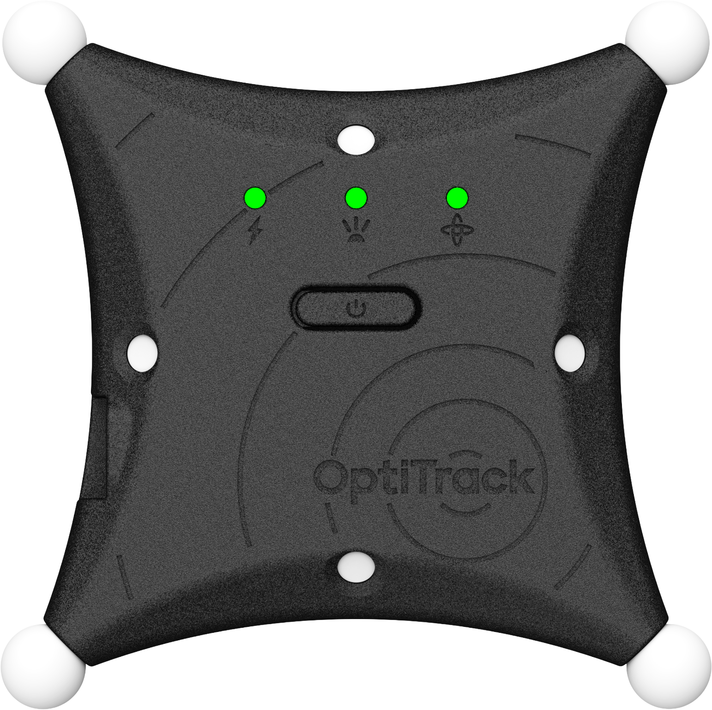

# ActiveIO Puck

## Overview

The ActiveIO Puck is a stand alone trackable object that provides lightning fast 6 DoF tracking information for any object to which it is applied. Carries a factory installed Active Tag with 8 LEDs and a rechargeable battery with up to 13 and a half hours of run time on a single charge.

<figure><figcaption></figcaption></figure>

## Quick Start Guide

#### Requirements

* Motive 3.5 or higher.
* ActiveIO BaseStation. Please see the [ActiveIO BaseStation page](activeio-basestation.md) for instructions on setting up and using an ActiveIO BaseStation.&#x20;

### Power

The ActiveIO Puck is powered by an internal battery that allows for 15W USB fast charging. The device ships with a USB-C cable and a wall charger. Charge the device before first use.&#x20;

To turn the device on, press the power button on the front. Once the device is powered on, it will be available in Motive.&#x20;

<figure><figcaption></figcaption></figure>

### Indicator Lights

Three LEDs above the power button indicate the status of the ActiveIO Puck. When the device is in the Advertising state, all 3 LEDs will blink white. After connecting the device to an instance of Motive, the LEDs will cycle in a rainbow pattern if the firmware is being updated.&#x20;


When the ActiveIO Puck is selected in Motive, all 3 indicator lights will display a solid yellow color. This allows you to quickly locate the selected puck in the capture volume.

Conversely, single-click the power button on the device to highlight it in Motive.&#x20;


**Left - Power**

The leftmost light indicates the battery strength & charging and charging status.&#x20;

<figure><figcaption></figcaption></figure>

* Solid blue indicates the device is running on battery power, with more than 10% charge available.
* Solid green means the device is fully charged.
* Flashing green indicates the device is charging.
* Blinking red indicates the battery is below 10% and needs to be charged. IR LEDs are disabled until the device is charged above 10% power.


The light flashes red if a charging error occurs. Disconnect and reconnect the device if this occurs. If the problem persists, [contact Support](https://optitrack.com/support#create-new-support-ticket).&#x20;


**Middle - Sync**

The middle LED shows the status of the connection to the BaseStation.&#x20;

<figure><figcaption></figcaption></figure>

* Flashing blue indicates the ActiveIO Puck is synced, in either Patterned or Always On mode.&#x20;
*
  Flashing green means the device is scanning or advertising for connection.
* Solid green indicates the device is in Continuous mode.

**Right - Device Calibration**

The right LED (the gyro symbol) indicates the calibration status.&#x20;

<figure><figcaption></figcaption></figure>

* Flashing Orange indicates the device needs calibration. Place the ActiveIO Puck on flat surface to complete its calibration.&#x20;
* Solid Orange means the device is calibrated.&#x20;

### Sync Modes

The ActiveIO Puck has three operating modes: Patterned, Always On, and Continuous.&#x20;

Patterned and Always On modes are synchronized with the camera system through an ActiveIO BaseStation, whereas Continuous mode is not. Synchronization allows the IR markers to be as bright and visible as possible when needed while reducing power consumption overall.&#x20;

* The middle LED light flashes blue when in the device is synced with the camera system.
* The middle LED light is solid green when the device is in Continuous mode.


To switch between Synced and Continuous modes, double click the power button on the device, wait 1 second, then double click again.


#### Patterned Mode

In Patterned Mode, the IR LEDs flash in a uniquely identifying pattern, in sync with the camera exposures through an ActiveIO BaseStation. Motive will automatically assign a [Pattern Group](../activeio-configuration.md#pattern-groups) to the device, which is shown in the Devices pane. After connecting multiple devices, use the [auto-pattern](../activeio-configuration.md#auto-pattern) option to ensure the patterns are unique across all devices in the take.&#x20;

#### Always On Mode

In Always On mode, the ActiveIO Puck is synchronized with the camera system so that all of the IR LEDs are on during camera exposure only. This mode requires an ActiveIO BaseStation to connect to the camera system.

#### Continuous Mode

In Continuous mode, the IR LEDs emit constant light with no blinking and are not synced with
\
the camera exposure. This mode allows you to use the ActiveIO device without an ActiveIO Base\
Station.&#x20;

Compared to synced modes, the markers may appear dimmer to the cameras and battery life will be
\
reduced when operating in Continuous mode.&#x20;

## Motive Setup

An ActiveIO Puck in sync mode will appear in the [Devices pane](../../motive-ui-panes/devices-pane.md) in an Advertising state when it first connects to Motive. All of the LEDs will blink white while the device is Advertising.  &#x20;


Please see the page [ActiveIO Configuration](../activeio-configuration.md) for more detail on using ActiveIO devices in Motive.&#x20;


<figure><figcaption></figcaption></figure>

Right-click the device in the Devices pane and select Claim to connect it to this instance of Motive. The Indicator LEDs on the device will flash in a rainbow sequence as the firmware is being updated, if necessary. &#x20;

<figure><figcaption></figcaption></figure>

Once claimed, select device properties become editable. Basic properties are shown, below.&#x20;

<figure><figcaption></figcaption></figure>

#### Marker State

The Marker State dropdown allows you to change between Patterned mode (ActiveIO) and Always On mode when the device is synced.&#x20;

#### Pattern Group

A collection of unique patterns that can be assigned to a specific device. The Pattern Group determines how the IR LEDs blink. You can manually change the Pattern Group through the Device properties as needed.&#x20;

When connecting multiple devices to the camera system, we recommend using the [auto-pattern](../activeio-configuration.md#auto-pattern) option to ensure the patterns are unique across all devices in the take.&#x20;

#### Quality of Service

The Quality of Service property allows you to send the IMU packet multiple times on redundant RF channels to reduce dropped packets in difficult RF environments. The result is more stable tracking performance under difficult conditions.


Please see the [Builder pane](../../motive-ui-panes/builder-pane.md) page for instructions on creating a [rigid body asset](../../motive-ui-panes/builder-pane.md#rigid-body-create), and the page [IMU Sensor Fusion](../../motive/imu-sensor-fusion.md) for instruction on pairing the active tag to an asset.&#x20;


## Specifications

Additional specifications are available on the OptiTrack website.&#x20;

Puck Body Dimensions

**Dimensions without diffusers**

* Width: 102mm (4.02”)
* Length: 102mm (4.02”)
* Depth: 20.6 mm (0.81”)

**Dimensions with diffusers**

* Width: 105.9mm (4.17”)
* Length: 105.9mm (4.17”)
* Depth: 20.6 mm (0.81”)

Weight

99.8 grams (3.52 oz)

Attachment

The ActiveIO Puck has a female bayonet mount on the back, with 7 mounting accessories available for attaching to different surface types:

* 1/4-20 mount style thread
* Flat Base
* Picatinny Rail
* Flat Strap (1")
* Belt Clip
* Wrist Strap
* Manus Glove

A CAD model is also available for download. This allows you to design custom mounts to suit the needs of your capture volume.&#x20;

See [Mounting Options](activeio-puck.md#mounting-options), below, for more information.&#x20;

Battery

**2000mAh Lithium Polymer Battery**\
Expected battery life of 20hrs at nominal operating conditions (cameras operating at 180Hz, with 500 𝞵s exposure setting). Lower frame rates or exposure times can extend battery life. 

**Charging**

* 5v USB-C (Battery Charging & Power Only)
* \~5hrs zero to full charge

LEDs

* 850nm IR Spectrum
* 8 LEDs with diffusers (12.75mm, 1/2", diameter) on four corner LED locations
* Illuminations synchronized with camera exposures

Illumination Angles

* Diffuser: +/- 135 Degree
* Bare LED: +/- 56 Degree

## Mounting Options

The ActiveIO Puck has a bayonet style mounting slot on the back of the device. OptiTrack offers 7 different mounting options, along with a downloadable CAD model to create your own custom mounts.&#x20;

### Add or Remove a Mount

To add a mount:&#x20;

1. Insert the male bayonet on the mounting accessory into the female bayonet on the back of the ActiveIO Puck.
2. Push down in the center of the mount and rotate it clockwise until it stops.

To remove a mount:

1. Push down in the center of the mount and rotate it counter-clockwise until it releases.

<figure><figcaption>
Adding a mount to an ActiveIO Puck. 
</figcaption></figure>

### Mounting Accessories

The ActiveIO Puck has several mounting accessories available.&#x20;

1/4-20 Mount

Uses a 1/2-20 through hole for mounting.&#x20;

<figure><figcaption></figcaption></figure>

Flat Base

The flat base provides a smooth and level surface to which you can attach Velcro. The base also includes 4 #8 screw holes that can be used to mount the device in place.&#x20;

<figure><figcaption></figcaption></figure>

Picatinny Rail

The Picatinny Rail Mount is designed to snap securely to Picatinny Rail, the U.S. Military's standard for mounting accessories to firearms.&#x20;

<figure><figcaption></figcaption></figure>

Flat Strap 1"

The Flat Strap Mount accommodates a 1" wide by .08" thick flat strap.&#x20;

<figure><figcaption></figcaption></figure>

Belt Clip

The Belt Clip Mount attaches the ActiveIO Puck over a belt or similar flat strap surface.&#x20;

<figure><figcaption></figcaption></figure>

Wrist Strap

The Wrist Strap Mount attaches to common watch bands.&#x20;

<figure><figcaption></figcaption></figure>

Manus Glove

The Manus Glove mount has an attachment designed for the Manus Glove interface.

<figure><figcaption></figcaption></figure>

### Adapter Plate CAD File

If any of the adapter plate accessories do not fit for the object you are tracking, you can use the attached CAD file to modify and 3D print customized adapter plates.

* Adapter Plate CAD file (STEP):


