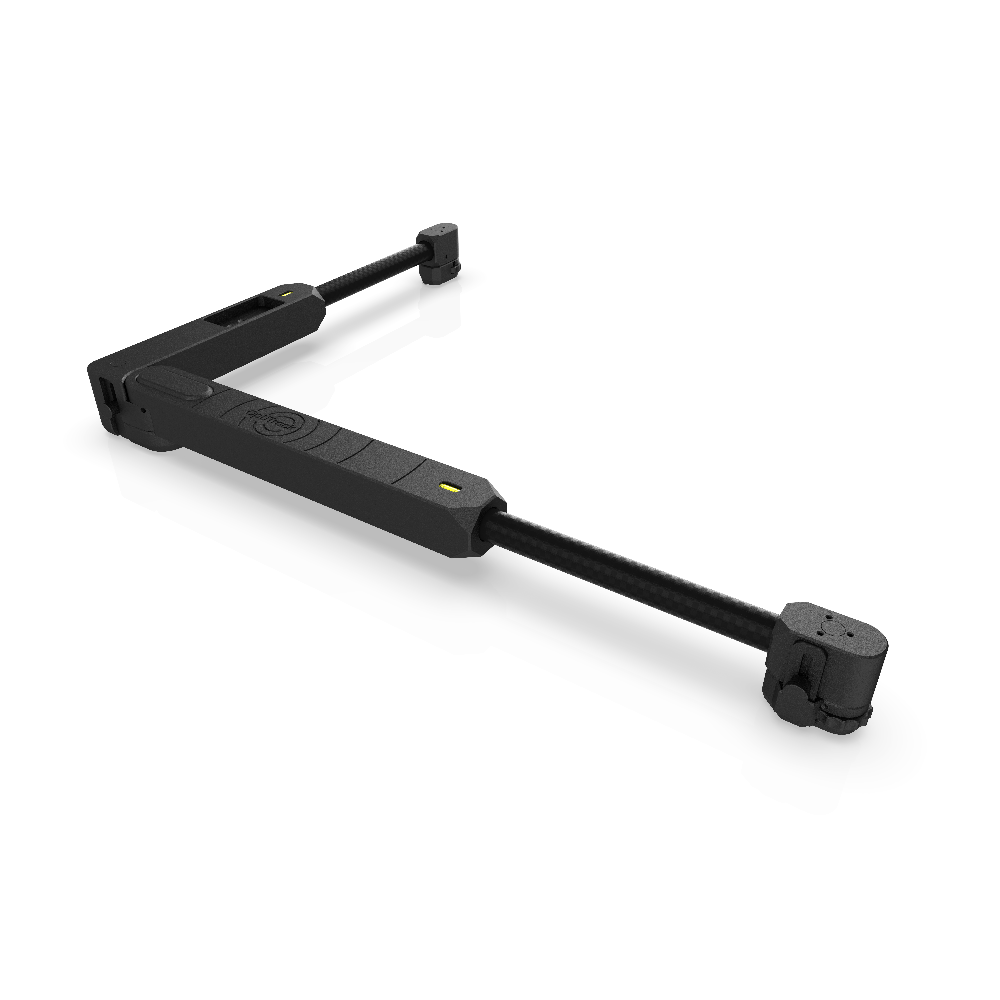

# ActiveIO Square

## Overview

The high-powered ActiveIO Square uses ActiveIO technology for more efficient and accurate calibrations. Unlike classic calibration squares, which contain passive markers that reflect light back to the camera, the ActiveIO square has LED markers that emit light rather than reflecting it, making it ideal for calibrating large volumes and systems with SlimX cameras.&#x20;

The ActiveIO Square includes features such as [Edge Locators](activeio-square.md#set-the-edge-locators) for calibrating force plates and built-in [leveling tools](activeio-square.md#level-the-square) to ensure accuracy of the ground plane.&#x20;

<figure><figcaption></figcaption></figure>

Please consult our [ActiveIO Configuration](../activeio-configuration.md) page for more information on configuring and working with ActiveIO devices. &#x20;

## Quick Start Guide

### Requirements

* [ActiveIO BaseStation](activeio-basestation.md)
* Motive 3.5 or higher

## Control Panel

The control panel for the ActiveIO Square is located on the X-axis of the device.&#x20;

<figure><figcaption></figcaption></figure>

### Power

The ActiveIO Square is powered by an internal battery that allows for 15W USB fast charging. The device ships with a USB-C cable. Charge the device before first use.&#x20;

<figure><figcaption>
The USB-C charging slot on the ActiveIO Square. 
</figcaption></figure>

To power the device on or off, press the Power button. Once the device is powered on, it will be available in Motive.&#x20;

<figure><figcaption>
The Power button on the ActiveIO Square.
</figcaption></figure>


#### Power-Saving Mode

The LEDs turn off if the square sits idle for several minutes, to prevent the battery from draining in between uses.&#x20;

If the device is on but the markers are not visible in Motive, pick it up or move it to turn the LEDs back on. &#x20;


### Sync Modes

The ActiveIO Square has two operating modes, Sync and Always On. The switch on the control panel allows you to change the mode when the device is not connected to to an ActiveIO BaseStation.&#x20;

<figure><figcaption>
The Sync switch on the ActiveIO Square.
</figcaption></figure>


When connected to an ActiveIO BaseStation, the control panel switch will remain in Sync mode, even when the marker state in Motive is set to Always On mode.&#x20;


#### Sync

In Sync mode, the ActiveIO Square is synced with an ActiveIO BaseStation. In this state, the Infrared marker LEDs flash in sync with the camera exposures. This allows the IR markers to be as bright and as visible as possible, while reducing battery power consumption.&#x20;

The middle LED indicator light flashes blue when in this mode.

#### Continuous


In Continuous mode, the IR LEDs emit constant light with no blinking and are not synced with the camera exposure. This mode does not require an ActiveIO BaseStation. The markers may appear dimmer to the cameras and battery life will be reduced when compared to Sync mode.&#x20;

The middle LED indicator light is solid green in this mode.

### Indicator Lights

The ActiveIO Square has three indicator lights on the control panel.&#x20;

#### Power

The left LED (the lightning bolt symbol) indicates battery strength and charging.

<figure><figcaption>
The Power indicator light on the ActiveIO Square.
</figcaption></figure>

* Solid blue: battery power is good.
* Solid orange: the battery is low and should be charged.&#x20;
* Blinking red: the battery is critically low and needs to be charged. The IR LEDs are disabled in this state.&#x20;
* Blinking green: the battery is charging.
* Solid green: the device is fully charged.


The light flashes red if a charging error occurs. Disconnect and reconnect the device if this happens. If the problem persists, [contact Support](https://optitrack.com/support#create-new-support-ticket).&#x20;


#### Sync State




The middle LED (the light emitting dome symbol) indicates which sync mode the device is in.&#x20;

<figure><figcaption>
The Sync state indicator light on the ActiveIO Square.
</figcaption></figure>

* Blinking blue: the ActiveIO Square is in sync mode.
* Blinking green: the device is scanning.
* Solid green: the device is in Continuous mode

#### IMU&#x20;

The right LED (the gyro symbol) is disabled on the ActiveIO Square.

<figure><figcaption></figcaption></figure>


#### Firmware Updates

Every time the ActiveIO Square connects to a new instance of Motive, the system does a firmware check and updates the device to the applicable firmware for the version of Motive. All three indicator lights will cycle through the rainbow during a firmware update. &#x20;


## Edge Locators

The ActiveIO Square has an Edge Locator at each marker point to use when calibrating a 90° degree object, such as a force plate.&#x20;

<figure><figcaption>
The Edge Locator on an end marker  on the ActiveIO Square.  Blue coloring for illustration purposes only. 
</figcaption></figure>

* Loosen the thumb screw and lower the Edge Locator.
* Place the ActiveIO Square on the right corner of the device, with the Edge Locator flush against the perpendicular edge, in contact with the ground.&#x20;
* After adjusting the Edge Locators, the ActiveIO Square may need to be leveled.&#x20;

<figure><figcaption></figcaption></figure>

Please see the [Force Plate Setup](../../movement-sciences/movement-sciences-hardware/general-motive-force-plate-setup.md) page for more details on calibrating a Force Plate.&#x20;

## Level the Square

The ActiveIO Square includes a built-in level on each axis.&#x20;

<figure><figcaption></figcaption></figure>

If the device is not horizontally level (as shown in the image, above), turn the adjustment knobs on each end of the device until the level's bubble is centered.&#x20;

<figure><figcaption>
A Leveling Knob on the ActiveIO Square.  Blue coloring for illustration purposes only. 
</figcaption></figure>

<figure><figcaption>
The level ActiveIO Square.
</figcaption></figure>

## Motive Setup

The first time Motive detects the ActiveIO Square, it appears in the [Devices pane](../../motive-ui-panes/devices-pane.md) in an Advertising state. Right-click to claim it and make it available for use in that instance of Motive. Select it to view the Device properties.&#x20;


#### Using the Square with Multiple Instances of Motive

Once claimed, the ActiveIO Square will remain available in that version of Motive. You must release the device first to claim it in another instance of Motive.&#x20;

* Within Motive, Right-click the device in the Devices pane and select _Release_.&#x20;
* On the device, triple-click the power button to release it from the system.

See the page [ActiveIO Configuration](../activeio-configuration.md) for more detail on connecting and configuring ActiveIO devices. &#x20;


When powered on in Sync mode, the ActiveIO Square connects to Motive through an ActiveIO BaseStation.&#x20;

<figure><figcaption>
The ActiveIO Square Basic Properties when the Square is in Sync (ActiveIO) mode. 
</figcaption></figure>

When powered on in Always On mode, the ActiveIO Square will appear in the Devices pane, with fewer editable properties.&#x20;

<figure><figcaption>
The ActiveIO Square Advanced Properties when the square is in Continuous mode. 
</figcaption></figure>

#### Notes (Advanced)

The Notes field is an optional freeform text field for user-defined content. Click the .png>) button and select Show Advanced if the field is not visible.&#x20;

#### Marker State

The Marker State dropdown allows you to change between Patterned mode (ActiveIO), Always On mode (Synchronized), and Continuous Illumination mode (Off) when the device is synced. We recommend using the ActiveIO Square in ActiveIO mode whenever possible.&#x20;

If the device is set to run in Always On mode, the Marker State is a read-only property, set to _Off_.&#x20;


The switch on the ActiveIO Square control panel will remain set to Sync whenever the device is connected to Motive through an ActiveIO BaseStation, even when the Marker State is set to _Off_ in Motive.&#x20;


<figure><figcaption>
Marker State options for the ActiveIO Square.
</figcaption></figure>

#### Pattern Group

A collection of unique patterns that can be assigned to a specific device. The Pattern Group determines how the IR LEDs blink. You can manually change the Pattern Group through the Device properties as needed. This control is editable only when the ActiveIO Square is connected through an ActiveIO BaseStation, and the Marker State is set to ActiveIO.&#x20;

When connecting multiple devices to the camera system, we recommend using the [auto-pattern](../activeio-configuration.md#auto-pattern) option to ensure the patterns are unique across all devices in the take.&#x20;

#### Quality of Service

The Quality of Service property is a standard ActiveIO setting that allows you to send a device's IMU packet multiple times on redundant RF channels to reduce dropped packets in difficult RF environments. The result is more stable tracking performance under difficult conditions.


This setting does not apply to the ActiveIO Square as the device IMU is not used to set the ground plane. &#x20;


## Specifications

[Additional specifications](https://www.optitrack.com/api/media/file/activeio-square-spec-sheet-1.pdf) are available on the [OptiTrack website](https://optitrack.com/).&#x20;

Square Dimensions

**Dimensions when Open**

* Width: 436 mm (17")
* Height: 336 mm (13.2")
* Depth: 47 mm (1.8")
   

**Dimensions when Closed**

* Width: 69 mm (2.7")
* Height: 409 mm (16.1")
* Depth: 47 mm (1.8")

Weight


0.6 kg (1 lb. 4.8 oz.)

Battery

**3500mAh Li-ion Battery**\
Expected battery life of 12hrs at nominal operating conditions \
Expected battery life of 4hrs in continuous mode

Charging

* USB-C PD Charging (5V@3A, 9v@1.5A, 15V@1A)
* \~4hrs zero to full charge

LEDs

* 850nm IR Spectrum
* 3 LEDs with Flat Diffusers: (8mm, 5/16" diameter)
* Illuminations synchronized with camera exposures

Illumination Angles

* Bare LED: +/- 56 Degree

