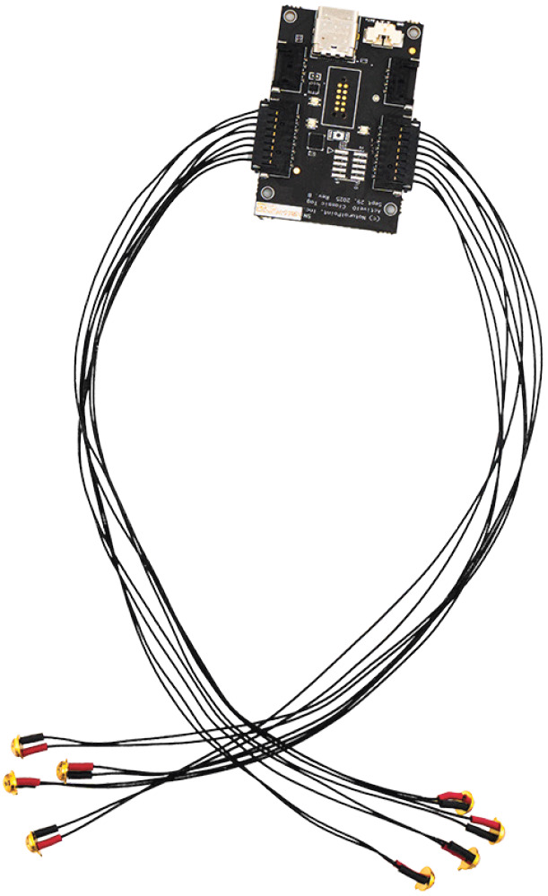
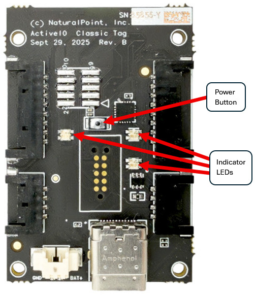
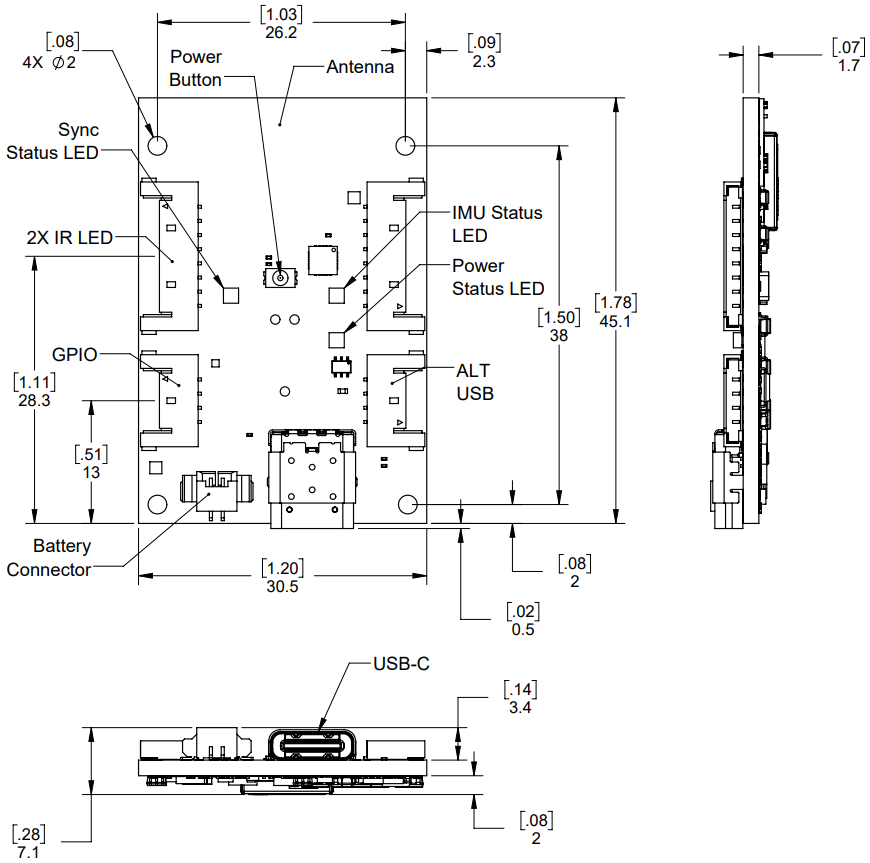

# ActiveIO Tag8

## Overview

The ActiveIO Tag8 is a tag with 8 attached LED markers that can be used to track an individual asset. It's essentially a bare printed-circuit assembly (PCA) that lets users integrate OptiTrack's ActiveIO technology into motion-capture assets of their own making. It's the same technology built into other ActiveIO devices, including HMD Clips.

<figure><figcaption></figcaption></figure>

## Quick Start Guide

### Requirements

* ActiveIO BaseStation
*
  Motive 3.5 or later

### Setup

The ActiveIO Tag8 needs no assembly before use.

### Activation

1. The ActiveIO Tag8 can be powered by a battery via connector or by an outside power source via USB-C port. When the Tag8 is connected to a battery, press the Power Button to turn it on. If it's powered via USB, it automatically powers on.
2. Once powered, the ActiveIO Tag8 appears in Motive.

<figure><figcaption></figcaption></figure>

### Operation

The ActiveIO Tag8 needs no programming with a unique label. Once connected to Motive, all labeling is automatic.&#x20;

When a battery is connected, the Tag8 can charge the battery if it's connected to an outside power source via USB.

### Indicator LEDs

When the Tag8 is connected to a battery, the lower right LED indicates battery strength and charging.

* It appears solid blue when battery power is good.
* It appears solid orange when the battery needs charging.
* It blinks red when the battery is critically low.
* It blinks green when charging.
* It appears solid green when fully charged or no battery is installed.
* It flashes red when a charging error occurs.
* **Note:** IR marker LEDs become disabled until the connected battery is recharged.

The upper left LED:

* Blinks blue when the ActiveIO Tag8 is synced.
* Breathes green when scanning.
* Appears solid green if the Tag8 is in Continuous mode.

The upper right LED:

* Appears solid yellow when the Inertial Measurement Unit (IMU) needs calibration.
* Appears solid green when the IMU is calibrated.

## Modes

The ActiveIO Clip has two synced modes (Patterned and Always On) and one non-synced mode (Continuous). To switch between Patterned and Always On modes, a property is available in Motive. To switch between either of the synced modes (Patterned and Always On) and the non-synced mode (Continuous), double-click the power button, wait 1 second, then double-click it again.

#### Patterned and Always On (Synced)

Patterned and Always On modes are synchronized with the camera system through an ActiveIO BaseStation. Synchronization allows the IR markers to be as bright and visible as possible when needed while reducing power consumption overall. The upper left indicator LED on the Tag8 blinks blue when it's synced.&#x20;

**NOTE:** The two synced modes (Patterned and Always On), do not work with the previous generation Active BaseStation.

The two synced modes differ as follows:

* **Patterned:** Each IR marker LED flashes a unique identifying pattern.
*
  **Always On:** All IR marker LEDs are on during camera exposure.

#### Continuous (not Synced)

Continuous mode is not synchronized and does not require an ActiveIO BaseStation. In Continuous mode, the IR LEDs emit constant light with no blinking and are not synced with the camera exposure. The markers can appear dimmer to the cameras than they do in the synced modes, and power consumption is increased. In Continuous mode, the upper left indicator LED on the Tag8 is solid green.

## Specifications

<figure><figcaption></figcaption></figure>

Electrical Attributes

* **On/Off:** Button
* **Power Input:** USB 5V
* **Power Draw (@PSE):** 100 mA (Idle), 150 mA (Paired)
* **Connector:** USB Type-C / 4 Pin Molex Header

Dimensions

* **Width:** 30.5 mm / 1.2 inches
* **Height:** 45.1 mm / 1.78 inches
* **Distance Between Mounting Holes (Width):** 26.2 / 1.03 inches
* **Distance Between Mounting Holes (Height):** 38 mm / 1.5 inches
* **Depth of Board:** 1.7 mm / .07 inch
* **Depth of Board with Components:** 7.1 mm / .28 inch

LEDs

* **LED Markers:** 8
* **LED Indicators:** 3

RF

* **Frequency:** 2.4 GHz
*
  **FCC:** CISPR 32 CLASS A/2.4GHz Intentional Radiator
*
  **FCC ID:** XPYNORAB2 PART 15 of FCC Rules

