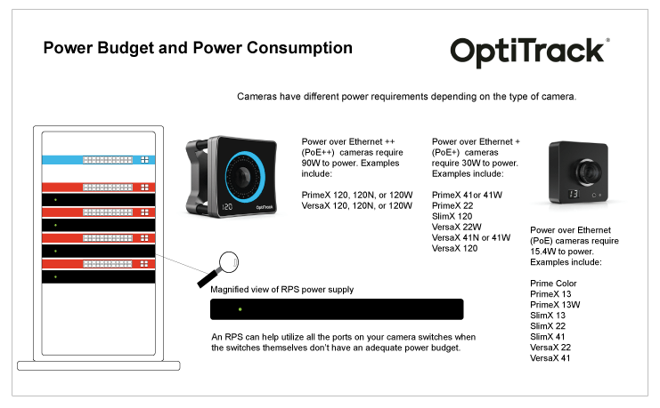
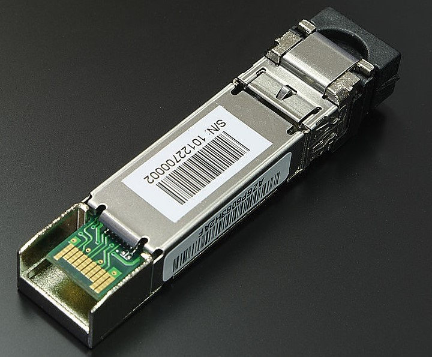
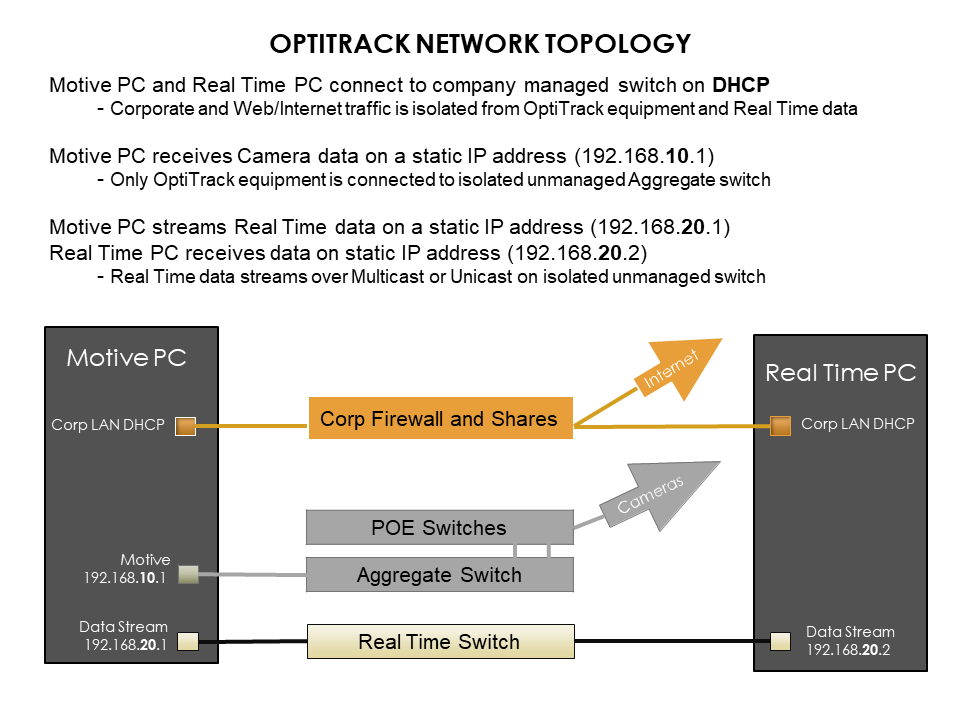

# Cabling and Load Balancing

## Overview

PrimeX and SlimX cameras use Ethernet cables for power and to connect to the camera network. To handle the camera data throughput, cables and networking hardware (switches, NIC) must be able to transmit at 1 Gigabit to avoid data loss. For networks with color cameras or a large camera count, we recommend using a 10 Gigabit network.&#x20;

For best performance, we recommend that all OptiTrack camera systems run on an independent, isolated network.&#x20;

This page covers the following topics:

* Switches and power load balancing.
* Ethernet cable types and which cables to use in an OptiTrack system.
* Recommended network configurations for small and large camera systems.
* Adding an eSync2 for synchronization.
* Checking for system errors in Motive.&#x20;

## Switch Requirements

Network switches form the backbone of an Ethernet-based OptiTrack camera system, providing the most reliable and direct communication between cameras and the Motive PC.&#x20;


We thoroughly test and validate the switches we offer for quality and load balancing, and ship all products pre-configured for easy installation right out of the box.&#x20;

For product specifications, please visit the [Sync and Networking Accessories](https://optitrack.com/accessories/sync-networking/) section of our website. [Contact Sales](https://optitrack.com/contact/) for additional information.&#x20;


### Power Budget and Camera Power Requirements

Switches also power the cameras. The total Watts a switch can provide is known as its Power (or PoE) Budget. The Watts needed to power all of the attached powered devices must be within the Power Budget for best performance.&#x20;

The number of cameras any one switch can support varies based on the total amount of power drawn by the cameras. For example, a 65 W switch can run 4 PrimeX 13 PoE cameras, which require 15.4 W each to power:

4 x 15.4 W = 61.6 W&#x20;

61.6 W < 65 W&#x20;

If the total Watts required exceeds the Power Budget, cameras may experience power failures, causing random disconnects and reconnects, or they may fail to appear in Motive.

Network switches provided by OptiTrack include a label to specify the number of cameras supported:

<figure><figcaption>
Power Requirements Label from an OptiTrack-supplied Switch.
</figcaption></figure>

### **Redundant Power Supply**&#x20;

Depending on which OptiTrack cameras are used, a switch may not have a large enough power budget to use every one of its ports. In a larger camera setup, this can result in multiple switches with unused ports. In this case, we recommend connecting each switch to a Redundant Power Supply (RPS) to extend its power budget.&#x20;

For example, a 24-port switch may have a 370W power budget, supporting 12 PoE+ cameras that require 30W to power. If the same 24-port switch is connected to an RPS, it can now power all 24 PoE+ cameras (each with a 30W power requirement) utilizing all 24 of the ports on the switch.

<figure><figcaption>
Click image to enlarge.
</figcaption></figure>

### PoE Switch Types

PoE switches are categorized based on the maximum power level that individual ports can supply. The table below shows the power output of the various types of PoE switches and lists the current camera models that require each power level.&#x20;

<table><thead><tr><th width="110.20001220703125">PoE Type</th><th width="131.5999755859375">Max Watts / Port</th><th>Cameras</th></tr></thead><tbody><tr><td>PoE</td><td>15.4W</td><td>Prime Color, PrimeX 13 or 13W, SlimX 13, SlimX 22, SlimX 41, VersaX 22, VersaX 41</td></tr><tr><td>PoE+</td><td>30W</td><td>PrimeX 22, PrimeX 41 or 41W, SlimX 120, VersaX 22W, VersaX 41N or 41W, VersaX 120</td></tr><tr><td>PoE++</td><td>90W</td><td>PrimeX 120 or 120W, VersaX 120N, or 120W</td></tr></tbody></table>

#### Power Requirements for External Devices

When calculating the number of switches needed, include the eSync2 (if used) and all BaseStations needed for the capture:

* eSync2: 4.4W
* BaseStation: 2.2W
* Wired AnchorPuck: 22W
* Wired CinePuck: 9W


Not all PoE++ switches are the same. **PoE++ Type 3** switches provide only 60W of power per port, which is insufficient to power a PrimeX 120 camera. A **PoE++ Type 4** switch supplies 100W per port, providing the optimum power to each PrimeX 120 on the switch.&#x20;


### SFP Module

A Small Form-Factor Pluggable Module (SFP Module) is a transceiver that inserts into an SFP port on the switch to allow the switch to accommodate different connection types than just the standard RJ45 Ethernet ports. This can include higher speed copper or fiber optic connections.&#x20;


SFP modules work with specific brands and models of switches. Always confirm that the module is compatible with the switch before you purchase the SFP module.&#x20;


<figure><figcaption>
An Ethernet PoE/PoE+ Gigabit switch.
</figcaption></figure> <figure><figcaption>
An example of an SFP module. 
</figcaption></figure>


Smaller systems may not need an SFP port to uplink camera data to Motive. OptiTrack offers an SFP module with switches intended for heavily loaded systems (i.e., those with larger camera counts or Prime Color Camera systems).&#x20;

When SFP ports are not required, use any standard Ethernet port on the switch to uplink data to Motive.&#x20;

If you're unsure if you need an switch with an SFP port and an SFP module, please reach out to either our [Sales ](https://optitrack.com/contact/)or [Support](https://optitrack.com/support/#contact-support) teams.&#x20;


### **Managed Features**&#x20;

Switches often include functions for managing network traffic that can interfere with the camera data and should be turned off. While these features are critical to a corporate LAN or other network with internet access, they can cause dropped frames, loss of frame data, camera disconnection, and other issues on a camera system.&#x20;

For example, features such as Broadcast Storm Control may identify large data transmissions from the cameras as an attack on the network and potentially shut down the associated ports on the switch, disconnecting the camera(s) in the process.&#x20;

OptiTrack switches ship with these management features disabled.&#x20;

### **VLANs Not Supported**&#x20;

Ports on a switch can be partitioned into separate network segments known as Virtual Local Area Networks, or VLANs. Your IT department may use these to allow one switch to provide a _virtually_ isolated network for the camera system and access to the corporate LAN and internet. **This is not a supported configuration for an OptiTrack camera system.**&#x20;


OptiTrack does not support the use of VLANs for camera systems. If you are connected to a VLAN and are experiencing issues, we recommend truly isolating the camera system on its own switch.


## **Ethernet Cable Requirements**

### **Cable Types**

There are multiple categories of Ethernet cables, each with different specifications for maximum data transmission rate and cable length.&#x20;

<table><thead><tr><th width="141">Cable Type</th><th width="203">Max Speed/Length</th><th width="207">Max Bandwidth</th><th>Diameter</th></tr></thead><tbody><tr><td>Cat6</td><td>10 Gb/s (55 m)</td><td>250 MHz</td><td>6.1 mm</td></tr><tr><td><strong>Cat6a</strong></td><td><strong>10 Gb/s (100 m)</strong></td><td><strong>500 MHz</strong></td><td><strong>8.38 mm</strong></td></tr><tr><td>Cat7/a</td><td>100 Gb/s (15 m*)</td><td>600 or 1000 MHz</td><td>8.51 mm</td></tr><tr><td>Cat8</td><td>40 Gb/s (30 m*)</td><td>2000 MHz</td><td>8.66 mm</td></tr></tbody></table>

\*In general, the maximum cable length for an Ethernet cable is 100 m. While Cat7 and Cat8 cables can transmit data at higher rates, it reduces the maximum distance the data can travel before signal loss occurs.&#x20;

* **Cat6a** cables are recommended.
* Cat5 or Cat5e cables run at lower speeds and are not supported.
* Cat7 and Cat8 cables will work, but do not offer any added benefits to offset the increased cost.&#x20;


_**What about fiber optic cables?**_&#x20;

While fiber optic cables can transmit data over greater distances than Ethernet, they do not provide power and as such cannot be used to connect cameras.&#x20;

A fiber optic connection can be used to connect to the Motive PC, but is not recommended unless the distance between the Motive PC and the switch is greater than 100 m.&#x20;


#### Round vs. Flat&#x20;

**Round cables** are better for long distances and high data transmission speeds. They are more insulated, easier to install without issues, and more durable, making them our recommended choice.&#x20;

**Flat cables** should not be used on an OptiTrack network as they are highly susceptible to cross talk and EMI.&#x20;

<figure><figcaption>
Always use Round Cat6 or Cat6a cables.
</figcaption></figure>

### **Electromagnetic Shielding**

Electromagnetic shielding protects cables from cross talk, electromagnetic interference (EMI), and radio frequency interference (RFI), all of which can result in loss of data or stalled cameras.&#x20;

Shielding also protects the cameras from electrostatic discharge (ESD), which can damage them.&#x20;

Ethernet cables are categorized based on the type of shielding they have overall and whether individual twisted pairs are also shielded.&#x20;


As more shielding is added to a cable, its flexibility decreases and its weight increases. These factors should be taken into account prior to purchasing cables and in planning the overall weight-load of the speed rail used to mount the cameras.&#x20;


**Overall shielding** wraps around all of the twisted pairs, directly below the PVC jacket. This shield can be a braided screen (S), foil (F), or both (SF). Cables without an overall shield are designated with a (U).

&#x20;**Individual Twisted pairs** can be shielded with foil (FTP), or left unshielded (UTP).&#x20;

Examples of cable shielding types:&#x20;

* S/UTP: The cable has a braided screen overall, with no shielding on the individual twisted pairs.&#x20;
* SF/FTP: The cable has two overall shields: a braided screen over a foil shield. The individual twisted pairs are shielded with foil.&#x20;
* U/UTP: The cable has no overall shield or shields on the individual twisted pairs. **We do not recommend using these type of cables in an OptiTrack camera system.**&#x20;


**Unshielded cables (U/UTP)** do not protect the cameras from Electrostatic Discharge (ESD), which can damage the camera. Do not use unshielded cables in environments where ESD exposure is a risk.&#x20;


### Tools for Cable Management

* **Gaffers Tape:**  This offers a good solution for covering a small run of wires on the floor.
* **Labels:**  Label both ends of each cable before connecting the PC and cameras to the switch(es). This will allow you to easily identify the port where the camera is connected.    &#x20;
* **Velcro Strips:**  These work best for cable bundling in flexible setups. While Velcro may take more effort to remove then plastic zip ties, they can be reused multiple times and create less clutter when changes are made to the setup.&#x20;
* **Truss Cable Management Clip:**  This is a specialty product used for Truss cabling. Clips help with cable organization, but can be size restrictive for a large bundle of cables.&#x20;
* **Wire Conduit:**  These products cover the entire cable bundle. They are size-restrictive and can be difficult to put on or take off. &#x20;
* **Floor Cable Covers:**  This product offers the best solution for covering floor cables, however they can be quite bulky.&#x20;

## Camera Network Setup

The number of cameras in the system determine how the network is configured. The [diagrams below ](cabling-and-load-balancing.md#ethernet-camera-system-diagrams)show the recommended wiring setup for either a small or large camera system.&#x20;

In addition to camera count, the type of video being captured can affect the system's bandwidth needs. Reference video modes (Grayscale and MJPEG) and color video require significantly more bandwidth than object mode.&#x20;

As noted above, always use 10 Gigabit shielded Ethernet cables (Cat6a or above) and a 10 Gigabit uplink switch to connect to the Motive PC, to accommodate the high data traffic. Make sure the NIC installed in the host PC can accommodate 10Gbps.&#x20;

### &#x20;Setup Steps

#### **Connect the Motive PC**&#x20;

Start by connecting the Motive (host) PC to the camera network's PoE switch via a Cat6a Ethernet cable. When the network includes multiple switches, connect the host to the aggregator switch.&#x20;

If the computer used for capture is also connected to an existing network, such as a Corporate LAN, use a second Ethernet port or add-on NIC to connect the computer to the camera network.&#x20;

<figure><figcaption>
Diagram showing the different networks that may be available on a Motive PC. 
</figcaption></figure>


When the Motive PC is connected to multiple networks, disable all Windows Firewall settings while using the mocap system.&#x20;

**DO NOT connect any third-party devices to the camera network.**&#x20;


#### **Connect the Ethernet Cameras to the PoE Switch(es)**

Using Cat6a or above cables, connect the individual cameras to the Ethernet switch based on the [power budget and load balancing](cabling-and-load-balancing.md#power-budget-and-camera-power-requirements) scheme established when designing the camera network.&#x20;

#### **Connect Other System Devices**

Connect any BaseStation(s) needed for the active devices directly to the aggregator switch, if used.&#x20;

Use an [eSync2](../../synchronization/synchronization-hardware/external-device-sync-guide-esync-2.md) synchronization hub to connect external devices such as force plates or Video Genlock to the camera network. The eSync connects to the PoE switch using an Ethernet cable.&#x20;

When the network includes multiple switches, connect the eSync2 to the aggregator switch. See the section below for more details on connecting the eSync2.&#x20;

#### **Power the Switches**

The switch(es) must be powered on to power the cameras. To completely shut down the camera system, power off the network switch(es).

For best performance, do not connect devices other than the computer to the camera network. Add-on network cards should be installed if additional Ethernet ports are required for the Motive PC.

### Ethernet Camera System Diagrams


These configurations have been tested for optimal use and safety. Deviating from them may negatively impact system performance.&#x20;




<figure><figcaption>
Connecting a network with a single switch.
</figcaption></figure>

#### Adding a Second Switch

A second switch can be connected to the primary switch via an uplink port, with the primary serving as the aggregation switch for the camera network. _This is the only configuration where two camera switches can be daisy-chained together._&#x20;

If additional switches are needed, a separate aggregation switch is required, so each switch has a direct connection to the aggregator. Please see the Multiple PoE Switches (High Camera Counts) tab for more details.&#x20;



<figure><figcaption>
Click image to enlarge.
</figcaption></figure>

**Uplink Switch:** For systems that require multiple PoE switches, connect all of the switches to an uplink aggregation switch to link to the host PC. Ethernet ports on the aggregation switch can be used to connect cameras.

The switches must be connected in a star topology with the uplink switch at the central node, connecting to the Motive PC.&#x20;


Use only PoE or PoE+ switches as aggregation switches.&#x20;


**NEVER** daisy chain multiple PoE switches in series; doing so can introduce latency to the system.



### **eSync2**

The [eSync2 ](../../synchronization/synchronization-hardware/external-device-sync-guide-optihub2.md)is a synchronization hub used to integrate external devices to an Ethernet-based mocap system. The [eSync2 properties](../../motive-ui-panes/properties-pane/properties-pane-esync2.md) set the timecode, input trigger, and other settings to ensure all devices on the camera network are in sync.&#x20;

External devices can include timecode inputs such as Video Genlock or Precision Time Protocol,  or output devices such as force plates or NI-DAQ devices.&#x20;

Only one eSync2 is needed per system. When one is used, it is the master in the synchronization chain.

.png>)


With large camera systems, connect the eSync to the aggregator switch via a standard Ethernet port for more stable camera synchronization.&#x20;

The eSync2 includes a 12V power cable to power the sync hub separately if the aggregator switch doesn't support PoE.&#x20;


### Final Steps

All of the connected cameras should now be listed in the [Devices pane](../../motive-ui-panes/devices-pane.md) and display in the [3D viewport](../../motive-ui-panes/viewport.md) when you start Motive. Make sure all of the connected cameras are properly listed in Motive.

<figure><figcaption>
Devices Pane with 4 Tracking Cameras installed.
</figcaption></figure>

Open the status [Log pane](../../motive-ui-panes/log-pane.md) and verify there are no current errors. The example below shows the sequence of errors that occur when a camera is disconnected. Look also for dropped frames, which may indicate a problem with how the system is delivering the camera data. Please refer to the [troubleshooting section ](../../general-troubleshooting/)for more details.

