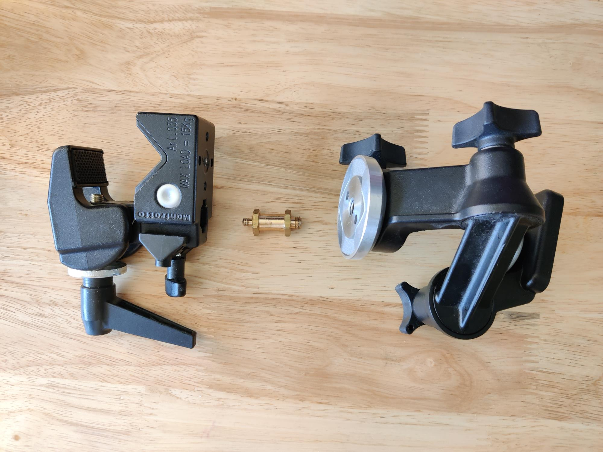

---
metaLinks:
  alternates:
    - >-
      https://app.gitbook.com/s/GaZwzcsVav6zPBRZpapU/hardware/camera-mount-structures
---

# Camera Mount Structures

Choosing an appropriate camera mounting solution is very important when setting up a capture volume. A stable setup not only prevents camera damage from unexpected collisions, but it also maintains calibration quality throughout capture. All OptiTrack cameras have **¼-20 UNC Threaded holes** – ¼ inch diameter, 20 threads/inch – which is the industry standard for mounting cameras. Before planning the mount structures, make sure that you have optimized your [camera placement](camera-placement.md) plans.


Due to thermal expansion issues when mounted to walls, we recommend using Trusses or Tripods as primary mounting structures.

* Trusses will offer the most stability and are less prone to unwanted camera movement for more accurate tracking.
* Tripods alternatively, offer more mobility to change the capture volume.
* Wall Mounts and Speed Rails offer the ability to maximize space, but are the most susceptible to vibration from HVAC systems, thermal expansion, earthquake resistant buildings, etc. This vibration can cause inaccurate calibration and tracking.


## Camera Clamps

Camera clamps are used to fasten cameras onto stable mounting structures, such as a truss system, wall mounts, speed rails, or large tripods. There are some considerations when choosing a clamp for each camera. Most importantly, the clamps need to be able to bear the camera weight. Also, we recommend using clamps that offer adjustment of all 3 degrees of orientation: pitch, yaw, and roll. The stability of your mounting structure and the placement of each camera is very important for the quality of the mocap data, and as such we recommend using one of the mounting structures suggested in this page.

.png>) .png>) .png>)

### Assembling the Clamps

Here at OptiTrack, we recommend and provide Manfrotto clamps that have been tested and verified to ensure a solid hold on cameras and mounting structures. If you would like more information regarding Manfrotto clamps, please visit our [Mounts and Tripods](https://optitrack.com/accessories/mounts-tripods/) page on our website or reach out to our [Sales team](https://optitrack.com/contact/).&#x20;

Manfrotto clamps come in three parts:

* Manfrotto 035 Super Clamp
* Manfrotto 056 3-Way, Pan-and-Tilt Head with 1/4"-20 Mount
* Reversible Short Brass Stud

<figure><figcaption></figcaption></figure>

For proper assembly, please follow the steps below:

1. Place the brass stud into the 16mm hexagon socket in the Manfrotto Super Clamp.&#x20;
2. Depress the spring-loaded button so the brass stud will lock into place.
3. Tighten the safety pin mechanism to secure the brass stud within the hexagon socket. Be sure that the 3/8″ screw (larger) end of the stud is facing out.
4. From here, attach the Super Clamp to the 3-Way, Pan-and-Tilt Head by screwing in the brass stud into the screw hole of the 3-Way, Pan-and-Tilt Head.&#x20;
5. Be sure to tighten these two components fairly tight as you don't want them to swivel when installing cameras. It helps to first tighten the 360° swivel on the 3-Way, Pan-and-Tilt Head as this will ensure that any unwanted swivel will not occur when tightening the two components together.&#x20;
6. Once, these two components are attached you should have a fully functioning clamp to attach your cameras to.&#x20;

<figure><figcaption>
Insert brass stud and depress spring loaded safety pin mechanism.
</figcaption></figure>

<figure><figcaption>
Tighten the safety pin mechanism to secure the brass stud. Then connect the Manfrotto Super Clamp to the 3-Way, Pan-and-Tilt Head via the bras stud 3/8" screw. 
</figcaption></figure>

## Choosing the Mounting Structure

Large scale mounting structures, such as trusses and wall mounts, are the most stable and can be used to reliably cover larger volumes. Cameras are well-fixed and the need for recalibration is reduced. However, they are not easily portable and cannot be easily adjusted. On the other hand, smaller mounting structures, such as tripods and C-clamps, are more portable, simple to setup, and can be easily adjusted if needed. However, they are less stable and more vulnerable to external impacts, which can distort the camera position and the calibration. Choosing your mounting structure depends on the capture environment, the size of the volume, and the purpose of capture. You can use a combination of both methods as needed for unique applications.

* Choosing an appropriate structure is critical in preparing the capture volume, and we recommend our customers consult our [Sales Engineers](http://optitrack.com/contact/) for planning a layout for the camera mount setup.

## Truss

A truss system provides a sturdy structure and a customizable layout that can cover diverse capture volume sizes, ranging from a small volume to a very large volume. Cameras are mounted on the truss beam using the camera clamps.

### General steps

1. Consult with the truss system provider or our [Sales Engineers](http://optitrack.com/contact/) for setting up the truss system.
2. Follow the truss installation instruction and assemble the trusses on-site, and use the fastening pins to secure each truss segment.
   * Fasten the base truss to the ground.
   * Connect each of the segments and fix them by inserting a fastening pin.
3. Attach clamps to the cameras.
4. Mount the clamps to the truss beam.
5. [Aim](aiming-and-focusing.md) each camera.

.png>) .png>)

## Tripods

Tripods are portable and simple to install, and they are not restricted to the environment constraints. There are various sizes and types of tripods for different applications. In order to ensure its stability, each tripod needs to be installed on a hard surface (e.g. concrete). Usually, one camera is attached per tripod, but camera clamps can be used in combination to fasten multiple cameras along the leg as long as the tripod is stable enough to bear the weight. Note that tripod setups are less stable and vulnerable to physical impacts. Any camera movements after calibration will distort the calibration quality, and the volume will need to be re-calibrated.

.png>)

## Wall Mounts and Speed Rails

Wall mounts and speed rails are used with camera clamps to mount the cameras along the wall of the capture volume. This setup is very stable, and it has a low chance of getting interfered with by way of physical contact. The capture volume size and layout will depend on the size of the room. However, note that the wall, or the building itself, may slightly fluctuate due to the changing ambient temperature throughout the day. Therefore, you may need to routinely re-calibrate the volume if you are looking for precise measurements.


Below are recommended steps when installing speed rails onto different types of wall material. However, depending on your space, you may require alternative methods.



Although we have instructions below for installing speed rails, we highly recommend leaving the installation to qualified contractors.


### Tools Required

**General Tools**

* Cordless drill
* Socket driver bits for drill
* Various drill bits
* Hex head Allen wrench set
* Laser level

**Speed Rail Parts**

* Pre-cut rails
* Internal locking splice
* 5" offset wall mount bracket
* End caps (should already be pre-installed onto pipes)
* Elbow speed rail bracket (optional)
* Tee speed rail bracket (optional)

**Wood Stud Setup**

Wood frame studs behind drywall requires:

* Pre-drilled holes.
* 2 1/2" long x 5/16" hex head wood lag screws.

**Metal Stud Framing Setup**

Metal stud framing behind drywall requires:

* Undersized pre-drilled holes as a marker in the drywall.
* 2"long x 5/16" self tapping metal screws with hex head.


Metal studs can strip easily if pre-drilled hole is too large.


**Concrete Block/Wall Setup**

Requires:

* Pre-drilled holes.
* Concrete anchors inserted into pre-drilled hole.
* 2 1/2" concrete lags.


Concrete anchors and lags must match for a proper fit.


### General Steps


It's easiest and safest to install with another person rather than installing by a single person and especially necessary when rails have been pre-inserted into brackets prior to installing on a wall.


1. Pre-drill bracket locations.
2. If working in a smaller space, slip speed rails into brackets prior to installing.
3. Install all brackets by the top lag first.
4. Check to see if all are correctly spaced and level.
5. Install bottom lags.
6. Slip speed rails into brackets.
7. Set screw and internal locking splice of speed rail.
8. Attach clamps to the cameras.
9. Attach the clamps to the rail.
10. [Aim](aiming-and-focusing.md) each camera.

.png>) .png>)  (1).png>)


**Helpful Tips/Additional Information**

* The 5" offset wall brackets should not exceed 4' between each bracket.
* Speed rails are shipped no longer than 8'.
* Using blue painter's tape is a simple way to mark placement without messing up paint.
* Make sure to slide the end of the speed rail without the end cap in first. If installed with the end-cap end first it will "mushroom" the end and make it difficult to slip brackets onto the speed rail.
* Check brackets for any burs/sharpness and gently sand off to avoid the bracket scratching the finish on the speed rail.
* To further reduce the bracket scratching the finish on the speed rail, use a piece of paper inside the bracket prior to sliding the speed rail through.

