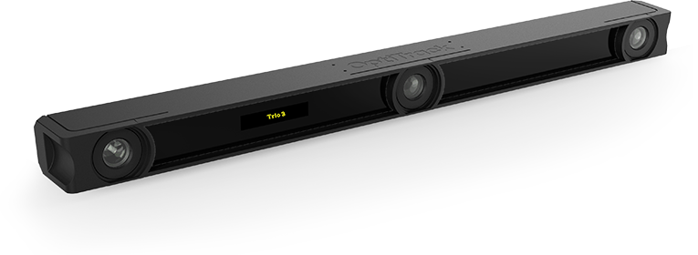

# Trio 3


USB Cameras are currently not supported in 3.x versions of Motive. The USB camera pages on this wiki are purely for reference only, at this time.


### [Overview](https://optitrack.com/cameras/v120-trio/)

### [Specs](https://optitrack.com/support/hardware/v120-trio.html)
