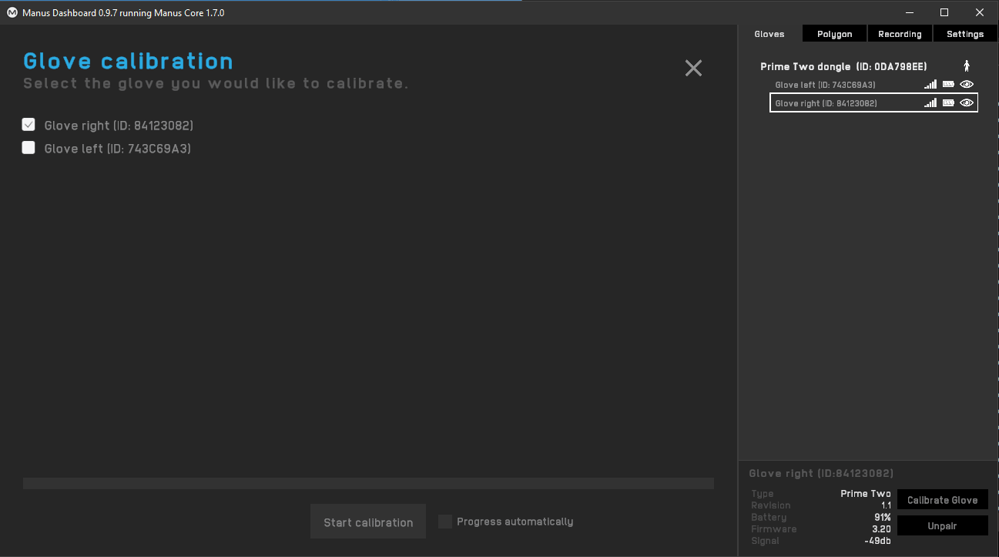

# Manus Glove Setup

This page provides instructions on integrating Manus gloves with an OptiTrack motion capture system.

## **Overview**

Starting from Motive 3.0 and above, these gloves can be integrated into Motive. This allows for easy integration of the external glove tracking system directly in Motive so that it can be used in tandem with the OptiTrack system to provide a more comprehensive tracking solution.

**Required Components**

* Manus Glove Prime X and Manus Glove Dongle.
* Manus Core and Dashboard software
* Motive 3.0 or above
* (optional) MoCap suit and markers for full body capture.


**Important Note**

* At the time of writing, the integration is supported for Manus Glove Prime X models only.
* **Sampling Rate:** Manus gloves run at a fixed sampling rate of 90Hz. If the camera system is set to run at a higher frame rate higher, Motive will _pad_ the missing samples in the glove data with previous samples.
* **Sync:** Manus gloves do not support hardware synchronization. Thus, Motive uses a software synchronization scheme to attempt to keep Manus glove 'as close as possible' to mocap data.
* **Manus Dongle:** Plug the Manus dongle on a separate USB bus from the one used to connect the USB Security Key. If both dongles are connected into the same bus, it may cause conflicts with Motive activation.


## Setup

### Manus Glove Setup

Before using Manus VR gloves in Motive, please ensure all gloves have been paired, calibrated and are able to report data from Manus software. This is a crucial first step for the successful use of Manus Gloves with Motive software.


Please note that steps required for setting up the glove may change depending on Manus Software versions. For the latest information, please refer to the [manufacturer documentation](https://www.manus-vr.com/setup).


#### **Steps**

1. Start the Manus Dashboard software.
2. Insert the Manus Glove Dongle(s) onto the computer. _Do not connect the dongle into the same USB bus used by the USB Security Key as it can cause conflicts with device detection._
3. Power on the Manus Gloves.
4. (optional) You may need to pair the glove with the dongle if needed. The gloves should come already paired.
5. Calibrate each glove. This involves going through a series of hand gestures to calibrate the glove to the user’s hand. This helps give more robust finger solve data.
6. Start Motive and the gloves should appear in the [Devices pane](../../motive-ui-panes/devices-pane.md).


Note: We suggest that Manus Dashboard be closed to resolve some performance issues in Motive.


## Motive Setup

Please refer to our [Glove Device Setup](./) page.&#x20;

## Export and streaming

Once Motive starts tracking the glove, the finger tracking data can be outputted for various applications. Real-time finger data can be streamed into any NatNet client, and recorded finger data can be exported into other file formats. For instructions on outputting tracking data from Motive, refer to the following pages:

* [Data Streaming](../../motive/data-streaming.md)
* [Data Export](../../motive/data-export/)
