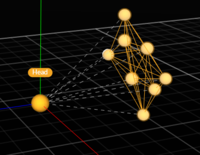

# Rigid Body Skeleton Marker Set


Please note that _Motive: Body_ license is required to access and use the rigid body skeleton Marker Sets. This is not supported with _Motive: Tracker_ license.


## Overview

6 Rigid Body Skeleton in Motive.

<figure><figcaption></figcaption></figure>

The Rigid Body Skeleton Marker Sets allows users to use rigid bodies to establish skeleton tracking. Rigid bodies are attached to head, torso, both hands, and both feet (6 rigid body skeleton only). Then, using the tracking information, Motive solves the entire skeleton through inverse kinematics. There are three types of rigid body skeleton Marker Sets in Motive:

* 6 Rigid Body Skeleton
* 4 Rigid Body Skeleton
* 4 Rigid Body Skeleton + Active Fingers

4 Rigid Body Skeleton is used for upper body tracking only, and 6 Rigid Body Skeleton is used for the entire full-body skeleton tracking. For the 6 Rigid Body Skeleton, two additional rigid bodies are attached to both feet, but the basic instructions for creating the skeleton are the same. You can use either the passive retro-reflective markers or the [active pucks](http://optitrack.com/products/active-components/#active-puck) to produce the rigid body skeleton.

## Rigid Body Placements

**Step 1. Prepare the rigid bodies**

* For 6 rigid body skeleton, a total 6 rigid bodies are needed: head (1), torso (1), both hands (2), and both feet (2)
* For 4 rigid body skeleton, a total 4 rigid bodies are needed: head (1), torso (1), both hands (2)

**Step 2. Attach the rigid bodies to the actor**

<table><thead><tr><th width="220">Placement</th><th>Description</th></tr></thead><tbody><tr><td>Right/Left Hand</td><td>Place a rigid body on top of each hand. (2)</td></tr><tr><td>Right/Left Foot</td><td>
Place a rigid body on top of each foot. (2)

<strong>This is needed only for the 6 Rigid Body skeleton markerset.</strong>
</td></tr><tr><td>Chest (or Hip)</td><td>Attach a rigid body at mid-spine on the back. If using a VR backpack PC, this can be attached on top of the backpack PC. This rigid body can also be replaced by a hip rigid body, and in that case, the rigid body needs to be placed slightly above the center of the hip bone. (1)</td></tr><tr><td>HMD (or Head)</td><td>Use the active HMD clip to attach active markers onto the HMD. If not using an HMD clip, you will need to manually place the markers on the HMD. If not using an HMD, place the rigid body on the back of the head. (1)</td></tr></tbody></table>

<figure><figcaption>
Anterior view of the actor with rigid bodies.
</figcaption></figure>

<figure><figcaption>
Posterior view of the actor with rigid bodies.
</figcaption></figure>

## Creating the Skeleton

**Step 1: Create a rigid body asset for the rigid body attached to Chest/Hip**

Let's first start with defining a rigid body for the chest rigid body. Open up the [Builder pane](../motive-ui-panes/builder-pane.md), make sure the _Rigid Bodies_ option is selected at the bottom, and access the _Create_ tab. This will bring up options for defining rigid bodies in Motive.

In the [3D viewport](../motive-ui-panes/viewport.md#perspective-view), select all of the markers on the chest rigid body, and you should be able to see the selected markers in the Builder pane. Name the rigid body as _Chest_, and click create. If you are attaching the rigid body on the lower back, you will name the rigid body _Hip_ instead.

_Only one of the Chest or the Hip rigid body is needed for the 6 rigid body skeleton._

<figure><figcaption></figcaption></figure>

**Step 2: Position the pivot point of the Chest/Hip rigid body**

Once the chest or hip rigid body has been created, the next step is to position and orient its pivot point at the appropriate location. Click the  icon in the 3D viewport to access the [Gizmo tool](../motive/assets/gizmo-tool-translate-rotate-and-scale.md) to easily translate the rigid body pivot points.

For the chest rigid body, the pivot point must be placed at the center of the torso, approximately at the heart center, which is in between the spine and the bottom end of the sternum. For the hip rigid body, the pivot point must be placed at the center of the hip bone.


This is easier to set up by switching one of the cameras to grayscale video mode and using the [Reference View pane](https://v23.wiki.optitrack.com/index.php?title=Reference_View_pane) to monitor where the pivot point is placed within the actor's body.


<figure><figcaption></figcaption></figure>

**Step 3: Orient the pivot point of the Chest/Hip rigid body**

After positioning the pivot point, adjust the orientation of the rigid body pivot also by using the rotate [Gizmo tool](../motive/assets/gizmo-tool-translate-rotate-and-scale.md). For creating 6 Rigid Body skeleton, the +z axis must direct towards the front of the actor.


_Enabling the Bone Orientation setting under the rigid body properties will reveal the orientation of the selected rigid body._


<figure><figcaption></figcaption></figure>

**Step 4: Create the HMDhead/Head rigid body**

Now that the chest, or hip, rigid body has been set up, next step is to create a rigid body for the head. This can be either the active HMD clip or a rigid body attached to the head. Only one of these needs to be created.



For HMDs using the active HMD clip, you can use the HMD tool in the [Builder pane](https://v23.wiki.optitrack.com/index.php?title=Builder_pane) to easily create a rigid body. Make sure to choose either the +Z-forward or the +X-forward orientation, and the rigid body must be named **HMDHead** for +Z-forward orientation or **HMDHeadX** for +X-forward orientation.

1. Open the [Builder pane](https://v23.wiki.optitrack.com/index.php?title=Builder_pane) under [View tab](https://v23.wiki.optitrack.com/index.php?title=Command_Bar#View) and click _Rigid Bodies_.
2. Under the _Type_ drop-down menu, select HMD. This will bring up the options for defining an HMD rigid body.
3. Under the _Orientation_ drop-down menu, select the desired orientation of the HMD.
4. Hold the HMD at the center of the tracking volume where all of the active markers are tracked well.
5. Select the 8 active markers in the [3D viewport](https://v23.wiki.optitrack.com/index.php?title=Viewport#Perspective_View).
6. Name the rigid body as _HMDHead_ for +Z-forward orientation or _HMDHeadX_ for +X-forward orientation.
7. Click _Create_. An HMD rigid body will be created from the selected markers and it will initiate the calibration process.
8. During calibration, slowly rotate the HMD to collect data samples in different orientations.
9. Once all necessary samples are collected, the calibrated HMD rigid body will be created.




The process of creating a head rigid body is similar to the steps for creating the Chest rigid body. You can use the [Builder pane](https://v23.wiki.optitrack.com/index.php?title=Builder_pane) to define a rigid body named _Head_.

Once the rigid body is defined, use the [Gizmo tool](https://v23.wiki.optitrack.com/index.php?title=Gizmo_Tool:_Translate,_Rotate,_and_Scale) to translate the pivot point to the center of the actor's head near the neck joint. Then, likewise, orient the rigid body so that +z axis is directing towards the front.

<figure><figcaption></figcaption></figure> <figure><figcaption></figcaption></figure>




**Step 5: Define the skeleton.**

Now that the head and torso rigid bodies have been prepared, we can start defining the skeleton. Open the [Builder pane](https://v23.wiki.optitrack.com/index.php?title=Builder_pane) and select Skeleton for the type and Rigid Body Skeleton for the template.&#x20;

<figure><figcaption>
Builder pane:  Creating a 6 Rigid Body Skeleton.
</figcaption></figure>

The builder pane will display a rotatable 3D image to show the correct placement of the rigid bodies on the actor. Select T-Pose from the Pose drop-down selection and have the actor stand with arms extended at shoulder height, palms facing the floor, to begin the capture. (Note that the 3D image will not change to match the selected pose). Leave the constraints set to Default or [import them using an existing XML template](../motive-ui-panes/constraints-pane/constraints-xml-files.md), if necessary. See [Constraints Pane](../motive-ui-panes/constraints-pane/) for more detail on manipulating and working with constraints. Select the Visual setting to match how you would like the skeleton to appear in Motive, with the Cycle Avatar option cycling between gender options. Assign a unique name to identify the skeleton.&#x20;

<figure><figcaption>
Visual options for Skeletons.
</figcaption></figure>

**Step 6: Create the Rigid Body Skeleton.**

Ask the subject to strike the selected calibration pose (e.g. [T-Pose](../motive/skeleton-tracking.md#calibration-pose)). Then select the two rigid bodies (head or HMDHead and chest or hip) and press _Create_ on the Builder pane. This action will automatically define rigid bodies for the remaining rigid bodies on the hand/foot, and also place the pivot points at the proper location automatically. All of the rigid bodies will have the prefix with the name given to the skeleton (see screenshot below), and the skeleton will be created and tracked.


**Rigid Body Names:**

In order for the rigid body skeleton to work, it is important that all of the rigid bodies have a name prefix that matches the skeleton name. If one of the rigid bodies doesn't seem to be contributing to the skeleton solve, please check these names.


<figure><figcaption></figcaption></figure>

<figure><figcaption>
<strong>Pivot Point Locations:</strong> Pivot: Head (when HMD is not used). Pivot: Left and Right Hand, Pivot: Left and Right Foot, Pivot: Hip (or replaced by Chest rigid body).
</figcaption></figure>

**Step 7: Double-check the created skeleton**

After the skeleton has been created, confirm tracking of the skeleton. If any of the skeleton segments seems to be misaligned, double-check the position of the attached rigid bodies and corresponding pivot points.

* **Chest RB Pivot:** When using the Chest rigid body for the torso-tracking. The length of the abdomen segment gets solved by referencing the location of the chest rigid body pivot point. If the created skeleton has an abnormally long or short abdomen segment, double-check and adjust the height of the chest pivot point.
* **Neck:** If the pivot orientation of the Chest rigid body doesn't align with the head rigid body, the neck of the created skeleton may appear to be bent. Make sure the chest rigid body's y-axis is pointed directly up towards the Head/HMD rigid body pivot.

<figure><figcaption></figcaption></figure>

## Exporting Skeleton Data

You can export skeleton tracking data for use in another application using the exporter tool on the File menu. Version 3.1.x supports the export to [BVH](../motive/data-export/data-export-bvh.md) and [FBX ASCII and FBX binary formats](../motive/data-export/data-export-fbx.md), in addition to CSV, C3D, and TRC formats. Additionally, constraints data can be exported to an XML&#x20;

Prior to exporting, the recorded skeleton must be solved. Right click on the skeleton in the Asset Pane and select Solve. Your skeleton is now ready to export.&#x20;

<figure><figcaption>
Asset context menu.
</figcaption></figure>

## Troubleshooting

<strong>Q : Skeleton is not tracking</strong>

A: If the skeleton, or certain parts of the skeleton, seems to not be tracked at all, make sure the rigid bodies are named properly. The rigid body must be named with the following syntax:

* **Head:** _(Skeleton Name)Head_ OR _(Skeleton Name)HMDHead_ OR _(Skeleton Name)HMDHeadX_
* **Torso:** _(Skeleton Name)Hip_ OR _(Skeleton Name)Chest_
* **Left hand:** _(Skeleton Name)LHand_
* **Right hand:** _(Skeleton Name)RHand_
* **Left foot:** _(Skeleton Name)LFoot_
* **Right foot:** _(Skeleton Name)RFoot_

<strong>Q : HMD head is facing backward/sideways</strong>

A: If the head or HMD is facing backward or sideways, the orientation is not properly set. Please double-check the position/orientation of the rigid body head to make sure they are set properly.

<strong>Q : Skeleton bones are flipped</strong>

A: Double-check the orientation of each rigid body. All rigid bodies must be named properly, and their z-axis must be facing the forward direction.

<strong>Q : Shoulder/hip bone is too high up</strong>

A: The position of the HMD (or head) and the Chest (or hip) rigid body is not accurately placed. The 6 rigid body skeleton gets calculated from pivot points of these two rigid bodies, so if there is an obvious misalignment of the created skeleton bones, double-check and make sure these two pivot points are set up properly.

