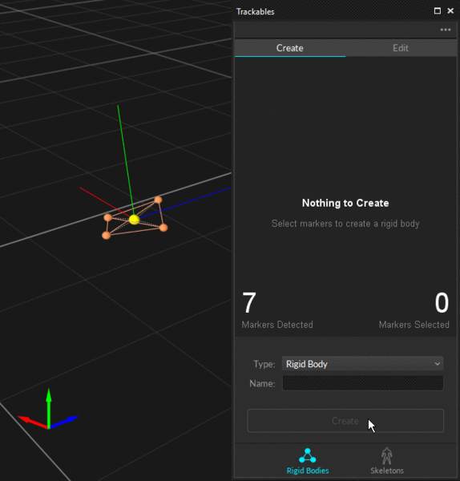

# Builder Pane

The Builder pane can be accessed under the _View tab_ or by clicking the  icon on the main toolbar.

## Overview

The **Builder pane** is used for creating and editing trackable models, also called trackable assets, in Motive. In general, **Rigid Body assets** are created for tracking rigid objects, and **Skeleton assets** are created for tracking human motions.

When created, trackable models store the positions of markers on the target object and use the information to auto-label the markers in 3D space. During the auto-label process, a set of predefined labels gets assigned to 3D points using the solver pipeline, and the labeled dataset is then used for calculating the position and orientation of the corresponding Rigid Bodies or Skeleton segments.

The trackable models can be used to auto-label the 3D capture both in Live mode (real-time) and in the Edit mode (post-processing). Each created trackable models will have its own properties which can be viewed and changed under the [Properties pane](properties-pane/). If new Skeletons or Rigid Bodies are created during post-processing, the _Take_ will need to be auto-labeled again in order to apply the changes to the 3D data.

.png>)

### Interface Overview

On the Builder pane, you can either create a new trackable asset or modify an existing one. Select the _Type_ of asset you wish to work on, and then select whether you wish to create or make modifications to existing assets. Create and modify tools for different types asset will be explained in the sections below.

.png>)

## Rigid Body: Create

For creating Rigid Bodies, select the Rigid Body from the _Type_ option and access the _Create_ tab at the top. Here, you can create Rigid Body assets and track any markered-objects in the volume. In addition to standard Rigid Body assets, you can also create Rigid Body models for head-mounted displays (HMDs) and measurement probes as well.

### Creating Rigid Body

**Step 1.**

Select all associated Rigid Body markers in the [3D viewport](viewport.md#perspective-view).

**Step 2.**

On the Builder pane, confirm that the selected markers match the markers that you wish to define the Rigid Body from.

**Step 3.**

Click _Create_ to define a Rigid Body asset from the selected markers.

You can also create a Rigid Body by doing the following actions while the markers are selected:

* **Prespective View (3D viewport):** While the markers are selected, right-click on the perspective view to access the context menu. Under the Rigid Body section, click _Create From Selected Markers_.
* **Assets pane:** While the markers are selected in Motive, click on the add  button in the [Assets pane](assets-pane.md).
* **Hotkey:** While the markers are selected, use the create Rigid Body hotkey (Default: Ctrl +T).

.png>) .png>)

**Step 4.**

Once the Rigid Body asset is created, the markers will be colored (labeled) and interconnected to each other. The newly created Rigid Body will be listed under the [Assets pane](assets-pane.md).


**Defining Assets in Edit mode:**

If the Rigid Bodies, or Skeletons, are created in the Edit mode, the corresponding _Take_ needs to be [auto-labeled](../motive/labeling.md#auto-label). Only then, the Rigid Body markers will be labeled using the Rigid Body asset and positions and orientations will be computed for each frame. If the 3D data have not been labeled after edits on the recorded data, the asset may not be tracked.


### Creating HMD Rigid Body

**This feature can be used only with HMDs that have the** [**OptiTrack Active HMD**](http://optitrack.com/products/active-components/) **clips mounted.**

For using OptiTrack system for VR applications, it is important that the pivot point of HMD Rigid Body gets placed at the appropriate location, which is at the root of the nose in between the eyes. When using the HMD clips, you can utilize the HMD creation tools in the Builder pane to have Motive estimate this spot and place the pivot point accordingly. It utilizes known marker configurations on the clip to precisely positions the pivot point and sets the desired orientation.


HMDs with passive markers can utilize the [External Pivot Alignment](builder-pane.md) tool to calibrate the pivot point.


 (1) (1) (1) (1) (1) (1) (12).png>)

#### **Steps**

1. First of all, make sure Motive is configured for tracking [active markers](../active-components/active-marker-tracking/).
2. Open the Builder pane under [View tab](toolbar-command-bar.md#view) and click _Rigid Bodies_.
3. Under the _Type_ drop-down menu, select HMD. This will bring up the options for defining an HMD Rigid Body.
4. If the selected marker matches one of the Active clips, it will indicate which type of Active Clip is being used.
5. Under the _Orientation_ drop-down menu, select the desired orientation of the HMD. The orientation used for streaming to Unity is +Z forward and Unreal Engine is +X forward, or you can also specify the expected orientation axis on the client plugin side.
6. Hold the HMD at the center of the tracking volume where all of the active markers are tracked well.
7. Select the 8 active markers in the [3D viewport](viewport.md#perspective-view).
8. Click _Create_. An HMD Rigid Body will be created from the selected markers and it will initiate the calibration process.
9. During calibration, slowly rotate the HMD to collect data samples in different orientations.
10. Once all necessary samples are collected, the calibrated HMD Rigid Body will be created.

### Creating Measurement Probe Rigid Body

You can also define a measurement probe using the Builder pane. The measurement probe tool utilizes the precise tracking of OptiTrack mocap systems and allows you to measure 3D locations within a capture volume. _For more information, please read through the_ [_Measurement Probe Kit Guide_](../motive/measurement-probe-kit-guide.md)_._

.png>)

#### **Creating a probe using the Builder pane**

1. Open the Builder pane under [View tab](toolbar-command-bar.md#view) and click _Rigid Bodies_.
2. Bring the probe out into the tracking volume and create a [Rigid Body](builder-pane.md#rigid-body-create) from the markers.
3. Under the _Type_ drop-down menu, select _Probe_. This will bring up the options for defining a Rigid Body for the measurement probe.
4. Select the Rigid Body created in step 2.
5. Place and fit the tip of the probe in one of the slots on the provided calibration block.
6. Note that there will be two steps in the calibration process: refining Rigid Body definition and calibration of the pivot point. Click _Create_ button to initiate the probe refinement process.
7. Slowly move the probe in a circular pattern while keeping the tip fitted in the slot; making a cone shape overall. Gently rotate the probe to collect additional samples.
8. After the refinement, it will automatically proceed to the next step; the pivot point calibration.
9. Repeat the same movement to collect additional sample data for precisely calculating the location of the pivot or the probe tip.
10. When sufficient samples are collected, the pivot point will be positioned at the tip of the probe and the _Mean Tip Error_ will be displayed. If the probe calibration was unsuccessful, just repeat the calibration again from step 4.
11. Once the probe is calibrated successfully, a probe asset will be displayed over the Rigid Body in Motive, and live x/y/z position data will be displayed under the [Probe pane](probe-pane.md).


**Caution**

* The probe tip _MUST_ remain fitted securely in the slot on the calibration block during the calibration process.
* Also, do not press in with the probe since the deformation from compressing could affect the result.



**Note: Custom Probes**

It's highly recommended to use the Probe kit when using this feature. With that being said, you can also use any markered object with a pivot arm to define a custom probe in Motive, but when a custom probe is used, it may have less accurate measurements; especially if the pivot arm and the object are not rigid and/or if any slight translation occurs during the probe calibration steps.


## Rigid Body: Modify

The Builder pane has tools that can be used to modify the tracking of a Rigid Body that's selected in Motive. To modify Rigid Bodies, select a single Rigid Body and access the _Modify_ tab at the top. This will bring up the options for editing a Rigid Body.

### Refine

.png>)

**This feature is supported in \_Live Mode**\_\*\* only.\*\*

The Rigid Body refinement tool improves the accuracy of Rigid Body calculation in Motive. When a Rigid Body asset is initially created, Motive references only a single frame for defining the Rigid Body definition. The Rigid Body refinement tool allows Motive to collect additional samples in the live mode for achieving more accurate tracking results. More specifically, this feature improves the calculation of expected marker locations of the Rigid Body as well as the position and orientation of the Rigid Body itself.

**Steps**

1. Select [View](toolbar-command-bar.md#view) from the toolbar at the top, open the Builder pane.
2. Select the _Rigid Bodies_ from the _Type_ dropdown menu.
3. In [Live mode](control-deck.md#live-and-edit-mode), select an existing Rigid Body asset that you wish to refine from the **Assets** pane.
4. Hold the physical selected Rigid Body at the center of the capture volume so that as many cameras as possible can clearly capture the markers on the Rigid Body.
5. Click **Refine** in the Builder pane.
6. Slowly rotate the Rigid Body to collect samples at different orientations until the progress bar is full.
7. Once all necessary samples are collected, the **Refine** and **Create + Refine** buttons will appear again in the Builder pane and the refinements will have been applied.

.png>)

### Probe Calibration

The _Probe Calibration_ feature under the Rigid Body edit options can be used to re-calibrate a pivot point of a measurement probe or a custom Rigid Body. This step is also completed as one of the calibration steps when first creating a measurement probe, but you can re-calibrate it under the _Modify tab_.

#### **Steps**

1. In Motive, select the Rigid Body or a measurement probe.
2. Bring out the probe into the tracking volume where all of its markers are well-tracked.
3. Place and fit the tip of the probe in one of the slots on the provided calibration block.
4. Click _Start_
5. Once it starts collecting the samples, slowly move the probe in a circular pattern while keeping the tip fitted in the slot; making a cone shape overall. Gently rotate the probe to collect additional samples.
6. When sufficient samples are collected, the mean error of the calibrated pivot point will be displayed.
7. Click _Apply_ to use the calibrated definition or click _Cancel_ to calibrate again.

### Location/Orientation

The _Modify_ tab is used to apply translation or rotation to the pivot point of a selected Rigid Body. A pivot point of a Rigid Body represents both position (x,y,z) and orientation (pitch, roll, yaw) of the corresponding asset.


You can also use the [Gizmo tools](../motive/assets/gizmo-tool-translate-rotate-and-scale.md) to quickly make modify the pivot point of a Rigid Body.


.png>)

#### **Location**

Use this tool to translate a pivot point in x/y/z axis (in mm). You can also reset the translation to set the pivot point back at the geometrical center of the Rigid Body.

#### **Orientation**

Use this tool to apply rotation to the local coordinate system of a selected Rigid Body. You can also reset the orientation to align the Rigid Body coordinate axis and the global axis.When resetting the orientation, the Rigid Body must be tracked in the scene.

### OptiTrack Clip Tool

The OptiTrack Clip Tool basically recalibrates HMDs with OptiTrack HMD Clips to position its pivot point at an appropriate location. The steps are basically the same as when first creating the [HMD Rigid Body](builder-pane.md#creating-hmd-rigid-body).

### Spherical Pivot Placement

This feature is useful when tracking a spherical object (e.g. ball). It will assume that all of the markers on the selected Rigid Body are placed on a surface of a spherical object, and the pivot point will be calculated and re-positioned accordingly. Simply select a Rigid Body in Motive, open the Builder pane to edit Rigid Body definitions, and then click _Apply_ to place the pivot point at the center of the spherical object.

## Skeleton: Create

To create Skeletons in Motive, you need to select the Skeleton option from the type dropdown menu and access the _Create_ tab at the top. Here, you select which [Skeleton Marker Set](https://github.com/OptiTrack/GitBook-Wiki/blob/main/motive/Skeleton-tracking.md#placing-the-markers) to use, choose the calibration post, and create the Skeleton model.

### Creating Skeleton

**Step 1.**

From the Skeleton creation options on the Builder pane, select a Skeleton Marker Set template from the _Template_ drop-down menu. This will bring up a Skeleton avatar displaying where the markers need to be placed on the subject.

**Step 2.**

Refer to the avatar and place the markers on the subject accordingly. For accurate placements, ask the subject to stand in the calibration pose while placing the markers. It is important that these markers get placed at the right spots on the subject's body for the best Skeleton tracking. Thus, extra attention is needed when placing the [Skeleton markers](https://github.com/OptiTrack/GitBook-Wiki/blob/main/motive/Skeleton-tracking.md#placing-the-markers).


The magenta markers indicate the [segment markers](https://github.com/OptiTrack/GitBook-Wiki/blob/main/motive/Skeleton-tracking.md#segment-markers) that can be placed at a slightly different position within the same segment.


**Step 3.**

Double-check the marker counts and their placements. It may be easier to use the [3D viewport](viewport.md#perspective-view) in Motive to do this. The system should be tracking the attached markers at this point.

**Step 4.**

In the Builder pane, make sure the numbers under the _Markers Needed_ and _Markers Detected_ sections are matching. If the Skeleton markers are not automatically detected, manually select the Skeleton markers from the [3D perspective view](viewport.md#perspective-view).

**Step 5.**

Select a desired set of marker labels under the _Labels_ section. Here, you can just use the _Default_ labels to assign labels that are defined by the Marker Set template. Or, you can also assign custom labels by loading previously prepared [marker-name XML](constraints-pane/constraints-xml-files.md) files in the label section.

**Step 6.**

Next step is to select the Skeleton creation pose settings. Under the _Pose_ section drop-down menu, select the desired calibration post you want to use for defining the Skeleton. This is set to the T-pose by default.

**Step 7.**

Ask the subject to stand in the selected calibration pose. Here, standing in a proper calibration posture is important because the pose of the created Skeleton will be calibrated from it. For more details, read the [calibration poses](https://github.com/OptiTrack/GitBook-Wiki/blob/main/motive/Skeleton-tracking.md#calibration-pose) section.

**Step 8.**

Click Create to create the Skeleton. Once the Skeleton model has been defined, confirm all Skeleton segments and assigned markers are located at expected locations. If any of the Skeleton segment seems to be misaligned, delete and create the Skeleton again after adjusting the marker placements and the calibration pose.


**In Edit Mode**

If you are creating a Skeleton in the post-processing of captured data, you will have to [auto-label](../motive/labeling.md#auto-label) the Take to see the Skeleton modeled and tracked in Motive.


.png>)

## Skeleton: Modify

### Recalibrate From Selection

**You can also select a Skeleton and use CTRL + R hotkey to refresh the tracking of Skeleton if needed.**

Existing Skeleton assets can be recalibrated using the existing Skeleton information. Basically, the recalibration recreates the selected Skeleton using the same Skelton Marker Set. This feature recalibrates the Skeleton asset and refreshes expected marker locations on the assets.

To recalibrate Skeletons, select all of the associated Skeleton markers from the perspective view along with the corresponding Skeleton model. Make sure the selected Skeleton is in a calibration pose, and click _Recalibrate_. You can also recalibrate from the context menu in the [Assets pane](assets-pane.md) or in the [3D Viewport](viewport.md#perspective-view).


Skeleton recalibration does not work with Skeleton templates with added markers.


.png>) .png>) .png>)

### Asset Model Markers

You can add or remove [asset model markers](../motive/data-recording/#marker-types-in-motive) from a Rigid Body or a Skeleton using the Builder pane. This is basically adding or removing markers to the existing Rigid Body and/or Skeleton definition. To do this, you will need to make sure the selection of Asset Model Markers is enabled in the Perspective viewport. Then, follow the below steps to add or remove markers:

#### **Steps**

1. Enable selection of Asset Model Markers.
2. Access the Modify tab on the Builder pane.
3. Select a Skeleton or a Rigid Body that you wish to modify the asset markers for.
4. CTRL + left-click on an asset model(s) marker that's associated with the selected asset.
5. On the Asset Model Markers in the Builder pane, click + for adding the marker to the definition or - for removing the asset model marker.
6. Use the Constraints pane to modify marker label and/or colors.

### Marker Sticks

_This feature works for Skeleton assets only_

For Skeleton marker sticks, you can use the Builder pane to add/remove markers sticks and also modify the color of the sticks as needed.
