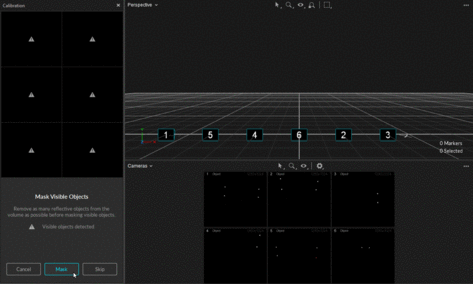

# Calibration

## Overview


Quick Start Guide - Calibration.


Calibration is essential for high quality optical motion capture systems. During calibration, the system computes the position and orientation of each camera and number of distortions in captured images to construct a 3D capture volume in Motive. This is done by observing 2D images from multiple synchronized cameras and associating the position of known calibration markers from each camera through triangulation.

If there are any changes in a camera setup the system must be recalibrated to accommodate those changes. Additionally, calibration accuracy may naturally deteriorate over time due to ambient factors such as fluctuations in temperature. For this reason, we recommend recalibrating the system periodically.

### General Steps in Calibration

1. Prepare and optimize the capture volume for setting up a motion capture system.
2. Apply masks to ignore existing reflections in the camera view.
3. Collect calibration samples through the wanding process.
4. Review the wanding result and apply calibration.
5. Set the ground plane to complete the system calibration.


Motive opens the calibration layout view by default, containing the necessary panes for the calibration process. This layout can also be accessed from the calibration layout button  in the top-right corner, or by using the Ctrl+1 [hotkey](../motive-hotkeys.md).


### Calibration Types

* **Full:**  Calibrate all the cameras in the volume from scratch, discarding any prior known position of the camera group or lens distortion information. A Full calibration will also take the longest time to run.
* **Refine:**  Adjusts slight changes in the calibration of the cameras based on prior calibrations. This will solve faster than a Full calibration. Use this only if the cameras have not moved significantly since they were last calibrated. A Refine calibration will allow minor modifications in camera position and orientation, which can occur naturally from the environment, such as due to mount expansion.


Refinement cannot run if a full calibration has not been completed previously on the selected cameras.


## Starting a New Calibration

The [Calibration pane ](../../motive-ui-panes/calibration-pane.md)will guide you through the calibration process. This pane can be accessed by clicking on the  icon on the toolbar or by entering the calibration layout from the top-right corner . For a new system calibration, click the _New Calibration_ button and Motive will walk you through the steps.

.png>)

### Preparing and Optimizing the Setup

* Cameras need to be appropriately placed and configured to fully cover the capture volume.
* Each camera must be mounted securely so that it remains stationary during capture.
* Motive's camera settings used for calibration should ideally remain unchanged throughout the capture. Re-calibration may be required if there are any significant modifications to the settings that influence the data acquisition, such as camera settings, gain settings, and Filter Switcher settings.
* The default grid size for the 3D Viewport is 6 square meters. To change this to match the size of the capture volume, click the _Settings_  button. On the _Views / 3D_ tab, adjust the values for the Grid Width and Grid Length as needed.&#x20;
* [Calibration settings](../../motive-ui-panes/settings/settings-general.md#calibration-settings-advanced) are advanced properties on the [Settings > General](../../motive-ui-panes/settings/settings-general.md) tab.&#x20;

## Masking

Before performing a system calibration, all extraneous reflections or unnecessary markers should be removed or covered so they are not seen by the cameras. When this isn't possible, extraneous reflections can be ignored by _masking_ them in Motive.

When the cameras detect reflections in their view, a warning sign  appears in the view for those cameras that see reflections; for Prime series cameras, the indicator LED ring will also light up in white.

Masks can be applied by clicking _Mask_ in the [calibration pane](../../motive-ui-panes/calibration-pane.md), and Motive will apply red masks over all of the reflections detected in the 2D camera view. Once masked, the pixels in the masked regions will be entirely filtered out from the data. Please note that Masks are applied additively, so if there are already masks applied in the camera view, clear them out first before applying a new one.


**Active Wanding:**

Applying masks to camera views is only necessary when using calibration wands with passive markers. Active calibration wands calibrate the capture volume with the LEDs of all the cameras turned off. This method is recommended if the volume has a lot of reflective material that cannot be removed.


.png>)

### Applying Masks

1. The [calibration pane](../../motive-ui-panes/calibration-pane.md) will display a warning  for any cameras that see reflections or noise in their view.
2. Check the corresponding camera view to identify where the reflection is coming from, and if possible, remove it from the capture volume or cover it for the calibration.
3. In the [Calibration pane](../../motive-ui-panes/calibration-pane.md), click _Mask_ to apply masks over all reflections in the view that cannot be removed or covered, such as other cameras.


**Masking from the Cameras Viewport**

Masks can also be applied from the Cameras Viewport if needed. From the Cameras view, click the gear  icon on the toolbar to see [masking options](../../motive-ui-panes/viewport.md#camera-masking-settings). You can also click on the  icon to switch to [different modes](../../motive-ui-panes/viewport.md#mouse-actions) to manually apply or erase masks.&#x20;


 


Masked pixels are completely filtered from the [2D data](../data-recording/data-types.md), which means the data in masked regions will not be collected for computing the [3D data](../data-recording/data-types.md). For this reason, excessive use of masking may result in data loss or frequent marker occlusions.&#x20;


.png>)

## Wanding

The wanding process is Motive's core pipeline for collecting calibration samples. A calibration wand with preset markers is waved repeatedly throughout the volume, allowing all cameras to see the calibration markers and capture the sample data points from which Motive will compute their respective position and orientation in the 3D space.

### Wand Samples

For best results, the following requirements should be met:

* At least two cameras must see all three of the calibration markers simultaneously.
* Cameras should see only calibration markers. If any other reflection or noise is detected during wanding the sample will not be collected and may affect the calibration results negatively. For this reason, the person doing the wanding should not be wearing anything reflective.
* The markers on the calibration wand must be in good quality. If the marker surface is damaged or scuffed, the system may struggle to collect wanding samples.

### Wand Types

There are different types of calibration wands suited for different capture applications. In all cases, Motive recognizes the asymmetrical layout of the markers as a wand and applies the dimensions of the wand selected at the beginning of the wanding process in calculating the calibration.&#x20;

Unless specified otherwise, the wands use retro-reflective markers placed in a line at specific distances. For optimal results, it is important to keep the calibration wand markers untouched and undistorted.


**Calibration Wands**

* **CW-500**:  The CW-500 calibration wand has a wand-width of 500mm when the markers are placed in configuration A. This wand is suitable for calibrating a large size capture volume because the markers are spaced farther apart, allowing the cameras to easily capture individual markers even at long distances.
* **CW-500 Active**:  With the same dimensions as the CW-500, the active wand is recommended for capture volumes that have a large amount of reflective material that cannot be removed. This wand calibrates the volume while the LEDs of all mounted cameras are turned off.
* **CW-250**:  The CW-250 calibration wand has a wand-width of 250mm. This wand is suitable for calibrating small to medium size volumes. Its narrower wand-width allows cameras in a smaller volume to easily capture all three calibration markers within the same frame. Note that a CW-500 wand can also be used like CW-250 wand if the markers are positioned in configuration B.
* **CWM-125 / CWM-250**:  Both CWM-125 and CWM-250 wands are designed for calibrating systems for precision capture applications. The accuracy of the calibrated wand width is the most precise and reliable on these wands, making them more suitable for precision capture in a small volume capture application.


### Wanding Steps


To start calibrating inside the volume, cover one of the markers and expose it wherever you wish to start wanding. When at least two cameras detect all three markers and no other reflections in the volume, Motive will recognize the wand and will start collecting samples.


1. Confirm that masking was successful, and the volume is free of extraneous reflections. Return to the masking steps if necessary to mask any items that cannot be removed or covered.
2. To complete a full calibration, deselect any cameras that were selected during the previous steps so that no cameras are selected.
3. Set the Calibration Type. If you are calibrating a new capture volume, choose _Full_ Calibration.
4. Under the Wand settings, specify the wand type you will use. Selecting the wrong wand type may result in scaling issues in Motive.
5. Double check the calibration setting. Once confirmed, press _Start Wanding_ to start collecting wanding sample.&#x20;
6. Bring your calibration wand into the capture volume and wave the wand gently across the entire volume. Slowly draw figure-eights repetitively with the wand to collect samples at varying orientations while covering as much space as possible for sufficient sampling.&#x20;
7.  Wanding trails will show in color in the [2D view](../../motive-ui-panes/viewport.md) for each camera. As you wand, consult the Cameras Viewport to evaluate individual camera coverage. Each camera should be thoroughly covered with wand samples (see image, below). If there are any large gaps, focus wanding on those areas to increase coverage. \
     

    <figure><figcaption>
Collected wanding samples shown in the 2D Camera Viewport.
</figcaption></figure>
8. The [Calibration pane](../../motive-ui-panes/calibration-pane.md) will display a table of the wanding status to monitor the progress. For best results, wand evenly and comprehensively throughout the volume, covering both low and high elevations.&#x20;
9. Continue wanding until the camera squares in the [Calibration pane](../../motive-ui-panes/calibration-pane.md) turn from dark green (insufficient number of samples) to light green (sufficient number of samples). Once all the squares have turned light green the _Start Calculating_ button will become active.
10. Press _Start Calculating_ in the [Calibration Pane](../../motive-ui-panes/calibration-pane.md). Generally, 1,000-4,000 samples per camera are enough. Samples above this threshold are unnecessary and can be detrimental to a calibration's accuracy.


**Wanding Tips**

* Avoid waving the wand too fast. This may introduce bad samples.
* Avoid wearing reflective clothing or accessories while wanding. This can introduce extraneous samples which can negatively affect the calibration result.
* Try not to collect samples beyond 10,000. Extra samples could negatively affect the calibration.
* Try to collect wanding samples covering different areas of each camera's view. The status indicator on Prime cameras can be used to monitor the sample coverage on individual cameras.
* Although it is beneficial to collect samples all over the volume, it is sometimes useful to collect more samples in the vicinity of the target regions where more tracking is needed. By doing so, calibration results will have a better accuracy in the specific region.



**Marker Labeling Mode**

When performing calibration wanding, leave the Marker Labeling Mode at the default setting of _Passive Markers Only._ This setting is located in _Application Settings_ → _Live-Reconstruction_ tab → _Marker Labeling Mode_. There are known problems with wanding in one of the active marker labeling modes. This applies for both passive marker calibration wands and IR LED wands.


### PrimeX Series: LED Indicator ring

<figure><figcaption></figcaption></figure> <figure><figcaption></figcaption></figure> <figure><figcaption></figcaption></figure>

For Prime series cameras, the LED indicator ring displays the status of the wanding process.&#x20;

* When wanding is initiated, the LED ring turns dark.&#x20;
* When a camera detects all three markers on the calibration wand, part of the LED ring will glow blue to indicate that the camera is collecting samples. The location of the blue light will indicate the wand position in the respective camera view.&#x20;
* As calibration samples are collected by each camera, all the lights in the ring will turn green to indicate enough samples have been collected.&#x20;
* Cameras that do not have enough samples will begin to glow white as other cameras reach the minimum threshold to begin calibration. Check the 2D view to see where additional samples are needed.
* When all of the cameras emit a bright green light to indicate enough samples have been collected, the _Start Calculating_ button will become active.

## Calibration Results

Pess _Start Calculating_ to calibrate. The length of time needed to calculate the calibration varies based on the number of cameras included in the system and the number of collected samples.&#x20;

As Motive starts calculating, blue wanding paths will display in the view panes, and the [Calibration pane](../../motive-ui-panes/calibration-pane.md) will update with the calibration result from each camera.&#x20;

Click _Show List_ to see the errors for each camera.


**Tip:**  Select a _Take_ in the [Data pane](../../motive-ui-panes/data-pane.md) to see its related calibration results in the [Properties pane](../../motive-ui-panes/properties-pane/). This information is available only for _Takes_ recorded in Motive 1.10 and above.


### Calibration Result Report

* When the calculation is done the results will display in the [Calibration pane](../../motive-ui-panes/calibration-pane.md).
* The result is determined by the mean error, resulting in the following ratings:  Poor, Fair, Good, Great, Excellent, and Exceptional.&#x20;
* If the results are acceptable, press _Continue_ to apply the calibration. If not, press _Cancel_ and repeat the wanding process.&#x20;
* In general, if the results are anything less than Excellent, we recommend you adjust the camera settings and/or wanding techniques and try again.

.png>)

#### Mean Ray Error

The Mean Ray Error reports a mean error value on how closely the tracked rays from each camera converged onto a 3D point with a given calibration. This represents the preciseness of the calculated 3D points during wanding. Acceptable values will vary depending on the size of the volume and the camera count.

#### Mean Wand Error

The Mean Wand Error reports a mean error value of the detected wand length compared to the expected wand length throughout the wanding process.

## Ground Plane and Origin

The final step of the calibration process is setting the ground plane and origin for the coordinate system in Motive. This is done using a Calibration Square.&#x20;

* Place the calibration square in the volume where you want the origin to be located, and the ground plane to be leveled.&#x20;
* If using a standard OptiTrack calibration square, Motive will recognize it in the volume and display it as the detected device in the Calibration pane.&#x20;
* Align the calibration square so that it references the desired axis orientation. Motive recognizes the longer leg on the calibration square as the positive z axis, and the shorter leg as the positive x axis. The positive y axis will automatically be directed upward in a right-hand coordinate system.&#x20;
* Use the level indicator on the calibration square to ensure the orientation is horizontal to the ground. If any adjustment is needed, rotate the nob beneath the markers to adjust the balance of the calibration square.
* Once the calibration square is properly placed and detected by the [Calibration pane](../../motive-ui-panes/calibration-pane.md), click _Set Ground Plane_. You may need to manually select the markers on the ground plane if Motive fails to auto-detect the ground plane.&#x20;
* If needed, the ground plane can be adjusted later.

.png>)

### Custom Calibration Square

A custom calibration square can also be used to define the ground plane. All it takes to make a custom square is three markers that form a right-angle with one arm longer than the other, like the shape of the calibration square.&#x20;

To use a custom calibration square, select _Custom_ in the drop-down menu, enter the correct vertical offset and select the square's markers in the 3D Viewport before setting the ground plane.

#### **Vertical offset**

The Vertical Offset is the distance between the center of the markers on the [calibration square](calibration-squares.md) and the actual ground and is a required value in setting the global origin.&#x20;

Motive accounts for the vertical offset when using a standard OptiTrack calibration square, setting the origin at the bottom corner of the calibration square rather than the center of the marker.&#x20;

 <figure><figcaption>
Ground plane marker is offset from the global origin after calibration.
</figcaption></figure>

When using a custom calibration square, measure the distance between the center of the marker and the lowest tip at the vertex of the calibration square. Enter this value in the _Vertical Offset_ field in the Calibration pane.&#x20;

.png>)


The **Vertical Offset** property can also be used to place the ground plane at a specific elevation. A positive offset value will set the plane below the markers, and a negative value will set the plane above the markers.


### Set Origin with a Rigid Body

To have the most control of the location of of the global origin, including placing it at the location of a marker, we recommend setting the origin to the pivot point of a rigid body.&#x20;

1. Create the Rigid Body.
2. Align the Rigid Body's pivot point to the location you would like to set as the global origin (0,0,0). To align the pivot point to a specific marker, shift-select the marker and the pivot point. From the [Builder pane](../../motive-ui-panes/builder-pane.md), click the Modify tab and select Align to...Marker.&#x20;
3. Select the Rigid Body in the[ Assets pane](../../motive-ui-panes/assets-pane.md) before proceeding to set the ground plane.&#x20;
4. In the Calibration pane, select _Rigid Body_ for the Ground Plane. Motive will set the origin to the selected Rigid Body's pivot point.&#x20;

## Change Ground Plane Options

On the main Calibration pane, Click _Change Ground Plane..._ for additional tools to further refine your calibration. Use the page selector  at the bottom of the pane to access the various page.&#x20;

<figure><figcaption>
Left to right:  Refine Ground Plane tool; Translate and Rotate tool; Scale Volume tool.
</figcaption></figure>

### Ground Plane Refinement

The Ground Plane Refinement feature improves the leveling of the coordinate plane. This is useful when establishing a ground plane for a large volume, because the surface may not be perfectly uniform throughout the plane.

To use this feature, place several markers with a known radius on the ground, and adjust the vertical offset value to the corresponding radius. Select these markers in Motive and press _Refine Ground Plane._ This will adjust the leveling of the plane using the position data from each marker.&#x20;

### Translate or Rotate Ground Plane

To adjust the position and orientation of the global origin after the capture has been taken, use the capture volume translation and rotation tool.

To apply these changes to recorded _Takes_, you will need to reconstruct the 3D data from the recorded 2D data after the modification has been applied.

### Scale Volume

To rescale the volume, place two markers a known distance apart. Enter the distance, select the two markers in the 3D Viewport, and click _Scale Volume_.&#x20;

## Calibration Files

Calibration files are used to preserve calibration results. The information from the calibration can be exported  as a .cal file, an [XML file with the .mcal extension](.mcal-xml-calibration-files.md), or as a .json file. Calibration files in the .cal or .mcal format can also be imported into Motive.&#x20;

Calibration files eliminate the effort of calibrating the system every time you open Motive. Calibration files are automatically saved into the default folders after each calibration. In general, we recommend exporting the calibration before each capture session. By default, Motive loads the last calibration file that was created. This can be changed via the [Application Settings](../../motive-ui-panes/settings/).


**Note:** Whenever there is a change to the system setup (e.g. cameras moved) these calibration files will no longer be relevant and the system will need to be recalibrated.


## Refining Calibration

### Continuous Calibration

The continuous calibration feature continuously monitors and refines the camera calibration to its best quality. When enabled, _minor_ distortions to the camera system setup can be adjusted automatically without wanding the volume again. In other words, you can calibrate a camera system once and no longer worry about external distortions such as vibrations, thermal expansion on camera mounts, or small displacements on the cameras. For detailed information, read the [Continuous Calibration](continuous-calibration.md) page.

**Enabling/Disabling Continuous Calibration**

Continuous calibration is enabled from the [Calibration Pane](../../motive-ui-panes/calibration-pane.md) once a system has been calibrated. It will also show when the continuous calibration last updated and its current status.

.png>)

### Offline Calibration

When capturing throughout a whole day, temperature fluctuations may degrade calibration quality and create the need to recalibrate the capture volume at different times of the day. However, repeating the entire calibration process can be tedious and time-consuming especially for a system with a large number of cameras.&#x20;

Instead of repeating an entire full calibration, you can record Takes while wanding and takes with the calibration square in the volume and use those takes to re-calibrate in the post-processing. This saves calibration calculation time on the capture day because you can apply the calibration from the recorded wanding take in the post-processing instead. Offline calibration allows time to inspect the collected capture data, re-calibrating from a recorded _Take_ only when signs of degraded calibration quality are seen in the captures.

#### **Offline Calibration Steps**

**Capture wanding and ground plane&#x20;**_**Takes**_**.** At different times of the day, record wanding _Takes_ that resemble the calibration wanding process. Also record corresponding ground plane _Takes_ with the calibration square set in the volume to define the ground plane.


Whenever a system is calibrated, Motive saves two Calibration _Take_ (\*.tak) files, one of the Wanding and one of the Ground Plane. These files can be reloaded as needed and can also be used to complete an offline calibration.&#x20;


1. Open the _Take_ to be recalibrated.&#x20;
2. From the [Calibration pane](../../motive-ui-panes/calibration-pane.md), click _Load Calibration..._
3. Browse to and select the wanding _Take_ that was captured around the same time as the _Take_ to be recalibrated.&#x20;
4. From the Calibration pane, click _New Calibration._
5. In Edit mode, click _Start Wanding_. Motive will import the wanding from the _Take_ file selected in step 3 and display the results.
6. Click the _Start Calculating_ button.
7. (Optional) Export the calibration results by selecting _Export Camera Calibration_ from the _File_ menu. The results will be saved as an .mcal file.
8. Click _Apply Results_ to accept the calibration.
9. Motive will move to the next step in the calibration process, setting the ground plane. If the ground plane is in a separate Take, then click _Done_ and proceed to step 10. If the ground plane is in the calibration _Take_ already loaded, then move to step 13.&#x20;
10. From the Calibration pane, click _Load Calibration..._
11. Browse to and select the Ground Plane _Take_ that was captured around the same time as the _Take_ to be recalibrated.&#x20;
12. From the Calibration pane, click _Change Ground Plane_.
13. Select _Custom_ for the ground plane type, enter the [vertical offset](./#vertical-offset) distance, select the three markers of the ground plane from the 3D Viewport, then click _Change Ground Plane_.
14. Motive will display a warning that any 3D data in the take will need to be reconstructed and auto-labeled. Click _Continue_ to proceed.

### Partial Calibration

.png>)

Partial calibration updates the calibration for selected cameras in a system by updating their position relative to the already calibrated cameras. Use this feature:

* In a high camera count systems where only a few cameras need to be adjusted.&#x20;
* To recalibrate the volume without resetting the ground plane. Motive will retain the position of the ground plane from the unselected cameras.&#x20;
* To add new cameras into a volume that has already been calibrated.&#x20;


If [Continuous Calibration](continuous-calibration-pane.md) is not enabled and a camera is bumped, use Partial Calibration to adjust the camera that is now out of place.


#### **Partial Calibration Steps**

1. Select the camera(s) to be recalibrated in the Cameras Viewport.
2. Open the [Calibration Pane](../../motive-ui-panes/calibration-pane.md) and select _New Calibration_.&#x20;
3. Select the Calibration Type. In most cases you will want to set this to _Full_, such as when adding new cameras to a volume or adjusting several cameras. When the camera moved slightly, _Refine_ works as well.
4. Specify the wand type.
5. From the Calibration Pane, click _Start Wanding_. A warning message will ask you to confirm that only the selected cameras will be calibrated. Click continue.
6. Wand in front of the selected cameras and at least one unselected camera. This will allow Motive to align the cameras being calibrated with the rest of the cameras in the system.&#x20;
7. When you have collected sufficient wand samples, click _Calculate_.
8. The Calibration Pane will display the [results](./#calibration-results). Repeat steps 2-7 until the results are Excellent or Exceptional.&#x20;
9. Click Apply. The selected cameras will now be calibrated to the rest of the cameras in the system.

**Notes:**

* This feature requires the unselected cameras to be in a good calibration state. If the unselected cameras are out of calibration, using this feature will return bad calibration results.
* Partial calibration does not update the calibration of the unselected cameras. However, the calibration report that Motive provides does include all cameras that received samples, selected or unselected.

### Camera Gizmo

Cameras can be modified using the gizmo tool if the Settings Window > General > Calibration > "Editable in 3D View" property is enabled. Without this property turned on the gizmo tool will not activate when a camera is selected to avoid accidentally changing a calibration. The process for using the gizmo tool to fix a misaligned camera is as follows:

1. Select the camera you wish to fix, then view from that camera (Hotkey: 3).
2. Select either the Translate or Rotate gizmo tool (Hotkey: W or E).
3. Use the red diamond visual to align the unlabeled rays roughly onto their associated markers.
4. Right click and choose _Correct Camera Position/Orientation_. This will perform a calculation to place the camera more accurately.
5. Turn on [Continuous Calibration](continuous-calibration.md) if not already done. Continuous calibration should finish aligning the camera into the correct location.

.png>) .png>)

## Active LED Calibration

The OptiTrack motion capture system is designed to track retro-reflective markers. However, active LED markers can also be tracked with appropriate customization. If you wish to use Active LED markers for capture, the system will ideally need to be calibrated using an active LED wand. Please contact us for more details regarding Active LED tracking.

## Q & A

### Troubleshooting

<strong>Q : It seems like the tracking measurements are scaled incorrectly. For example, I am seeing a 2m distance between two markers where the actual distance is only 1m.</strong>

A: This can occur if the capture volume was calibrated with the wrong [calibration wand ](./#wand-types)selected, or if the volume was incorrectly [scaled](./#scale-volume).&#x20;

<strong>Q : The calibration wand does not get detected during the wanding process.</strong>

A: This can happen if the markers on the calibration wand are not in the expected positions for the selected wand, or if the marker surface is scratched or damaged.&#x20;

If markers on the calibration wand have been damaged, please [contact us](http://optitrack.com/support/#contact-support) to have them replaced.

<strong>Q : Calibration returns bad results</strong>

A: Possible causes/solutions are:

* Make sure you are not wanding too fast. If the wand moves too fast, the centroid of the captured markers will not be good enough for calibration.
* Make sure you selected the correct calibration wand.&#x20;
* Remove all intermittent extraneous reflections that might appear during wanding. These reflections will introduce false data into the samples and affect the overall calibration unfavorably. This includes any reflective accessories or clothing that the person wanding is wearing. Mask all extraneous reflections that cannot be removed.
* Avoid collecting too many samples. The required number of samples will vary depending on the system specs.

### General Questions

<strong>Q : Is it possible to reconstruct a new set of 3D data using a different camera calibration file?</strong>

A: Yes, but it is not recommended unless the camera setup has remained unchanged. You can do this by the following steps:

1. Export a calibration (.cal) file from a previously recorded _Take_ or from a fresh new calibration.
2. Open the recorded _Take_ that already contains the old calibration file that you wish to update.
3. Load the new calibration file which was exported from the first step.
4. Perform reconstruct and auto-label. The obtained 3D data will reflect the new camera calibration.

<strong>Q : Which calibration wand is a good size?</strong>

A: In general, smaller calibration wands are suitable for calibrating smaller volumes, and larger calibration wands are suitable for calibrating larger volumes.

