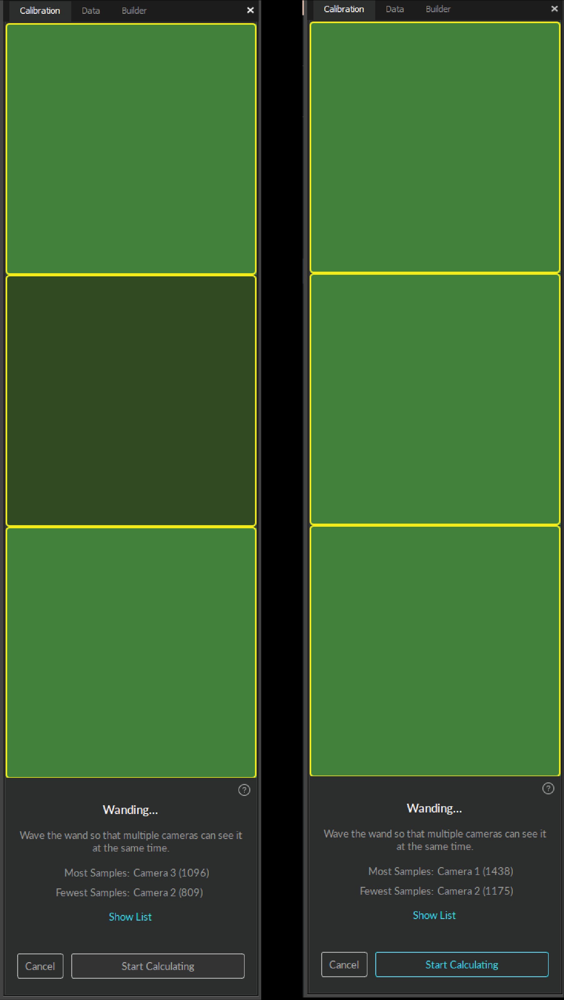

# Calibration

This page provides detailed instructions on camera system calibration and information about the [Calibration pane](../../motive-ui-panes/calibration-pane.md).

## Overview


Motive Quick Start - Calibration. _Calibration workflow._


Calibration is essential for high quality optical motion capture systems. During calibration, the system computes position and orientation of each camera and amounts of distortions in captured images, and they are used constructs a 3D capture volume in Motive. This is done by observing 2D images from multiple synchronized cameras and associating the position of known calibration markers from each camera through triangulation.

Please note that if there is any change in a camera setup over the course of capture, the system must be recalibrated to accommodate for changes. Moreover, even if setups are not altered, calibration accuracy may naturally deteriorate over time due to ambient factors, such as more or less light entering the capture volume as the day progresses and fluctuation in temperature. Thus, for accurate results, it is recommended to periodically calibrate the system.

### General Steps in Calibration

1. Prepare and optimize the capture volume for setting up a motion capture system.
2. Apply masks to ignore existing reflections in the camera view.
3. Collect calibration samples through the wanding process.
4. Review the wanding result and apply calibration.
5. Set the ground plane to complete the system calibration.


By default, Motive will start up on the calibration layout containing necessary panes for the calibration process. This layout can also be accessed by clicking on a calibration layout from the top-right corner , or by using the Ctrl+1 [hotkey](../motive-hotkeys.md).


## Starting a New Calibration

The [Calibration pane ](../../motive-ui-panes/calibration-pane.md)will guide you through the calibration process. This pane can be accessed by clicking on the  icon on the toolbar or by entering the calibration layout from the top-right corner . For a new system calibration, click the _New Calibration_ button and it will take you to the next step.

### Preparing and Optimizing the Setup

* Cameras need to be appropriately placed and configured to fully cover the capture volume.
* Each camera must be mounted securely so that they remain stationary during capture.
* Motive's camera settings used for calibration should ideally remain unchanged throughout the capture. Re-calibration may be required if there is any significant modifications to the settings that influence the data acquisition, such as camera settings, gain settings, and Filter Switcher settings.

.png>)

## Masking

Before performing system calibration, all extraneous reflections or unnecessary markers should ideally be removed or covered so that they are not seen by the cameras. If this is not possible, extraneous reflections can be ignored by applying _masks_ over them in Motive.

When the cameras detect reflections in their view, it will be indicated with a warning sign  to alert which cameras are seeing reflections; for Prime series cameras, the indicator LED ring will also light up in white.

Masks can be applied by clicking _Mask_ in the [calibration pane](../../motive-ui-panes/calibration-pane.md), and it will apply red masks over all of the reflections detected in the 2D camera view. Once masked, the pixels in the masked regions will entirely be filtered out from the data. Please note that Masks get applied additively, so if there are already masks applied in the camera view, clear them out first before applying a new one.


**Active Wanding:**

Applying masks to camera views only applies to calibration wands with passive markers. Active calibration wands are capable of calibrating the capture volume while the LEDs of all the cameras are turned off. If the capture has a large amount reflective material that cannot be moved, this method highly recommended.


.png>)

### Applying Masks

1. Check the [calibration pane](../../motive-ui-panes/calibration-pane.md) to see if any of the cameras are seeing extraneous reflections or noise in their view.
2. Check the corresponding camera view to identify where the extraneous reflection is coming from, and if possible, remove them from the capture volume or cover them so that the cameras do not see them.
3. In the [Calibration pane](../../motive-ui-panes/calibration-pane.md), click _Mask_ to apply masks over all of the existing reflections in the view.


**Masking from the Cameras Viewport**

Masks can also be applied from the Cameras viewport if needed. In the view pane, while the [cameras view](../../motive-ui-panes/viewport.md) is selected, click on the gear icon on the toolbar and options to apply auto-mask or clear existing masks will be listed. You can also click on the  icon to switch to different modes for manually applying and/or erasing masks.


 .png>)


You should be careful when using the masking features because masked pixels are completely filtered from the [2D data](../data-recording/data-types.md). In other words, the data in masked regions will not be collected for computing the [3D data](../data-recording/data-types.md), and excessive use of masking may result in data loss or frequent marker occlusions. For this reason, all removable reflective objects must be taken out or covered before the using the masking tool so the masking can be minimized. After all reflections are removed or masked from the view, proceed onto the wanding process.


.png>)

## Wanding

The wanding process is the core pipeline for collecting calibration sample into Motive. A calibration wand is waved in front of the cameras repeatedly throughout the volume, allowing all cameras to see the calibration markers. Through this process, each camera captures sample data points in order to compute their respective position and orientation in the 3D space.

### Wand Samples

It is important to understand the requirements of good wanding samples. For a streamline process, the following requirements must be met:

* At least two, or more, cameras must see all of the three calibration markers simultaneously.
* Cameras should only see calibration markers. If any other reflection or noise is detected during the wanding process, the sample will not be collected and may affect the calibration result negatively. For this reason, person who is wanding should not be wearing anything reflective.
* The markers on the calibration wand must be in good quality. If the marker surface is damaged or scuffed, the system may struggle to collect wanding samples.

.png>)

### Wand Types

There are different types of calibration wands suited for different capture applications.\\


**Calibration Wands**

* **CW-500**: The CW-500 calibration wand has a wand-width of 500mm when the markers are placed in the configuration A. This wand is suitable for calibrating a large size capture volume because the markers are spaced out further apart, allowing the cameras to easily capture individual markers even at long distances.
* **CW-500 Active**:Hosting the same dimensions as the CW-500, the active version is recommended for capture volumes that have a large amount of reflective material that cannot be removed. This wand calibrates the volume while the LEDs of all mounted cameras are turned off.
* **CW-250**: The CW-250 calibration wand has a wand-width of 250mm. This wand is suitable for calibrating small to medium size volumes. With narrower wand-width, it allows cameras, that are set up in a smaller volume, to be able to easily capture all three calibration markers within the same frame. CW-500 wand can also be used like CW-250 wand if the markers are positioned at configuration B.
* **CWM-125 / CWM-250**: Both CWM-125 and CWM-250 wands are designed for calibrating the system for precision capture applications. The accuracy of the calibrated wand width is most precise and reliable on these wands, and they are most suitable for doing precision capture in a small volume capture applications.


### Wanding Steps

1. Before starting the wanding process, if any of the cameras are detecting extraneous reflections, return to the masking steps and make sure they are either masked or removed.
2. Set the Calibration Type. If you are calibrating a new capture volume, choose _Full_ Calibration.
3. Under the Wand settings, specify the wand that you will be using to calibrate the volume. _It is very important to input the matching wand size here. When an incorrect dimension is given to Motive, the calibrated 3D volume will be scaled incorrectly._
4. Double check the calibration setting. Once confirmed, press _Start Wanding_ to start collecting the wanding sample. Here, do not have any specific camera selected if you wish to perform calibration for the entire camera system.
5. Start wanding. Bring your calibration wand into the capture volume and start waving the wand gently across the entire capture volume. Gently draw figure-eight repetitively with the wand to collect samples at varying orientations and cover as much space as possible for sufficient sampling. Wanding trails will be shown in colors on the [2D view](../../motive-ui-panes/viewport.md). A table displaying the status of the wanding process will show up in the [Calibration pane](../../motive-ui-panes/calibration-pane.md) to monitor the progress. For best results, wand the volume evenly and comprehensively throughout the volume, covering both low and high elevations. If you wish to start calibrating inside the volume, cover one of the markers and expose it wherever you wish to start wanding. When at least two cameras detect all the three markers while no other reflections are present in the volume, the wand will be recognized, and Motive will start collecting samples.
6. You'll want to wand until the camera squares in the [Calibration pane](../../motive-ui-panes/calibration-pane.md) turn from dark green (insufficient amount of samples) to light green (sufficient amount of samples). Once all the squares have turned light green the Start Calculating button will now be active.

.png>)

After wanding throughout all areas of the volume, consult the each 2D view from the Camera Preview Pane to evaluate individual camera coverage. Each camera should be thoroughly covered with wand samples. If there are any large gaps, attempt to focus wanding on those to increase coverage. When sufficient amounts of calibration samples are collected by each camera, press Calculate in the [Calibration Pane](../../motive-ui-panes/calibration-pane.md), and Motive will start calculating the calibration for the capture volume. Generally, 1,000-4,000 samples are enough. Samples above this threshold are unnecessary and can actually be detrimental to a calibration's accuracy.


**Wanding Tips**

* Avoid waving the wand too fast. This may introduce bad samples.
* Avoid wearing reflective clothing or accessories while wanding. This can introduce extraneous samples which can negatively affect the calibration result.
* Try not to collect samples beyond 10,000. Extra samples could negatively affect the calibration.
* Try to collect wanding samples covering different areas of each camera view. The status indicator on Prime cameras can be used to monitor the sample coverage on individual cameras.
* Although it is beneficial to collect samples all over the volume, it is sometimes useful to collect more samples in the vicinity of the target regions where more tracking is needed. By doing so, calibration results will have a better accuracy in the specific region.



**Marker Labeling Mode**

When performing calibration wanding, please make sure the Marker Labeling Mode is set to the default _Passive Markers Only_ setting. This setting can be found under Application Settings: _Application Settings_ → _Live-Reconstruction_ tab → _Marker Labeling Mode_. There are known problems with wanding in one of the active marker labeling modes. This applies for both passive marker calibration wands and IR LED wands.


### PrimeX Series: LED Indicator ring

For Prime series cameras, the LED indicator ring displays the status of the wanding process. As soon as the wanding is initiated, the LED ring will turn dark. When a camera is detecting all three markers on the calibration wand, a part of its LED ring will glow blue to indicate that the camera is collecting samples, and the clock-position of the blue light will indicate the wand position in the respective camera view. As calibration samples are collected by each camera, green lights will fill up around the ring to provide feedback on whether enough samples have been collected. Eventually, we want all of the cameras to be filled with a bright green light to make sure enough samples covering all areas of the camera view are collected. Also, starting from Motive 3.0, any cameras that do not have enough samples collected towards the end of the wanding process, the ring light will start glow in white.

For more information on camera status indicators, please visit our wiki page [here](../../hardware/camera-status-indicators.md).

### Calibration Types

**Calibration Type**

You can selected different calibration types before wanding: Full and Refine

* **Full:** Calibrate cameras from scratch, discarding any prior known position of the camera group or lens distortion information. A Full calibration will also take the longest time to run.
* **Refine:** Adjusts slight changes on the calibration of the cameras based on prior calibrations. This will solve faster than a Full calibration. Only use this if your previous calibration closely reflects the placement of cameras. In other words, Refine calibration only works if you do not move the cameras significantly from when you last calibrated them. Only slight modifications can be allowed in camera position and orientation, which often occurs naturally from the environment such as mount expansion.


Refinement results will be poor if a full calibration has not been completed previously on the selected cameras.


## Calibration Results

After sufficient marker samples have been collected, press _Start Calculating_ to calibrate using collected samples. The time needed for the calculation varies depending on the number of cameras included in the setup as well as the number of collected samples. As Motive starts calculating, blue wanding paths will be displayed on the view panes, and [Calibration pane](../../motive-ui-panes/calibration-pane.md) will provide visual feedback on calibration result of each camera. If you click Show list, you can check amount of error on each camera also.


**Tip:** Calibration details for recorded _Takes_ can also be reviewed. Select a _Take_ in the [Data pane](../../motive-ui-panes/data-pane.md), and related calibration results will be displayed under the [Properties pane](../../motive-ui-panes/properties-pane/). This information is available only for _Takes_ recorded in Motive 1.10 and above.


### Calibration Result Report

After the calculation, a calibration result will be reported in the [Calibration pane](../../motive-ui-panes/calibration-pane.md). The result is directly related to the mean error and the calibration result tiers are (on order from worst to best): Poor, Fair, Good, Great, Excellent, and Exceptional. If the results are acceptable, press Continue to apply the calibration. If not, press cancel and repeat the wanding process. In general, if it reports anything below excellent, you might want to adjust camera settings, wanding techniques, and try again.

.png>)

Calibration Result

| Category        | Description                                                                                                                                                                                                                                                                                                     |
| --------------- | --------------------------------------------------------------------------------------------------------------------------------------------------------------------------------------------------------------------------------------------------------------------------------------------------------------- |
| Mean Ray Error  | The Mean Ray Error reports a mean error value on how closely the tracked rays from each camera converged onto a 3D point with a given calibration. This represents the preciseness of the calculated 3D points during wanding. Acceptable value will vary depending on the size of the volume and camera count. |
| Mean Wand Error | The Mean Wand Error reports a mean error value of the detected wand length compared to the expected wand length throughout the wanding process.                                                                                                                                                                 |

## Ground Plane and Origin

The final step of the calibration process is setting the ground plane and the origin. This is accomplished by placing the calibration square in your volume and telling Motive where the calibration square is. Place the calibration square inside the volume where you want the origin to be located and the ground plane to be leveled to. The position and orientation of the calibration square will be referenced for setting the coordinate system in Motive. Align the calibration square so that it references the desired axis orientation.

The longer leg on the calibration square will indicate the positive z axis, and shorter leg will indicate the direction of the positive x axis. Accordingly, the positive y axis will automatically be directed upward in a right-hand coordinate system. Next step is to use the level indicator on the calibration square to ensure the orientation is horizontal to the ground. If any adjustment is needed, rotate the nob beneath the markers to adjust the balance of the calibration square.

.png>)

After confirming that the calibration square is properly placed and detected by the [Calibration pane](../../motive-ui-panes/calibration-pane.md), press _Set Ground Plane_. You may need to manually select the markers on the ground plane if Motive fails to auto-detect the ground plane. If needed, the ground plane can be adjusted later.

### Custom Calibration Square

Custom calibration square can also be used to define the ground plane. A set of three markers will be needed, and for accurate ground plane, these markers need to form a right-angle with one arm longer than the other, just like the shape of the calibration square. When using a custom calibration square, select _Custom_ in the drop-down menu, manually input the correct vertical offset and select the markers before setting the ground plane.

**Vertical offset**

The Vertical Offset is the offset distance between the center of markers on the [calibration square](calibration-squares.md) and the actual ground. For custom calibration square, you will need to define this in order to take account of the offset distance and sets the global origin slightly below the markers. Accordingly, this value should correspond to the actual distance between the center of the marker and the lowest tip at the vertex of the calibration square. This setting can also be used when you want to place the ground plane at a specific elevation. A positive offset value will place the plane below the markers, and a negative value will place the plane above the markers.

.png>)

 (1).png>)

### Ground Plane Refinement

Ground Plane Refinement feature is used to improve the leveling of the coordinate plane. To refine the ground plane, use the bottom page selector to access the refine page. Then, place several markers with a known radius on the ground, and adjust the vertical offset value to the corresponding radius. You can then select these markers in Motive and press Refine Ground Plane, and it will refine the leveling of the plane using the position data from each marker. This feature is especially useful when establishing a ground plane for a large volume, because the surface may not be perfectly uniform throughout the plane.

### Translating/Rotating Ground Plane

If you wish to adjust position and orientation of the global origin after the capture has been taken, you can apply the capture volume translation and rotation from the [Calibration pane](../../motive-ui-panes/calibration-pane.md). For applying changes to recorded _Takes_, Anew set of 3D data must be reconstructed from the recorded 2D data after the modification has been applied.

.png>) .png>)

## Calibration Files

Calibration files can be used to preserve calibration results. The information from the calibration is exported or imported via the CAL file format. Calibration files reduce the effort of calibrating the system every time you open Motive. Calibration files will be automatically saved into the default folders after each calibration but in general, it is suggested to export calibration before each capture session. By default, Motive loads the last calibration file that was created, this can be changed via the [Application Settings](../../motive-ui-panes/settings/).


**Note:** Whenever there is a change to the system setup (e.g. cameras moved) these calibration files will no longer be relevant and the system will need to be recalibrated.


## Refining Calibration

### Continuous Calibration

The continuous calibration feature continuously monitors and refines the camera calibration to its best quality. When enabled, _minor_ distortions to the camera system setup can be adjusted automatically without wanding the volume again. In other words, you can calibrate a camera system once and you will no longer have to worry about external distortions such as vibrations, thermal expansion on camera mounts, or small displacements on the cameras. For detailed information, read through the [Continuous Calibration](continuous-calibration.md) page.

**Enabling/Disabling Continuous Calibration**

Continuous calibration can be enabled, or disabled, from the [Calibration Pane](../../motive-ui-panes/calibration-pane.md) once a system has been calibrated. It will also show when the continue calibration has updated last time.

.png>)

### Offline Calibration

When capturing throughout a whole day, temperature fluctuations may degrade calibration quality and you will want to recalibrate the capture volume at different times of the day. However, repeating entire calibration process could be tedious and time-consuming especially with a high camera count setup. In this case, instead of repeating the entire calibration process, you can just record Takes with the wand waves and the calibration square, and use the take to re-calibrate the volume in the post-processing. This offline calibration can save calibration calculation time on the capture day because you can process the recorded wanding take in the post-processing instead. Also, the users can inspect the collected capture data and decide to re-calibrate the recorded _Take_ only when any signs of degraded calibration quality is seen from the captures.

**Offline Calibration Steps**

**1) Capture wanding/ground plane takes.** At different times of the day, record wanding Takes that closely resembles the calibration wanding process. Also record corresponding ground plane Takes with calibration square set in the volume for defining the ground plane.


Whenever a system is calibrated, a Calibration Wanding file gets saved and it could be used to reproduce the calibration file through the offline calibration process.


**2) Load the recorded Wanding \_Take**\_**.** If you wish to re-calibrate the cameras for captured Takes during playback, load the wanding take that was recorded around the same time.

**3) Motive:** [**Calibration pane**](../../motive-ui-panes/calibration-pane.md)**.** In the Edit mode, press Start Wanding. The wanding samples from recorded 2D data will be loaded.

**4) Motive:** [**Calibration pane**](../../motive-ui-panes/calibration-pane.md)**.** Press Calculate, and wait until the calculation process is complete.

**5) Motive:** [**Calibration pane**](../../motive-ui-panes/calibration-pane.md)**.** Apply Result and export the calibration file. _File tab_ → _Export Camera Calibration_.

**6) Load the recorded Ground Plane \_Take**\_**.**

**7) Open the saved calibration file.** With the Ground Plane _Take_ loaded in Motive, open the exported calibration file, and the saved camera calibration will be applied to the ground plane take.

**8) Motive: Perspective View.** From 2D data of the Ground Plane _Take_, select the calibration square markers.

**9) Motive:** [**Calibration pane**](../../motive-ui-panes/calibration-pane.md)**: Ground Plane.** Set the Ground plane.

**10) Motive: Perspective View.** Switch back to the Live mode. The recorded Take is now re-calibrated.

### Partial Calibration

.png>)

The partial calibration feature allows you to update the calibration for some selection of cameras in a system. The way this feature works is by updating the position of the selected cameras relative to the already calibrated cameras. This means that you only need to wand in front of the selected cameras as long as there is at least one unselected camera that can also see the wand samples.

This feature is especially helpful for high camera count systems where you only need to adjust a few cameras instead of re-calibrating the whole system. One common way to get into this situation is by bumping into a single camera. Partial calibrations allow you to quickly re-calibrate the single bumped camera that is now out of place. This feature is also useful for those who need to do a calibration without changing the location of the ground plane. The reason the ground plane does not need to be reset is because as long as there is at least one unselected camera Motive can use that camera to retain the position of the ground plane relative to the cameras.

**Partial Calibration Steps**

1. Open the [Calibration Pane](../../motive-ui-panes/calibration-pane.md).
2. Set Calibration Type: In most cases you will want to set this to _Full_, but if the camera only moved slightly _Refine_ works as well.
3. Specify the wand type.
4. From the [Calibration Pane](../../motive-ui-panes/calibration-pane.md), click Start Wanding. A pop-up dialogue will appear indicating that only selected cameras are being calibrated.
5. Choose _Calibrate Selected Cameras_ from the dialogue window.
6. Wave the calibration wand mainly within the view of the selected cameras.
7. Click Calculate. At this point, only the selected cameras will have their calibration updated.

**Notes:**

* This feature relies on the fact that the unselected cameras are in a good calibration state. If the unselected cameras are out of calibration, then using this feature will return bad calibration.
* Partial calibration does not update the calibration of unselected cameras. However, the calibration report that Motive provides does include all cameras that received samples, selected or unselected.
* The partial calibration process can also be used for adding new cameras onto existing calibration. Use _Full_ calibration type in this case.

### Camera Gizmo

Cameras can be modified using the gizmo tool if the Settings Window > General > Calibration > "Editable in 3D View" property is enabled. Without this property turned on the gizmo tool will not activate when a camera is selected to avoid accidentally changing a calibration. The process for using the gizmo tool to fix a misaligned camera is as follows:

1. Select the camera you wish to fix, then view from that camera (Hotkey: 3).
2. Select either the Translate or Rotate gizmo tool (Hotkey: W or E).
3. Use the red diamond visual to align the unlabeled rays roughly onto their associated markers.
4. Right lock then choose "Correct Camera Position/Orientation". This will perform a calculation to place the camera more accurately.
5. Turn on Continuous Calibration if not already done. Continuous calibration should finish aligning the camera into the correct location.

.png>) .png>)

## Active LED Calibration

The OptiTrack motion capture system is designed to track retro-reflective markers. However, active LED markers can also be tracked with appropriate customization. If you wish to use Active LED markers for capture, the system will ideally need to be calibrated using an active LED wand. Please contact us for more details regarding Active LED tracking.

## Q & A

### Troubleshooting

<strong>Q : It seems like the tracking measurements are scaled incorrectly. For example, I am seeing a 2m distance between two markers where the actual distance is only 1m.</strong>

A: Tracking measurement scaling incorrectly is likely because the capture volume was calibrated with a mismatching calibration wand. In such cases, make sure the correct wand dimension is selected under the OptiWand setting.

<strong>Q : The calibration wand does not get detected during the wanding process.</strong>

A: This could happen for two main reasons. It could be happening either because the markers on the calibration wand have been displaced from the intended positions or because the marker surface has been scratched or damaged. In such cases, Motive will not be able to detect the calibration wand, and for this reason, always try to keep the calibration wand markers untouched and undistorted.

If markers on the calibration wand have been damaged, please [contact us](http://optitrack.com/support/#contact-support) to have them replaced.

<strong>Q : Calibration result returns bad results</strong>

A: Make sure you are not wanding too fast. If the wand moves too fast, the centroid of the captured markers would not be good enough for calibration.

* Remove all intermittent extraneous reflections that might appear during wanding. These reflections will introduce false data into the samples and affect the overall calibration unfavorably. This is also often introduced by reflective accessories that the person, who is wanding, is wearing. Keep this in mind and remove/mask all extraneous reflections.
* Avoid collecting too many samples. Required number of samples will vary depending on system specs.

### General Questions

<strong>Q : Is it possible to reconstruct a new set of 3D data using a different camera calibration file?</strong>

A: Yes, this is possible but note that this will be reasonable only when the camera setup has remained unchanged. You can do this by the following steps:

1. Export a calibration (.cal) file from a previously recorded _Take_ or from a fresh new calibration.
2. Open the recorded _Take_ that already contains the old calibration file that you wish to update.
3. Load the new calibration file which was exported from the first step.
4. Perform reconstruct and auto-label. The obtained 3D data will reflect the new camera calibration.

<strong>Q : Which calibration wand is a good size?</strong>

A: In general, smaller calibration wands are suitable for calibrating smaller volumes, and larger calibration wands are suitable for calibrating larger volumes.

