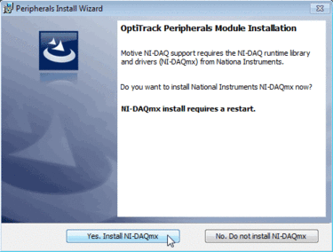

# Installation and License Activation

## Installation

### Host PC Requirements

Required PC specifications may vary depending on the size of the camera system. Generally, a system with more than 24 cameras will require the recommended specs to run properly.

<table><thead><tr><th>Recommended</th><th valign="top">Minimum</th></tr></thead><tbody><tr><td><ul><li>OS: Windows (64-bit) any version currently supported by Microsoft</li><li>CPU: Intel i7 or better, running at 3 GHz or greater</li><li>RAM: 16GB of memory</li><li>GPU: GTX 1050 or better with the latest drivers and support for OpenGL 3.2+</li><li>USB C port to connect the Security Key or USB A port to connect the Hardware Key</li></ul></td><td valign="top"><ul><li>OS: Windows (64-bit) any version currently supported by Microsoft</li><li>CPU: Intel i7, 3 GHz</li><li>RAM: 4GB of memory</li><li>GPU that supports OpenGL 3.2+</li><li>USB C port or an adapter for USB A to USB C to connect the Security Key, or a USB A port to connect the Hardware Key</li></ul></td></tr></tbody></table>

### Download Motive

Download the Motive installer from the [OptiTrack Support](https://optitrack.com/support/) website. Click [Downloads > Motive](https://optitrack.com/support/downloads/motive.html) to find the latest version of Motive, or previous releases, if needed.&#x20;

Both Motive: Body and Motive: Tracker use the same software installer.

### Installation Steps

#### **Run the Installer**

When the download is complete, run the installer to begin the installation.

#### **Install the USB Driver and Dependencies**

When installing Motive for the first time, the installer will prompt you to install the OptiTrack USB Driver. This driver is required for all OptiTrack USB devices, including the Security and Hardware Keys. You may also be prompted to install other dependencies such as the C++ redistributable, which is included in the Motive installer. After all dependencies have been installed, Motive will resume its installation.

#### **Install Motive**

Follow the installation prompts and install Motive in your desired file directory. We recommend installing the software in the default directory, `C:\Program File\OptiTrack\Motive`.

.png>)

#### **OptiTrack Peripheral Module**

At the Custom Setup section of the installation process, you will be prompted to choose whether to install the Peripheral Devices along with Motive. If you plan to use force plate, NI-DAQ, or EMG devices along with the motion capture system, the Peripheral Devices must be installed.&#x20;

If you are not going to use these devices, you may skip to the next step.


**Peripheral Module NI-DAQ**

After selecting to install the Peripheral Devices, you will be prompted to install the OptiTrack Peripherals Module along with the NI-DAQmx driver at the end of the Motive installation. Select _Yes_ to install the plugins and the NI-DAQmx driver. This may take a few minutes to install and only needs to be done one time.


.png>) 

#### **Finish Installation**

Once all the steps above are completed, Motive is installed. If you want to use additional plugins, visit the [downloads](http://optitrack.com/downloads/plugins.html) page.

### Host PC Setup

The following settings are sufficient for most mocap applications. The page [Windows 11 Optimization for Realtime Applications](../general-troubleshooting/windows-11-optimization-for-realtime-applications.md) has our recommended configuration for more demanding uses. &#x20;

#### **Firewall / Antivirus**

We recommend isolating the camera network and the host PC so that firewall and antivirus protection are not required. That will not be possible in situations where the host PC is connected to a corporate  or institutional network. If so:&#x20;

* Make sure all antivirus software installed on the Host PC allows Motive traffic.
* For Ethernet cameras, make sure the windows firewall is configured so the camera network is recognized.&#x20;

Potential issues that can occur if antivirus software is installed:&#x20;

* Some programs (i.e., BitDefender, McAfee, etc.) may block Motive from downloading. The Motive software downloaded directly from [OptiTrack.com/downloads](https://optitrack.com/support/downloads/) is safe for use and will not harm your computer.&#x20;
* If you're unable to view cameras in the [Devices pane](../motive-ui-panes/devices-pane.md), or you are seeing frame/data drops, verify that the antivirus or firewall settings allow all traffic from your camera network to Motive and vice versa.&#x20;
* Antivirus software may need to be completely uninstalled if it continues to interfere with camera communication.&#x20;

#### **High Performance**

Windows power saving mode limits CPU usage, which can impact Motive performance.&#x20;

To best utilize Motive, set the Power Plan to _High Performance_. Go to _Control Panel → Hardware and Sound → Power Options_ as shown in the image below.

.png>) .png>)

#### **Graphics Card Settings**

**Required only for computers with integrated graphics.**

Computers that have integrated graphics on the motherboard in addition to a dedicated graphics card may switch to the integrated graphics when the computer goes to sleep mode. This may cause the Viewport to become unresponsive when the PC exits sleep mode.&#x20;

To prevent this, set Motive to use high performance graphics only.&#x20;

* Type _Graphics_ in the Windows Search bar to find and open the Graphics settings, located at _System > Display > Graphics_.&#x20;

<figure><figcaption>
Add an application for custom graphics settings. 
</figcaption></figure>

* In the Add an app field, select Desktop app, then browse to the Motive executable: \
  C:\Program Files\OptiTrack\Motive\Motive.exe.
* Motive will now appear in the list of customizable applications.&#x20;
* Click Motive to display, then click, the Options button.
* &#x20;Set the Graphics preference to High performance and click Save.

<figure><figcaption>
Windows Graphics preference for an application.
</figcaption></figure>

## License Activation

Once Motive is installed, the next step is to activate the software using the Motive 3.x license information provided at the time of purchase, and attach either the USB Security or Hardware Key. The Security Key attaches to the Host PC either through a USB C port or using an adapter for USB A to USB C. The Hardware Key attaches to the Host PC through a USB A port.

<figure><figcaption>
     Security Key.
</figcaption></figure> <figure><figcaption>
          Hardware Key. 
</figcaption></figure>

### Security Key vs. Hardware Key

OptiTrack introduced a new licensing option with Motive 3.&#x20;

* **Security Key (Motive 3.x and above):** Beginning with version 3.0, a USB C Security Key is now available.&#x20;
* **Hardware Key (Motive 2.x or below):** The USB A Hardware Key works with all versions of Motive. Motive 2.x versions and earlier require the USB A Hardware Key.&#x20;

Only one key should be connected at a time.&#x20;

Security Keys are purchased separately. For more information, please see the following page: [https://optitrack.com/accessories/license-keys/](https://optitrack.com/accessories/license-keys/)

To replace your Hardware Key with a Security Key, please [contact our Technical Sales group](https://www.optitrack.com/contact/).

### License Types

There are five types of Motive licenses:&#x20;

* Motive:Body-Unlimited
* Motive:Body
* Motive:Tracker
* Motive:Edit-Unlimited
* Motive:Edit&#x20;

Each license unlocks different features in the software depending on the use case that the license is intended to facilitate.

* The Motive:Body and Motive:Body-Unlimited licenses are intended for either small (up to 3) or large-scale Skeleton tracking applications.
* The Motive:Tracker license is intended for real-time Rigid Body tracking applications.
* The Motive:Edit and Motive:Edit Unlimited licenses are intended for users modifying data after it has been captured (post production work).&#x20;

For more information on different Motive licenses, check the software comparison table on our [website](http://optitrack.com/software/compare/). An abbreviated version is available in the table below.

<table><thead><tr><th width="136">Feature</th><th width="104" align="center">Tracker</th><th width="110" align="center">Body</th><th width="147" align="center">Body Unlimited</th><th width="100" align="center">Edit</th><th align="center">Edit Unlimited</th></tr></thead><tbody><tr><td>Live Rigid Bodies </td><td align="center">Unlimited</td><td align="center">Unlimited</td><td align="center">Unlimited</td><td align="center">No</td><td align="center">No</td></tr><tr><td>Live Skeletons &#x26; Trained Markersets </td><td align="center">No</td><td align="center">Up to 3</td><td align="center">Unlimited</td><td align="center">No</td><td align="center">No</td></tr><tr><td>Edit Rigid Bodies and Non-Trained (Manually- Labeled) Markersets</td><td align="center">Unlimited</td><td align="center">Unlimited</td><td align="center">Unlimited</td><td align="center">Unlimited</td><td align="center">Unlimited</td></tr><tr><td>Edit Skeletons &#x26; Trained Markersets </td><td align="center">No</td><td align="center">Up to 3</td><td align="center">Unlimited</td><td align="center">Up to 3</td><td align="center">Unlimited</td></tr><tr><td>Duplex Mode</td><td align="center">No</td><td align="center">Live Capture and Post</td><td align="center">
Live Capture 

and Post
</td><td align="center">Post Only</td><td align="center">Post Only</td></tr></tbody></table>

### Activate the License

Motive licenses are activated using the License Activation tool. This tool can be found:

* On the OptiTrack Support page.
* On the Host PC at C:\Program Files\OptiTrack\Motive\LicenseTool.
* On the Motive splash screen, when an active license is not installed.

#### License Activation Tool

* Launch Motive. If the license has been activated, the splash screen will appear momentarily before Motive loads. If not, the splash screen will display the _License not found_ error and a menu.&#x20;

<figure><figcaption>
Motive splash screen with the License not found message.
</figcaption></figure>

* Click _License Tool_ to open the License Activation Tool.&#x20;

<figure><figcaption></figcaption></figure>

* The _License Serial Number_ and _License Hash_ were provided on a printed card (enclosed in an envelope) when the license was purchased. If the card is missing, this information is also located on the order invoice.
* The _Security Key Serial Number_ is printed on the attached USB security or hardware key. &#x20;
* If you have already activated the license on another machine, make sure to enter the same name when activating it on the new PC.
* Once you have entered all the information, click _Activate_. The license files will be copied into the license folder: C:\ProgramData\OptiTrack\License.
* Click _Retry_ to finish loading Motive.


Only one license (initial or maintenance) can be activated at a time. If you purchased one or more years of maintenance licensing, wait until the initial license expires before activating the first maintenance license. Let the first maintenance license expire before activating the next, and so on.&#x20;


#### **Online Activation Tool**

The Online License Activation tool allows you to activate licenses from the [OptiTrack Support page](https://optitrack.com/support/). This option requires more steps but is helpful if you are activating licenses for multiple systems or do not have access to the host PC to use the license tool from the splash screen.&#x20;

.png>)

* Enter the email address to send the license file(s) to in the E-mail Address field.&#x20;
* The _License Serial Number_ and _License Hash_ are located on the order invoice.
* The _Device Serial Number_ is printed on the USB security key.&#x20;
* If you have already activated the license on another machine, make sure to enter the same name when activating it on the new PC.
* Once you have entered all the information, click _Activate_.&#x20;
* The license file(s) will arrive via email. Check your spam filter and junk mail if you don't see it in your inbox.&#x20;
* Download the license file(s) to the License Folder on the hard drive of the host PC: C:\ProgramData\OptiTrack\License.
* Insert the USB security key, then launch Motive.&#x20;


**Notes on Connecting the Security or Hardware Key**

* Connect the Security or Hardware Key to a USB port where the USB bus does not have a lot of traffic. This is especially important if you have other peripheral devices that connect to the computer via USB ports. If there is too much other data flowing through the USB bus used by the Security or Hardware Key, Motive might not be able to detect the key.
* Make sure only one key is plugged in. If both a Hardware Key and a Security Key are connected to the same computer, Motive may not activate properly.


### License Details

#### Check My License

The Check My License tool allows you to lookup license information to obtain the expiration date.&#x20;

.png>)

**About Motive Screen**

_About Motive_ includes information about the active license, which can be exported to a text file by clicking the Export... link at the bottom.&#x20;

<figure><figcaption>
About Motive with an active license.
</figcaption></figure>

If Motive does not detect an active license, you can still open _About Motive_ from the splash screen, however the only information available is the Machine ID.&#x20;

<figure><figcaption>
About Motive without an active license. 
</figcaption></figure>

## Using Activated Software on a Different Computer

You can install Motive on more than one computer with the same license and security key, but you will not be able to use it on multiple PCs simultaneously. Only the PC with the security key connected will be able to run Motive.  &#x20;

#### Use the License Activation Tool

You can use the License Activation Tool to acquire the license files for the new host PC. This includes the initial license and any maintenance licenses that were purchased.

* When run from the Motive splash screen, the tool will download the license files directly&#x20;
* When run from the OptiTrack Support website, the license files will be sent via emailed. &#x20;

When using this method to transfer the license, enter the same contact information that was entered the first time the license was activated. We recommend exporting the license data to a text file from the original installation to use as a reference. &#x20;

If the original information is lost, please contact [OptiTrack Support](https://optitrack.com/support/) for assistance.&#x20;

#### Copy and Paste the License Files

The license file(s) can also be copied from one computer to another. License files are located at c:\ProgramData\OptiTrack\License. Open the license folder from the Motive Help menu. &#x20;

If the files are copied from one PC to another, there is no need to re-run the License Activation Tool to begin using the currently active license. Simply install the version of Motive supported by the license and connect the security key.&#x20;

## More Questions?

For more information on licensing of Motive, refer to the Licensing FAQs from the OptiTrack website:

* [http://optitrack.com/support/faq/licensing.html](http://optitrack.com/support/faq/licensing.html)

For common licensing issues and troubleshooting recommendations, please see the Licensing Troubleshooting page. &#x20;

For more questions, contact OptiTrack Support:

* [http://optitrack.com/support/](http://optitrack.com/support/)
* Please attach the LicenseData.txt file exported from the _About Motive_ panel as a reference.
