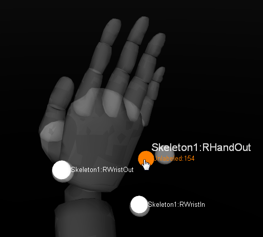

# Labeling

## Labeling Overview

### **Marker Labels**

Marker labels are software tags assigned to identify **trajectories** of reconstructed 3D markers so they can be referenced for tracking individual markers, Rigid Bodies, Skeletons, or Trained Markersets. Labeled trajectories can be exported individually or combined together to compute positions and orientations of the tracked objects.&#x20;


**Solved Data:** After editing marker data in a recorded _Take_, corresponding [Solved Data](data-recording/data-types.md#solved-data) must be updated.


### **Monitoring Labels**

Labeled or unlabeled trajectories can be identified and resolved from the following places in Motive:

* [**3D Perspective Viewport**](../motive-ui-panes/viewport.md#perspective-view): From the 3D viewport, select _Marker Labels_ in the visual aids  menu to show marker labels for selected markers.
* [**Labels pane**](../motive-ui-panes/labels-pane.md): The Labels pane lists all the marker labels and corresponding percentage gap for each label. The label will turn magenta in the list if it is missing at the current frame.
* [**Graph View pane**](../motive-ui-panes/graph-view-pane.md): The timeline scrubber highlights in red any frames where the selected label is not assigned to a marker. The _Tracks_ view provides a list of labels and their continuity in a captured _Take_.

 

## Labeling Methods

There are two approaches to labeling markers in Motive:

* **Auto-label pipeline:** Automatically label sets of Rigid Body, Skeleton, or Trained Markerset markers using calibrated asset definitions. Motive uses the unique marker placement stored in the Asset definition to identify an asset and applies its associated marker labels automatically. This occurs both in real-time and post-processing.&#x20;


Auto-labeling applies only to assets enabled with a checkmark  in the [Assets pane](../motive-ui-panes/assets-pane.md).


* **Manual Label:** Manually label individual markers using the [Labels pane](../motive-ui-panes/labels-pane.md). Use this workflow to give Rigid Bodies and Trained Markersets more meaningful labels.

.png>) 

### Auto-label

As noted above, Motive stores information about Rigid Bodies, Skeletons, and Trained Markersets in asset definitions, which are recorded when the assets are created. Motive's auto-labeler uses asset definitions to label a set of reconstructed 3D trajectories that resemble the marker arrangements of active assets.&#x20;

Once all of the markers on active assets are successfully labeled, corresponding Rigid Bodies and Skeletons get tracked in the 3D viewport.

The auto-labeler runs in real-time during Live mode and the marker labels are saved in the recorded _TAKES_. Running the auto-labeler again in post-processing will label the Rigid Body and Skeleton markers again from the 3D data.

### Auto-labeling Steps

#### **From the Data pane**

1. Select the _Take(s)_ from the [Data pane](../motive-ui-panes/data-pane.md).
2. Right-click to open the context menu.
3. Click _reconstruct and auto-label_ to process the selected _Takes_. This pipeline creates a new set of 3D data and auto-labels the markers that match the corresponding asset definitions.


Be careful when reconstructing a _Take_ again either by **Reconstruct** or **Reconstruct and Auto-label.** These processes overwrite the 3D data, discarding any post-processing edits on trajectories and marker labels.&#x20;

Recorded Skeleton marker labels, which were intact during the live capture, may be discarded, and the reconstructed markers may not be auto-labeled correctly again if the Skeletons are never in well-trackable poses during the captured _Take_. This is another reason to always start a capture with a good [calibration pose](skeleton-tracking.md#calibration-pose) (e.g., a T-pose).


### Rename Labels

Label names can be changed through the [Constraints Pane](../motive-ui-panes/constraints-pane/) or the [Labels Pane](../motive-ui-panes/labels-pane.md).&#x20;

* The [Constraints pane](../motive-ui-panes/constraints-pane/) displays marker labels for either the selected asset or all assets in the _Take_. Markers that are not part of an asset are not included.&#x20;
* The Labels pane displays marker labels for either the selected asset or all markers in the _Take_.&#x20;

 <figure><figcaption>
Marker labels in Labels pane.
</figcaption></figure>

**To change a marker label:**

* Right-click the label and select _Rename_, or
* Click twice on the label name to open the field for editing.&#x20;


We recommend using the single asset view rather than _-All-_ when relabeling markers from the Constraints pane.


**To switch assets:**

Use the Assets pane or the 3D Viewport to select a different asset or click the  button in the Constraints pane to unlock the asset selection drop-down.&#x20;

<figure><figcaption>
Asset Selection unlocked in the Constraints Pane.
</figcaption></figure>


* When _-All-_ is selected in the Constraints pane, the marker labels include the asset name as a prefix, e.g., _Bat\_marker1._ Delete the prefix if updating labels from this view.
* The Labels pane does not include the asset name prefix when _-All-_ is selected.&#x20;


## Manual Labeling

There are times when it is necessary to **manually label** a section or all of a trajectory, either because the markers of a Rigid Body, Skeleton, or Trained Markerset were misidentified (or unidentified) during capture or because individual markers need to be labeled without using any tracking assets. In these cases, the [Labels pane](../motive-ui-panes/labels-pane.md) in Motive is used to perform manual labeling of individual trajectories.&#x20;

The manual labeling workflow is supported only in post-processing of the capture when a _Take_ file (.TAK) has been loaded with 3D data as its playback type. In case of [2D data](reconstruction-and-2d-mode.md#2d-mode) only capture, the _Take_ must be **Reconstructed** first in order to assign, or edit, the marker labels in 3D data.&#x20;

This manual labeling process, along with [3D data editing](data-editing.md), is typically referred to as _post processing_ of mocap data.

## Labels pane


Labeling Tutorial 2. Manual Labeling in Motive. **This video is based on older version of Motive. There maybe a few differences in Motive 2.0, but the general workflow still remains the same.**


The [Labels pane](../motive-ui-panes/labels-pane.md) is used to assign, remove, and edit marker labels in the [3D data](data-recording/data-types.md#3d-data) and is used along with the [Editing Tools](data-editing.md) for complete post-processing.

* Shows the labels involved in the Take and their corresponding _percentage of occluded gaps_ values. If the trajectory has no gaps (100% complete), no number is shown.&#x20;
* By default, only labeled markers are shown. To see unlabeled markers, click the  button in the upper right corner of the pane and select any layout option other than _Labeled only_.&#x20;
* Labels are color-coded to note the label's status in the current frame of 3D data.  Assigned marker labels are shown in white, while labels without reconstructions and unlabeled reconstructions that are not in the current frame are shown in magenta.&#x20;

Please see the [Labels pane](../motive-ui-panes/labels-pane.md) page for a detailed explanation of each option.


The **Tracks View** under the [Graph View pane](../motive-ui-panes/graph-view-pane.md) can be used in conjunction with the Labels pane to quickly locate gaps in a trajectory to see which markers and gaps are associated.&#x20;


### Quick Label Mode

The **Quick Label** mode allows you to tag labels with single-clicks in the 3D Viewport and is a handy way to reassign or modify marker labels throughout the capture.&#x20;

.png>) .png>)

### Quick Label Mode Steps

1. Select the asset to label, either from the Assets Pane, the 3D Viewport, or from the asset selection drop-down list in the Labels pane.&#x20;
2. This will display all of the asset's markers and their corresponding percentage gap.
3. Click the  button and select any option other than _Labeled Only_ to see unlabeled markers.&#x20;
4. Select the **Label Range**:
   * **All or Selected:**  Assign labels to a selected marker for all, or selected, frames in a capture.
   * **Spike or Fragment:**  Apply labels to a marker within the frame range bounded by trajectory gaps and spikes (erratic change).&#x20;
   * **Swap Spike or Fragment:**  Apply labels only to spikes created by labeling swaps. &#x20;
5. Inspect the behavior of the selected trajectory then use the **Apply Labels** drop-down list in the Labels pane Settings to apply the selected label to frames forward or frames backward or both.  Click  to display settings, if necessary.&#x20;
6.  Click the Mouse Actions button  to switch to Quick Label Mode (Or use Hotkey: D). The cursor will change to a finger icon. 

    <figure><figcaption>
Mouse Actions menu.
</figcaption></figure>
7.  &#x20;Select a label from the Labels pane. The label name will display next to the pointed finger until a marker is selected in the 3D Viewport, assigning the label to that marker.\
     

    <figure><figcaption>
Quick Label Mode in the 3D Viewport.
</figcaption></figure>

8.  The **Increment Options** setting determines how the Quick Label mode should behave after a label is assigned. 

    <figure><figcaption></figcaption></figure>

    * &#x20;**Do Not Increment** keeps the same label attached to the cursor.&#x20;
    * **Go To Next Label** automatically advances to the next label in the list, even if it is already assigned to a marker in the current frame. This is the default option.&#x20;
    * **Go To Next Unlabeled Marker** advances to the next label in the list that is not assigned to a marker in the current frame.&#x20;
9. When you are done, toggle back to normal Select Mode using either Hotkey: D or the Mouse Actions menu.


When the [3D viewport](../motive-ui-panes/viewport.md#perspective-view) Visual Aids are set to display marker labels and Quick Label mode is toggled on, _all_ of the labels for visible markers will appear in the 3D viewport.&#x20;

Uncheck Labels in the viewport Visuals if you do not wish to see them in Quick Label mode.


.png>)

### Tips for Labeling Skeletons

* The hip bone is the main parent bone, top of the hierarchy, where all other child bones link to. Always label the hip segment first when working with skeletons. Manually assigning hip markers sometimes helps the auto-labeler to label the entire asset.
* Show/Hide **Skeleton visibility** under the Visual Aids  options in the [perspective view](../motive-ui-panes/viewport.md#perspective-view) to have a better view on the markers when assigning marker labels.
* Toggle **Skeleton selectability** under the Selection Options  in the [perspective view](../motive-ui-panes/viewport.md#perspective-view) to use the Skeleton as a visual aid without it getting in the way of marker data.
* Show/Hide **Skeleton sticks and marker colors** under the Visual Aids  in the [perspective view](../motive-ui-panes/viewport.md#perspective-view) options for intuitive identification of labeled markers as you tag through Skeleton markers.
* Enable the **Quality Visual** setting in the skeleton properties to graphically see:
  * When there are no markers contributing to a bone. The bone will appear red.
  * When a Degree of Freedom limit is reached. The bone will appear blue.

## Labeling Workflows

The labeling workflow is flexible and alternative approaches to the steps in this section can also be used.&#x20;


**General Labeling Tips**

* Use the [Graph View pane](../motive-ui-panes/graph-view-pane.md) to monitor occlusion gaps and labeling errors during post-processing.
* [Motive Hotkeys](motive-hotkeys.md) can increase the speed of the workflow. Use **Z and Shift+Z hotkeys** to quickly find gaps in the selected trajectory.
* Set the Visual Aids for Markers in the perspective view to _Hide for Disabled Assets_ then uncheck the  box to the left of the asset name in the Assets pane when you are done labeling it to better focus on the remaining unlabeled assets.&#x20;


### Using Combined Reconstruction and Auto-label Pipeline

**Step 1.** In the [Data pane](../motive-ui-panes/data-pane.md), **Reconstruct and auto-label** the take with all of the desired assets enabled.

**Step 2.** In the [Graph View pane](../motive-ui-panes/graph-view-pane.md), examine the trajectories and navigate to the frame where labeling errors are frequent.

**Step 3.** Open the [Labels pane](../motive-ui-panes/labels-pane.md).

**Step 4.** Select an asset that you wish to label.

**Step 5.** From the label columns, click on the marker label that you wish to re-assign.

**Step 6.** Inspect behavior of a selected trajectory and its labeling errors and set the appropriate labeling settings (allowable gap size, maximum spike and applied frame ranges).

**Step 7.** Switch to the QuickLabel mode (Hotkey: D).

**Step 8.** In the [Perspective View](../motive-ui-panes/viewport.md#perspective-view), assign the labels to the corresponding marker reconstructions by clicking on them.

**Step 9.** When all markers have been labeled, switch back to the Select Mode.

### Using Standalone Reconstruction Pipeline and Auto-label Pipeline Separately

**Step 1.** Start with 2D data of a captured _Take_ with model assets (Skeletons, Rigid Bodies, or Trained Markersets).

**Step 2.** **Reconstruct and Auto-Label**, or just **Reconstruct**, the _Take_ with all of the desired assets enabled under the [Assets pane](../motive-ui-panes/assets-pane.md). If you use reconstruct only, you can skip step 3 and 5 for the first iteration.

**Step 3.** Examine the reconstructed 3D data and inspect the frame range where markers are mislabeled.

**Step 4.** Using the [Labels pane](../motive-ui-panes/labels-pane.md), manually fix/assign marker labels, paying attention to the label settings (direction, max gap, max spike, selected duration).

**Step 5.** Unlabel all trajectories you want to re-auto-label.

**Step 6.** **Auto-Label** the _Take_ again. Only the unlabeled markers will get re-labeled, and all existing labels will be kept the same.

**Step 7.** Re-examine the marker labels. If some of the labels are still not assigned correctly from any of the frames, repeat steps 3-6 until complete.

### Labeling Error Fix

The general process for resolving labeling error is:

1. Identify the trajectory with the labeling error.
2. Determine if the error is a swap, an occlusion, or unlabeled.
3. Resolve the error with the correct tool.

* Swap: Use the Swap Fix tool (Edit Tools) or just re-assign each label (Labels pane).
  * When manually labeling markers to fix swaps, set appropriate settings for the labeling direction, max spike, and selected range settings.
* Occlusion: Use the Gap Fill tool (Edit Tools).
* Unlabeled: Manually label an unlabeled trajectory with the correct label (Labels panel).

For more data editing options, read through the [Data Editing](data-editing.md) page.

