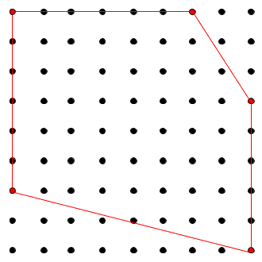

# Rigid Body Tracking

In Motive, Rigid Body assets are used for tracking rigid, unmalleable, objects. A set of markers is securely attached to tracked objects, and respective placement information is used to identify the object and report 6 Degree of Freedom (6DoF) data. Thus, it's important that the distances between placed markers stay the same throughout the range of motion. Either passive retro-reflective markers or active LED markers can be used to define and track a Rigid Body.&#x20;

## Rigid Body Marker Placement

A Rigid Body in Motive is a collection of three or more markers on an object that are interconnected to each other with an assumption that the tracked object is unmalleable. More specifically, Motive assumes the spatial relationship among the attached markers remains unchanged and the marker-to-marker distance does not deviate beyond the allowable _deflection_ tolerance defined under the corresponding Rigid Body properties. Otherwise, involved markers may become [unlabeled](../data-recording/). Cover any reflective surfaces on the Rigid Body with non-reflective materials and attach the markers on the exterior of the Rigid Body where cameras can easily capture them.


**Tip:** If you wish to get more accurate 3D orientation data (pitch, roll, and yaw) of a Rigid Body, it is beneficial to spread markers as far as you can within the same Rigid Body. By placing the markers this way, any slight deviation in the orientation will be reflected from small changes in the position.


.png>)

### Number of Markers

In a 3D space, a minimum of three coordinates are required for defining a plane using vector relationships. Likewise, at least three markers are required to define a Rigid Body in Motive. Whenever possible, it is best to use 4 or more markers to create a Rigid Body. Additional markers provide more 3D coordinates for computing positions and orientations of a rigid body, making overall tracking more stable and less vulnerable to marker occlusions. When any of markers are occluded, Motive can reference other visible markers to solve for the missing data and compute the position and orientation of the rigid body.

However, placing too many markers on one Rigid Body is not recommended. When too many markers are placed in close vicinity, markers may overlap on the camera view, and Motive may not resolve individual reflections. This can increase the likelihood of label-swaps during capture. Securely place a sufficient number of markers (usually less than 10), just enough to cover the main frame of the Rigid Body.


Tip: The recommended number of markers per Rigid Body is **4 \~ 12 markers**.&#x20;

You may encounter limits if using an excessive number of markers, or experience system performance issues when using the refine tool on such an asset. &#x20;


### Asymmetrical Marker Placements

Within a Rigid Body asset, the markers should be placed asymmetrically because this provides a clear distinction of orientations. Avoid placing the markers in symmetrical shapes such as squares, isosceles, or equilateral triangles. Symmetrical arrangements make asset identification difficult and may cause the Rigid Body assets to _flip_ during capture.

### Unique Marker Placements

When tracking multiple objects using passive markers, it is beneficial to create **unique** Rigid Body assets in Motive. Specifically, you need to place retroreflective markers in a distinctive arrangement between each object, which will allow Motive to more clearly identify the markers on each Rigid Body throughout capture. In other words, their unique, non-congruent, arrangements work as distinctive identification flags among multiple assets in Motive. This not only reduces processing loads for the Rigid Body solver, but it also improves the tracking stability. Not having unique Rigid Bodies could lead to labeling errors especially when tracking several assets with similar size and shape.


**Note for Active Marker Users**

If you are using [OptiTrack active markers](../../active-components/active-marker-tracking/) for tracking multiple Rigid Bodies, it is not required to have unique marker placements. Through the active labeling protocol, active markers can be labeled individually, and multiple rigid bodies can be distinguished through uniquely assigned marker labels. Please read through [Active Marker Tracking](../../active-components/active-marker-tracking/) page for more information.


#### **What Makes Rigid Bodies Unique?**

The key idea of creating unique Rigid Body is to **avoid geometrical congruency** within multiple Rigid Bodies in Motive.

* **Unique Marker Arrangement.** Each Rigid Body must have a unique, non-congruent, marker placement creating a unique shape when the markers are interconnected.
* **Unique Marker-to-Marker Distances.** When tracking several objects, introducing unique shapes could be difficult. Another solution is to vary Marker-to-marker distances. This will create similar shapes with varying sizes and make them distinctive from the others.
* **Unique Marker Counts** Adding extra markers is another method of introducing uniqueness. Extra markers will not only make the Rigid Bodies more distinctive, but they will also provide more options for varying the arrangements to avoid the congruency.

#### **What Happens When Rigid Bodies Are Not Unique?**

Having multiple non-unique Rigid Bodies may lead to mislabeling errors. However, in Motive, non-unique Rigid Bodies can also be tracked fairly well as long as the non-unique Rigid Bodies are continuously tracked throughout capture. Motive can refer to the trajectory history to identify and associate corresponding Rigid Bodies within different frames.&#x20;

Even though it is possible to track non-unique Rigid Bodies, we strongly recommend making each asset unique. Tracking of multiple congruent Rigid Bodies could be lost during capture either by occlusion or by stepping outside of the capture volume. Also, when two non-unique Rigid Bodies are positioned in vicinity and overlap in the scene, their marker labels may get swapped. If this happens, additional efforts are required to [correct the labels](../labeling.md) in post-processing of the data.

#### **Tracking Multiple Rigid Bodies**&#x20;

Depending on the object, there could be limitations on marker placements and number of variations of unique placements that could be achieved. The following list provides sample methods for varying unique arrangements when tracking multiple Rigid Bodies.

* **Create Distinctive 2D Arrangements.** Use distinctive, non-congruent, marker arrangements as the starting point for producing multiple variations, as shown in the examples above.
* **Vary marker height.** Use marker bases or posts of different heights to introduce variations in elevation to create additional unique arrangements.
* **Vary Maximum Marker to Marker Distance.** Increase or decrease the overall size of the marker arrangements.
* **Add Two (or more) Markers** Lastly, if an additional variation is needed, add extra markers. We recommended adding at least two extra markers in case any become occluded.

## Creating a Rigid Body

In creating a Rigid Body asset, a set of markers attached to a rigid object are grouped and auto-labeled as a Rigid Body. This Rigid Body definition can be used in multiple takes to continuously auto-label the same asset markers. Motive recognizes the unique spatial relationship in the marker arrangement and automatically labels each marker to track the Rigid Body.&#x20;

<figure><figcaption>
Builder Pane:  Create a Rigid Body.
</figcaption></figure>

### Steps to Create a Rigid Body

**Step 1:**  Select all associated Rigid Body markers in the [3D viewport](../../motive-ui-panes/viewport.md#perspective-view).

**Step 2:**  On the [Builder pane](../../motive-ui-panes/builder-pane.md), confirm that the selected markers match those on the object you want to define as the Rigid Body.&#x20;

**Step 3:**  Click _Create_ to define a Rigid Body asset from the selected markers.

You can also create a Rigid Body by doing the following actions while the markers are selected:

* **Perspective View (3D viewport):**  Right-click the selection in the perspective view to access the context menu. Under the _Markers_ section, click _Create Rigid Body_.

<figure><figcaption>
Creating a Rigid Body from selected markers (8)  using the right-click context menu.
</figcaption></figure>

* **Assets pane:**  Click the add  button at the bottom of the [Assets pane](../../motive-ui-panes/assets-pane.md).

<figure><figcaption>
Creating a Rigid Body from the Assets pane. 
</figcaption></figure>

* **Hotkey:**  While the markers are selected, use the _create Rigid Body_ hotkey (Default: Ctrl +T).

**Step 4:**  Once the Rigid Body asset is created, the markers will be colored (labeled) and interconnected to each other. The newly created Rigid Body will be listed under the [Assets pane](../../motive-ui-panes/assets-pane.md).


Motive can detect and pair a rigid body to its associated IMU. See the [IMU Sensor Fusion](../imu-sensor-fusion.md) page for more details. &#x20;


<figure><figcaption>
Rigid Body in the 3D Viewport.
</figcaption></figure>


**Defining Assets in Edit mode:**

If Rigid Bodies are created in Edit mode, the corresponding _Take_ needs to be [auto-labeled](../data-recording/data-types.md). The Rigid Body markers will be labeled using the Rigid Body asset and positions and orientations will be computed for each frame. If the 3D data have not been labeled after edits on the recorded data, the asset may not be tracked.


### Rigid Body Properties

Rigid Body properties define the specific configurations of Rigid Body assets and how they are tracked and displayed in Motive. For more information on each property, read the [Properties: Rigid Body](../../motive-ui-panes/properties-pane/properties-pane-rigid-body.md) page.

#### **Default Properties**

Default properties are applied to any newly created asset, such as minimum markers to boot or continue, asset scale, and asset name and color. Default properties are configured under the Assets section in the [Application Settings](../../motive-ui-panes/settings/settings-assets.md) panel. Click the  button to open.&#x20;

<figure><figcaption>
Asset and Rigid Body default configuration settings.
</figcaption></figure>

#### **Modifying Properties**

Properties for existing Rigid Body assets can be changed from the [Properties pane](../../motive-ui-panes/properties-pane/).

### Add or Remove Markers

There are multiple ways to add or remove markers on a Rigid Body.&#x20;

* From the [Assets pane](../../motive-ui-panes/assets-pane.md), select the Rigid Body that needs markers added or removed.
* In the 3D [Viewport](../../motive-ui-panes/viewport.md), select the marker(s) to be added or removed. &#x20;
* From the [Constraints Pane](../../motive-ui-panes/constraints-pane/): &#x20;
  * At the bottom of the pane, click  to add or  to remove the selected marker(s).
* From the [Builder pane](../../motive-ui-panes/builder-pane.md):
  * Select the Modify tab.
  * In the Marker Constraints section, click  to add or  to remove the selected marker(s).

<figure><figcaption>
Add or Remove Marker Constraints from the Builder Pane.
</figcaption></figure>

## Tracking a Rigid Body

The pivot point or bone of a Rigid Body is used to define both its position and orientation. The default position of the bone for a newly created rigid body is at its geometric center and its orientation axis will align with the global coordinate axis. To view the pivot point in the 3D viewport, enable the _Bone_ setting in the Visuals section of the selected Rigid Body in the [Properties pane](../../motive-ui-panes/properties-pane/properties-pane-rigid-body.md).

### Real-time Information

Position and orientation of a tracked Rigid Body can be monitored in real-time from the [Info pane](../../motive-ui-panes/info-pane.md). Select a Rigid Body in Motive, open the Info pane by clicking the  button on the toolbar. Click the  button in the top right corner and select Rigid Bodies from the menu to view respective real-time tracking data of the selected Rigid Body.

## Adjusting a Rigid Body Pivot Point

The location of a pivot point can be adjusted by assigning it to a marker or by translating along the Rigid Body axis (x, y, z). For the most accurate pivot point location, attach a marker at the desired pivot location, set the pivot point to the marker, and apply the translation for precise adjustments.&#x20;

### Post-Processing Edit Modes

**Edit Mode** is used for playback of captured _Take_ files. In this mode, you can playback and stream recorded data and complete post-processing tasks. The Cameras View displays the recorded 2D data while the 3D Viewport represents either recorded or real-time processed data, as described below.

There are two modes for editing:

* **Edit:** Playback in standard Edit mode displays and streams the processed 3D data saved in the recorded _Take_. Changes made to settings and assets are not reflected in the Viewport until the _Take_ is [reprocessed](../reconstruction-and-2d-mode.md#applying-changes-to-3d-data).&#x20;
* **Edit 2D:** Playback in Edit 2D mode performs a live reconstruction of the 3D data, immediately reflecting changes made to settings or assets. These changes are displayed in real-time but are not saved into the recording until the _Take_ is [reprocessed](../reconstruction-and-2d-mode.md#applying-changes-to-3d-data) and saved. To playback in 2D mode, click the Edit button and select _Edit 2D_. &#x20;

<figure><figcaption>
Click Edit to select the Edit mode.
</figcaption></figure>


Regardless of the selected Edit mode, you must reprocess the _Take_ to create new 3D data based on the modifications made.&#x20;


### Default Orientation

By default, the orientation axis of a Rigid Body is aligned with the global axis when the Rigid Body is first created. Once it's created, its orientation can be adjusted, either by editing the Rigid Body orientation through the [Builder pane](../../motive-ui-panes/builder-pane.md) or by using the GIZMO tools.

Several tools are available on the Builder pane to align Rigid Bodies. Click  to open the builder pane then click on the Modify tab. Select a Rigid Body in the 3D Viewport to see the Rigid Body tools.&#x20;

<figure><figcaption>
The Builder Pane / Modify Tab. Options to modify a Rigid Body.
</figcaption></figure>

### Location:  Translate Pivot Point

Use the _Location_ tool to enter the amount of translation (in mm) to apply along the (x, y, z) coordinates then click _Apply_. Clicking _Apply_ again will add to the existing translation and can be used to fine-tune the adjustment of the bone.&#x20;

Click _Clear_ to reset the fields to 0mm.

_Reset_ will position the pivot point at the geometric center of the Rigid Body according to its marker positions.

<figure><figcaption>
The Builder Pane / Modify Tab. Translate tools for Rigid Bodies.
</figcaption></figure>

### Orientation:  Rotate Pivot Point

Use this tool to apply rotation to the local coordinate system of a selected Rigid Body. You can also reset the orientation to re-align the Rigid Body coordinate axis and the global axis. When resetting the orientation, the Rigid Body must be tracked in the scene.

<figure><figcaption>
The Builder Pane / Modify Tab. Rotate tools for Rigid Bodies.
</figcaption></figure>

### Reset Pivot Point:  Context Menu

In addition to the Reset buttons on the Builder pane, you can right-click a selected rigid body to open the Asset(s) context menu. Select _Bones (#) --> Reset Location._&#x20;

<figure><figcaption>
Asset(s) Context Menu for a Rigid Body - Bones > Reset Location.
</figcaption></figure>

### Align to Geometry

The Align to Geometry feature provides an option to align the pivot of a rigid body to a geometry offset. Motive includes several standard geometric objects that can be used, as well as the ability to import custom objects created in other applications. This allows for consistency between Motive and external rendering programs such as Unreal Engine and Unity.&#x20;

To use this feature, select the rigid body from the Assets pane. In the Properties pane, click the  button and select _Show Advanced_ if it is not already selected. &#x20;

Scroll to the _Visuals_ section of the asset's properties. Under _Geometry_, select the object type from the list.&#x20;

<figure><figcaption>
Rigid Body Advanced Properties:  Geometry.
</figcaption></figure>

To import your own object, select _Custom Model_. This will open the _Attached Geometry_ field. Click on the file folder icon to select the .obj or .fbx file to import into Motive. &#x20;

<figure><figcaption>
Select custom geometry Model. 
</figcaption></figure>

### Align to Camera

To align an asset to a specific camera, select both the asset and the camera in the 3D ViewPort. Click _Camera_ in the _Align to..._ field in the Modify tab.

<figure><figcaption></figcaption></figure>

### Align to Rigid Body

To align an asset to an existing Rigid Body, you must be in 2D edit mode. Click the Edit button at the bottom left and select _EDIT 2D_ from the menu.&#x20;

<figure><figcaption>
Switch from 3D to 2D edit mode.
</figcaption></figure>

### Spherical Bone Placement

This feature is useful when tracking a spherical object (e.g., a ball). Motive will assume all of the markers on the selected Rigid Body are placed on the surface of a spherical object and will calculate and re-position the pivot point accordingly. Simply select a Rigid Body in Motive, open the Builder pane to edit Rigid Body definitions, and then click _Apply_ to place the pivot point at the center of the spherical object.

### Refine

The Rigid Body refinement tool improves the accuracy of the Rigid Body calculation in Motive. When a Rigid Body asset is initially created, Motive references only a single frame to define it. The Rigid Body refinement tool allows Motive to collect additional samples, achieving more accurate tracking results by improving the calculation of expected marker locations of the Rigid Body as well as the position and orientation of the Rigid Body itself.

<figure><figcaption>
Refine a Rigid Body from the Builder pane Modify tab.
</figcaption></figure>

#### **Steps**

1. From the [View](../../motive-ui-panes/toolbar-command-bar.md#view) menu, open the [Builder pane](../../motive-ui-panes/builder-pane.md), or click the  button on the toolbar.
2. Click the _Modify_ tab.
3. Select the Rigid Body to be refined in the Asset pane.&#x20;
4. To refine the asset in [Live mode](../../motive-ui-panes/control-deck.md#live-and-edit-mode), hold the selected Rigid Body at the center of the capture volume so as many cameras as possible can clearly capture its markers.
   1. In the **Refine** section of the Modify tab of the Builder pane, click _Start..._
   2. Slowly rotate the Rigid Body to collect samples at different orientations until the progress bar is full.
5. You can also refine the asset in Edit mode. Motive will automatically replay the current take file to complete the refinement process.&#x20;

<figure><figcaption>
Rigid Body Refinement in Progress.
</figcaption></figure> <figure><figcaption>
Rigid Body Refinement Results.
</figcaption></figure>

### The Gizmo Tools

The [gizmo tools](../assets/gizmo-tool-translate-rotate-and-scale.md) under the mouse options button in the perspective view of the 3D Viewport are another option to easily modify the position and orientation of Rigid Body pivot points.&#x20;

<figure><figcaption>
Gizmo tool menu in  the perspective viewport.
</figcaption></figure>

* **Select Tool (Hotkey: Q):**  The Default option. Used for selecting objects in the Viewport. Return to this mode when you are done using the Gizmo tools.&#x20;
* **Translate Tool (Hotkey: W):**  Translate tool for moving the Rigid Body pivot point.
* **Rotate Tool (Hotkey: E):**  Rotate tool for reorienting the Rigid Body coordinate axis.
* **Scale Tool (Hotkey: R):**  Scale tool for resizing the Rigid Body pivot point.

Please see the [Gizmo tools](../assets/gizmo-tool-translate-rotate-and-scale.md) page for detailed information.

<figure><figcaption>
Gizmo Translate Tool in the 3D Viewport.
</figcaption></figure>

## Rigid Body Tracking Data Output

Rigid Body tracking data can be exported or streamed to client applications in real-time:

* Captured 6 DoF Rigid Body data can be exported into CSV, or FBX files. Please read the [Data Export](../data-export/) page for more details.
* You can also use one of the streaming plugins or use NatNet client applications to receive tracking data in real-time. See: [NatNet SDK](../../developer-tools/natnet-sdk/natnet-4.0.md).

## Additional Features

### Hide Markers for Disabled Assets

You can disable assets and hide their associated markers once you are finished labeling and editing them to better focus on the remaining unedited assets.&#x20;

To disable an asset, uncheck the  box to the left of the asset name in the Asset pane.&#x20;

**To Hide Markers:** &#x20;

* Click the  button in the 3D Viewport.
* Select Markers > Hide for Disabled Assets.&#x20;

<figure><figcaption>
Marker Options from the Visuals menu in the 3D Viewport.
</figcaption></figure>

### Export Asset Definitions

Assets can be exported into the Motive user profile (.MOTIVE) file if they need to be re-imported. The [user profile](../motive-basics.md#motive-user-profile-.motive) is a text-readable file that contains various configuration settings in Motive. This can include asset definitions.

When an asset definition is exported to a user profile, Motive stores marker arrangements calibrated to the asset, which allows the asset to be imported into different takes without being rebuilt each time in Motive.&#x20;

Profile files specifically store the spatial relationship of each marker. Only the identical marker arrangements will be recognized and defined with the imported asset.

To export all of the assets in Live or in the current _TAKE_ file, go to the _File_ menu → _Export Assets_.&#x20;

You can also select _Export Profile_ from the _File menu_ to export other software settings, in addition to the assets.

.png>)  (2).png>)
