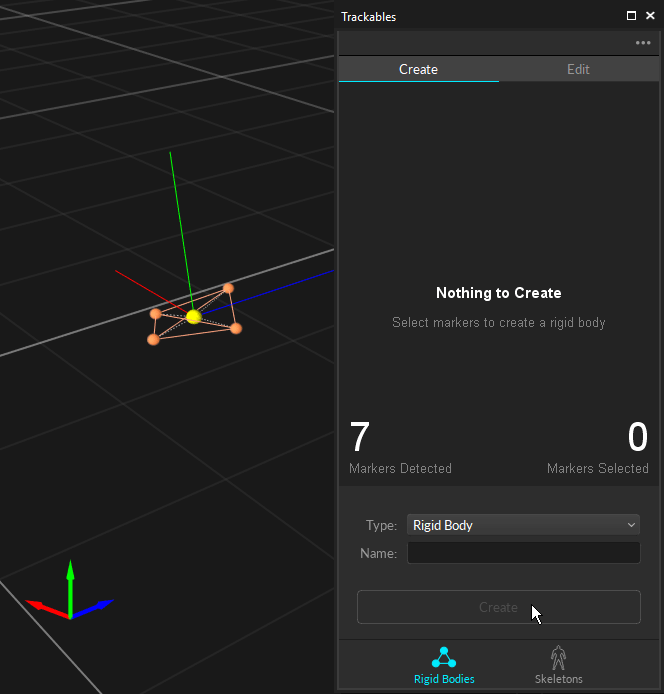

# Rigid Body Tracking

In Motive, Rigid Body assets are used for tracking rigid, unmalleable, objects. A set of markers get securely attached to tracked objects, and respective placement information gets used to identify the object and report 6 Degree of Freedom (6DoF) data. Thus, it's important that the distances between placed markers stay the same throughout the range of motion. Either passive retro-reflective markers or active LED markers can be used to define and track a Rigid Body. This page details instructions on how to create rigid bodies in Motive and other useful features associated with the assets.

## Rigid Body Marker Placement

A Rigid Body in Motive is a collection of three or more markers on an object that are interconnected to each other with an assumption that the tracked object is unmalleable. More specifically, it assumes that the spatial relationship among the attached markers remains unchanged and the marker-to-marker distance does not deviate beyond the allowable [_deflection_](../../motive-ui-panes/properties-pane/properties-pane-rigid-body.md) tolerance defined under the corresponding Rigid Body properties. Otherwise, involved markers may become [unlabeled](../data-recording/). Cover any reflective surfaces on the Rigid Body with non-reflective materials, and attach the markers on the exterior of the Rigid Body where cameras can easily capture them.


**Tip:** If you wish to get more accurate 3D orientation data (pitch, roll, and yaw) of a Rigid Body, it is beneficial to spread markers as far as you can within the same Rigid Body. By placing the markers this way, any slight deviation in the orientation will be reflected from small changes in the position.


.png>) .png>)

### Number of Markers

In a 3D space, a minimum of three coordinates is required for defining a plane using vector relationships; likewise, at least three markers are required to define a Rigid Body in Motive. Whenever possible, it is best to use 4+ markers to create a Rigid Body. Additional markers provide more 3D coordinates for computing positions and orientations of a rigid body, making overall tracking more stable and less vulnerable to marker occlusions. When any of markers are occluded, Motive can reference to other visible markers to solve for the missing data and compute position and orientation of the rigid body.

However, placing too many markers on one Rigid Body is not recommended. When too many markers are placed in close vicinity, markers may overlap on the camera view, and Motive may not resolve individual reflections. This may increase the likelihood of label-swaps during capture. Securely place a sufficient number of markers (usually less than 10) just enough to cover the main frame of the Rigid Body.


Tip: The recommended number of markers per a Rigid Body is **4 \~ 12 markers**. Rigid Body cannot be created with more than 20 markers in Motive.


### Asymmetrical Marker Placements

Within a Rigid Body asset, its markers should be placed asymmetrically because this provides a clear distinction of orientations. Avoid placing the markers in symmetrical shapes such as squares, isosceles, or equilateral triangles. Symmetrical arrangements make asset identification difficult, and they may cause the Rigid Body assets to _flip_ during capture.

### Unique Marker Placements

When tracking multiple objects using passive markers, it is beneficial to create **unique** Rigid Body assets in Motive. Specifically, you need to place retroreflective markers in a distinctive arrangement between each object, and it will allow Motive to more clearly identify the markers on each Rigid Body throughout capture. In other words, their unique, non-congruent, arrangements work as distinctive identification flags among multiple assets in Motive. This not only reduces processing loads for the Rigid Body solver, but it also improves the tracking stability. Not having unique Rigid Bodies could lead to labeling errors especially when tracking several assets with similar size and shape.


**Note for Active Marker Users**

If you are using [OptiTrack active markers](../../active-components/active-marker-tracking/) for tracking multiple Rigid Bodies, it is not required to have unique marker placements. Through the active labeling protocol, active markers can be labeled individually and multiple rigid bodies can be distinguished through uniquely assigned marker labels. Please read through [Active Marker Tracking](../../active-components/active-marker-tracking/) page for more information.


**What Makes Rigid Bodies Unique?**

The key idea of creating unique Rigid Body is to **avoid geometrical congruency** within multiple Rigid Bodies in Motive.

* **Unique Marker Arrangement.** Each Rigid Body must have a unique, non-congruent, marker placement creating a unique shape when the markers are interconnected.
* **Unique Marker-to-Marker Distances.** When tracking several objects, introducing unique shapes could be difficult. Another solution is to vary Marker-to-marker distances. This will create similar shapes with varying sizes, and make them distinctive from the others.
* **Unique Marker Counts** Adding extra markers is another method of introducing the uniqueness. Extra markers will not only make the Rigid Bodies more distinctive, but they will also provide more options for varying the arrangements to avoid the congruency.

**What Happens When Rigid Bodies Are Not Unique?**

Having multiple non-unique Rigid Bodies may lead to mislabeling errors. However, in Motive, non-unique Rigid Bodies can also be tracked fairly well as long as the non-unique Rigid Bodies are continuously tracked throughout capture. Motive can refer to the trajectory history to identify and associate corresponding Rigid Bodies within different frames. In order to track non-unique Rigid Bodies, you must make sure the _Properties → General Settings → **Unique**_ setting in [Rigid Body Properties](../../motive-ui-panes/properties-pane/properties-pane-rigid-body.md) of the assets are set to _False_.

Even though it is possible to track non-unique Rigid Bodies, it is strongly recommended to make each asset unique. Tracking of multiple congruent Rigid Bodies could be lost during capture either by occlusion or by stepping outside of the capture volume. Also, when two non-unique Rigid Bodies are positioned in vicinity and overlap in the scene, their marker labels may get swapped. If this happens, additional efforts will be required for [correcting the labels](../labeling.md) in post-processing of the data.

**Multiple Rigid Bodies Tracking**

Depending on the object, there could be limitations on marker placements and number of variations of unique placements that could be achieved. The following list provides sample methods for varying unique arrangements when tracking multiple Rigid Bodies.

**1. Create Distinctive 2D Arrangements.** Create distinctive, non-congruent, marker arrangements as the starting point for producing multiple variations, as shown in the examples above.

**2. Vary heights.** Use marker bases or posts, with different heights to introduce variations in elevation to create additional unique arrangements.

**3. Vary Maximum Marker to Marker Distance.** Increase or decrease the overall size of the marker arrangements.

**4. Add Two (or more) Markers** Lastly, if an additional variation is needed, add extra markers to introduce the uniqueness. We recommended adding at least two extra markers in case any of them is occluded.

## Creating Rigid Body

A set of markers attached to a rigid object can be grouped and auto-labeled as a Rigid Body. This Rigid Body definition can be utilized in multiple takes to continuously auto-label the same Rigid Body markers. Motive recognizes the unique spatial relationship in the marker arrangement and automatically labels each marker to track the Rigid Body. At least three coordinates are required to define a plane in 3D space, and therefore, a minimum of three markers are essential for creating a Rigid Body.

.png>)

### Steps to Create Rigid Bodies

**Step 1.**

Select all associated Rigid Body markers in the [3D viewport](../../motive-ui-panes/viewport.md#perspective-view).

**Step 2.**

On the Builder pane, confirm that the selected markers match the markers that you wish to define the Rigid Body from.

**Step 3.**

Click _Create_ to define a Rigid Body asset from the selected markers.

You can also create a Rigid Body by doing the following actions while the markers are selected:

* **Perspective View (3D viewport):** While the markers are selected, right-click on the perspective view to access the context menu. Under the Rigid Body section, click _Create From Selected Markers_.
* **Assets pane:** While the markers are selected in Motive, click on the add  button in the [Assets pane](../../motive-ui-panes/assets-pane.md).
* **Hotkey:** While the markers are selected, use the create Rigid Body hotkey (Default: Ctrl +T).

.png>) .png>)

**Step 4.**

Once the Rigid Body asset is created, the markers will be colored (labeled) and interconnected to each other. The newly created Rigid Body will be listed under the [Assets pane](../../motive-ui-panes/assets-pane.md).


**Defining Assets in Edit mode:**

If the Rigid Bodies, or skeletons, are created in the Edit mode, the corresponding _Take_ needs to be [auto-labeled](../data-recording/data-types.md). Only then, the Rigid Body markers will be labeled using the Rigid Body asset and positions and orientations will be computed for each frame. If the 3D data have not been labeled after edits on the recorded data, the asset may not be tracked.


### Rigid Body Properties

Rigid Body properties consist of various configurations of Rigid Body assets in Motive, and they determine how Rigid Bodies are tracked and displayed in Motive. For more information on each property, read through the [Properties: Rigid Body](../../motive-ui-panes/properties-pane/properties-pane-rigid-body.md) page.

**Default Properties**

When a Rigid Body is first created, default Rigid Body properties are applied to the newly created assets. The default creation properties are configured under the Assets section in the [Application Settings](../../motive-ui-panes/settings/settings-assets.md) panel.

**Modifying Properties**

Properties for existing Rigid Body assets can be changed from the [Properties pane](../../motive-ui-panes/properties-pane/).\\

.png>)

### Adding or Removing Markers

You can add or remove Marker Constraints from a Rigid Body in the Constraints pane.

To add a marker you can select the marker in the Perspective view and make sure an existing Rigid Body is selected from the dropdown in the Constraints pane.

Once selected you can click the '+' in the Constraints pane to add the marker to the Rigid Body.

To remove a marker from the Rigid Body, simply select the marker in the Constraints pane and click '-'.

<figure><figcaption></figcaption></figure>

## Tracking Rigid Body

The pivot point of a Rigid Body is used to define both position and orientation. When a rigid body is created, its pivot point is be placed at its geometric center by default, and its orientation axis will be aligned with the global coordinate axis. To view the pivot point and the orientation in the 3D viewport, set the _Bone Orientation_ to true under the display settings of a selected Rigid Body in the [Properties pane](../../motive-ui-panes/properties-pane/properties-pane-rigid-body.md).

.png>)

### Real-time Information

Position and orientation of a tracked Rigid Body can be monitored in real-time from the [Info pane](../../motive-ui-panes/info-pane.md). You can simply select a Rigid Body in Motive, open the Info pane, and access the Rigid Bodies tool from the  to view respective real-time tracking data of the selected Rigid Body.

### Default Orientation

As mentioned previously, the orientation axis of a Rigid Body, by default, gets aligned with the global axis when the Rigid Body was first created. After a Rigid Body is created, its orientation can be adjusted by editing the Rigid Body orientation using the [Builder pane](../../motive-ui-panes/builder-pane.md) or by using the GIZMO tools as described in the next section.

## Adjusting Rigid Body Pivot Point

There are situations where the desired pivot point location is not at the center of a Rigid Body. The location of a pivot point can be adjusted by assigning it to a marker or by translating along the Rigid Body axis (x,y,z). For most accurate pivot point location, attach a marker on the desired pivot location, set the pivot point to the marker, and apply the translation for precise adjustments. If you are adjusting the pivot point after the capture, in the Edit mode, the _Take_ will need to be [auto-labeled](../data-recording/data-types.md) again to apply the changes.

### Using the Gizmo Tool

\
Using the gizmo tools from the perspective view options to easily modify the position and orientation of Rigid Body pivot points. You can translate and rotate Rigid Body pivot, assign pivot to a specific marker, and/or assign pivot to a mid-point among selected markers.

* Select Tool (Hotkey: Q): Select tool for normal operations.
* Translate Tool (Hotkey: W): Translate tool for moving the Rigid Body pivot point.
* Rotate Tool (Hotkey: E): Rotate tool for reorienting the Rigid Body coordinate axis.
* Scale Tool (Hotkey: R): Scale tool for resizing the Rigid Body pivot point.

Read through the [Gizmo tools](../assets/gizmo-tool-translate-rotate-and-scale.md) page for detailed information.

.png>) .png>)

### Translating Pivot Point

To translate the pivot point, access the Rigid Body editing tools in the [Builder pane](../../motive-ui-panes/builder-pane.md) while the Rigid Body is selected. In the _Location_ section, you can input the amount of translation (in mm) that you wish to apply. Note that the translation will be applied along the x/y/z of the Rigid Body orientation axis. Resetting the translation will position the pivot point at the geometric center of the Rigid Body according to its marker positions.

### Resetting the Pivot Point

If you wish to reset the pivot point, simply open the Rigid Body context menu in the [Perspective pane](../../motive-ui-panes/viewport.md#perspective-view) and click Reset Pivot. The location of the pivot point will be reset back to the center of the Rigid Body again.

.png>)

### Pivot for Spherical Placement

This feature is useful when tracking a spherical object (e.g. ball). The _Spherical Pivot Placement_ feature in the Builder pane will assume that all the Rigid Body markers are placed on the surface of a spherical object, and the pivot point will be calculated and re-positioned accordingly. To do this, select a Rigid Body, access Modify tab in the [Builder pane](../../motive-ui-panes/builder-pane.md), and click Apply from the _Spherical Pivot Placement_.

## Rigid Body Tracking Data Output

***

Rigid Body tracking data can be either outputted onto a separate file or streamed to client applications in real-time:

* Captured 6 DoF Rigid Body data can be exported into CSV, FBX, or BVH files. See: [Data Export](../data-export/)
* You can also use one of the streaming plugins or use NatNet client applications to receive tracking data in real-time. See: [NatNet SDK](../../developer-tools/natnet-sdk/natnet-4.0.md)

## Additional Features

### Export Asset Definitions

Assets can be exported into Motive user profile (.MOTIVE) file if it needs to be re-imported. The [user profile](../motive-basics.md#motive-user-profile-.motive) is a text-readable file that can contain various configuration settings in Motive; including the asset definitions.

When the asset definition(s) is exported to a MOTIVE user profile, it stores marker arrangements calibrated in each asset, and they can be imported into different takes without creating a new one in Motive. Note that these files specifically store the spatial relationship of each marker, and therefore, only the identical marker arrangements will be recognized and defined with the imported asset.

To export the assets, go to _Files_ tab → _Export Assets_ to export all of the assets in the Live-mode or in the current TAK file. You can also use _Files_ tab → _Export Profile_ to export other software settings including the assets.

 (1) (1) (1) (1) (1) (1).png>)  (1) (1) (1) (1) (1) (1) (3).png>)

### Rigid Body Refinement

.png>)


**This feature is supported in \_Live Mode**\_\*\* only.\*\*


**This feature is supported in \_Live Mode**\_\*\* only.\*\*

The Rigid Body refinement tool improves the accuracy of Rigid Body calculation in Motive. When a Rigid Body asset is initially created, Motive references only a single frame for defining the Rigid Body definition. The Rigid Body refinement tool allows Motive to collect additional samples in the live mode for achieving more accurate tracking results. More specifically, this feature improves the calculation of expected marker locations of the Rigid Body as well as the position and orientation of the Rigid Body itself.

**Steps**

1. Select [View](../../motive-ui-panes/toolbar-command-bar.md#view) from the toolbar at the top, open the [Builder pane](../../motive-ui-panes/builder-pane.md).
2. Select the _Rigid Bodies_ from the _Type_ dropdown menu.
3. In [Live mode](../motive-basics.md#live-mode-and-edit-mode), select an existing Rigid Body asset that you wish to refine from the **Assets** pane.
4. Hold the physical selected Rigid Body at the center of the capture volume so that as many cameras as possible can clearly capture the markers on the Rigid Body.
5. Click **Refine** in the [Builder pane](../../motive-ui-panes/builder-pane.md).
6. Slowly rotate the Rigid Body to collect samples at different orientations until the progress bar is full.
7. Once all necessary samples are collected, the **Refine** and **Create + Refine** buttons will appear again in the Builder pane and the refinements will have been applied.

.png>)
