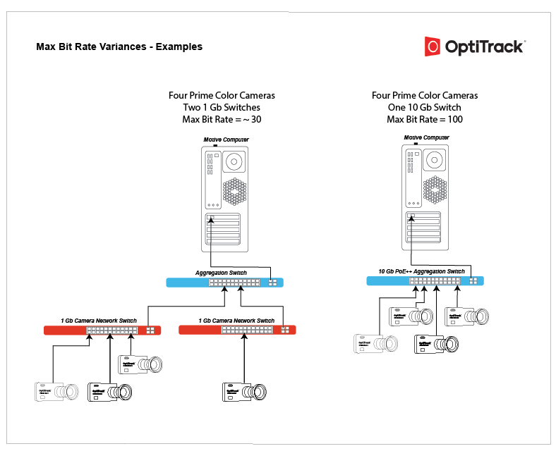

# Prime Color Camera Setup: Camera Settings

## Overview

* Listed in their own category in the [Devices pane](../../motive-ui-panes/devices-pane.md), Prime Color Cameras are configured in the same manner as other OptiTrack tracking cameras.&#x20;
* Select a camera in the Devices pane to view its Properties in the [Properties pane](../../motive-ui-panes/properties-pane/). &#x20;
* For an overview of settings applicable to all OptiTrack cameras, please see the page [Properties Pane: Camera](../../motive-ui-panes/properties-pane/properties-pane-camera.md).&#x20;

<figure><figcaption>
Color Camera in the Devices Pane.
</figcaption></figure>

## Color Camera Properties

### Resolution

Default: 1920 x 1080

This property sets the resolution of the images captured by the selected camera.

You may need to reduce the maximum frame rate to accommodate the additional data produced by recording at higher resolutions. The table below shows the maximum allowed frame rates for each respective resolution setting.

| Resolution          | Max Frame rate |
| ------------------- | -------------- |
| 960 x 540 (540p)    | 500 FPS        |
| 1280 x 720 (720p)   | 360 FPS        |
| 1920 x 1080 (1080p) | 250 FPS        |

### Compression Mode

Default: Constant Bit Rate.

This property determines how much the captured images will be compressed.&#x20;

#### **Constant Bit-Rate**

In the Constant Bit-Rate mode, Prime Color cameras vary the degree of image compression to match the data transmission rate given under the Bit Rate settings. At a higher bit-rate setting, the captured image will be compressed less. At a lower bit-rate setting, the captured image will be compressed more to meet the given data transfer rate. Compression artifacts may be introduced if it is set too low.


The Constant Bit-Rate mode is used by default and is recommended because it is easier to control the data transfer rate and efficiently utilizes the available network bandwidth.


#### **Variable Bit-Rate**

The Variable Bit-Rate setting keeps the amount of the compression constant and allows the data transfer rate to vary. This mode is beneficial when capturing images with objects that have detailed textures because it keeps the amount of compression consistent on all frames. However, this mode may also cause dropped frames if the camera needs to compress highly detailed images, spiking the data transfer rate, which may overflow the network bandwidth as a result. For this reason, we recommend using the Constant Bit-Rate setting in most applications.

### Compression

The compression property sets the percentage (100%) of the maximum data transmission speed to allocate for the camera.&#x20;

### Bit Rate

Default: 30 MB/s

**Available only while using Constant Bit rate Mode**

The bit-rate setting determines the selected color camera's output transmission rate.&#x20;

The maximum data transmission speed that a Prime color camera can output is 100 megabytes per second (MB/s). At this setting, the camera will capture the best quality image, however, it could overload the network if there isn't enough bandwidth to handle the transmitted data.

There's also a diminishing return to what the human eye can detect with the image quality. The image might look identical at 30 and 100 bit rates.


Since the bit rate controls the rate of data each color camera outputs, this is one of the most important settings to adjust when configuring the system.&#x20;

When a system is experiencing 2D frame drops, one of the following system requirements is not being met:&#x20;

* Network bandwidth
* CPU processing speed
* RAM/disk memory

Decreasing the bit-rate in such cases may slow the data transmission speed of the color camera enough to resolve the problem.


#### **Bit Rate and Image Quality**

While the image quality increases at a higher bit-rate setting, this also results in larger file sizes and possible frame drops due to data bandwidth bottlenecks. The desired result may differ depending on the capture application and its intended use. The graph below illustrates how the image quality varies depending on the camera frame rate and bit-rate settings.

.png>)

#### Convert Bit Rate to Bit Rate per frame

It's useful to convert Bit Rate (MB/s) to Bit Rate per frame (MB/frame) to compare different FPS and Bit Rate combinations.&#x20;

**Bit Rate (MB/s) / Frame Rate (s/frame) = Data per Frame (MB/frame)**

Example:&#x20;

* Bit Rate of 10 and a FPS of 30&#x20;
* 10/30 = 0.3 MB/frame

In this example, the 1080p image can accommodate up to 0.3 MB for all data in any given frame.&#x20;

OptiTrack testing determined that, for a 1920x1080 resolution, 0.15 MB/frame is the minimum rate before the image noticeably deteriorates. &#x20;

#### Optimizing Bitrate for Small File Size

At different resolutions the minimum data per frame to yield a decent image is as follows:

* 0.15 MB/frame at 1080p
* 0.08 MB/frame at 720p
* 0.05 MB/frame at 540p
* 0.05 MB/frame at 272p

#### Optimizing Bit Rate for Image Quality

At different resolutions, the minimum data per frame to yield a high-quality image is as follows:

* 0.26 MB/frame at 1080p
* 0.11 MB/frame at 720p
* 0.08 MB/frame at 540p
* 0.08 MB/frame at 272p

These heuristics are used by the Color Camera Presets to auto-set the bit rate values.


_**How is the image quality at a frame rate of 120Hz or even 250Hz?**_

To determine this, we solve for the required bit rate that will produce the desired data rate per frame (.3 in this example):

* At 120 Hz, the bit rate must be 36
  * &#x20;X / 120 = 0.3
  * X = 36
* At 240 Hz, the bit rate must be 72
  * X/240 = .3
  * X = 72


#### Other Factors

To determine the ideal bit rate for your camera system, it's important to also consider the network configuration. Once you've calculated the ideal bit rate for the cameras, you can use that value to determine how many Prime Color cameras you can attach to each 1 Gb child switch and the total number of cameras the 10 Gb aggregator will handle.

For example:&#x20;

If the goal is to achieve 0.3 MB/frame at 240 Hz, then a bit rate of 72 MB/s is required for each camera. This translates to:

* One camera per 1Gb child switch or PoE injector (1 Gbps = 125 MBps)
* Approximately 17 prime color cameras per 10 Gbps aggregator switch (10 Gbps = 1250 MBps)
  * &#x20;1250/72 = 17

Consider the two scenarios with exactly 4 cameras each and notice that the maximum bit rate is different for the two systems. Technically, the single camera on the 1 Gb switch could run at a bit rate of 100.

<figure><figcaption>
Examples of different Prime Color Camera configurations with different maximum bit rates. 
</figcaption></figure>


**Tip: Monitoring data output from each camera**

Data output from the entire camera system can be monitored through the [Status Panel](../../motive-ui-panes/status-panel.md). Output from individual cameras can be monitored from the 2D Camera Preview pane when the _Camera Info_ display is enabled under the visual aids (  ) option.


.png>)

### Gamma

Default : 28

Gamma correction is a non-linear amplification of the output image. The gamma setting will adjust the brightness of dark pixels, midtone pixels, and bright pixels differently, affecting both brightness and contrast of the image. Depending on the capture environment, especially with a dark background, you may need to adjust the gamma setting to get best quality images.

.png>) .png>)

### LED

Default: Off

When using the [eStrobes](prime-color-setup-hardware-setup.md#estrobes) to light the capture volume, the LED setting must be enabled on the Prime Color cameras to which the eStrobes are connected. Once enabled, the Prime Color camera will output  the signals from its RCA sync output port, allowing the eStrobes to receive this signal and illuminate the LEDs.

## Color Camera Presets

Presets for Color Cameras use standard settings to optimize for different outcomes based on file size and image quality.  Calibration mode sets the appropriate video mode for the camera type in addition to other setting changes.&#x20;

<figure><figcaption>
Color Camera preset options.
</figcaption></figure>


The optimal [Bit Rate](prime-color-camera-setup-camera-settings.md#bit-rate) for each preset is calculated based on the master camera frame rate when the preset is selected. Lower bit rates result in smaller file sizes. Higher bit rates produce higher quality captures and result in larger file sizes.


* **Small Size - Lower Rate**
  * Video Mode:  Color Video
  * Rate Multiplier:  1/4 (or closest possible)
  * Exposure:  20000 (or max)
  * Bit Rate:  \[calculated]
* **Small Size - Full Rate**
  * Video Mode:  Color Video
  * Rate Multiplier:  x1
  * Exposure:  20000 (or max)
  * Bit Rate:  \[calculated]
* **Great Image**
  * Video Mode:  Color Video
  * Rate Multiplier:  x1
  * Exposure:  20000 (or max)
  * Bit Rate:  \[calculated]
* **Calibration Mode**
  * Video Mode: Object Mode
  * Rate Multiplier:  x1
  * Exposure:  250
  * Bit Rate:  N/A
