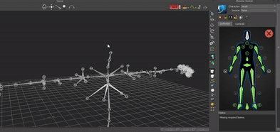
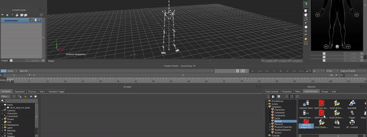
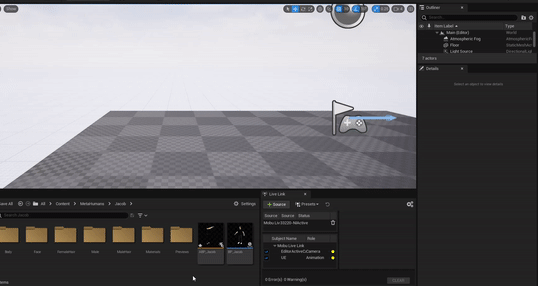
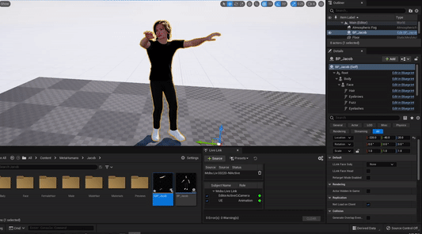

---
metaLinks:
  alternates:
    - >-
      https://app.gitbook.com/s/GaZwzcsVav6zPBRZpapU/plugins/optitrack-unreal-engine-plugin/unreal-engine-motionbuilder-workflow
---

# Unreal Engine: MotionBuilder Workflow

This guide will cover how to get motion capture data streamed from Motive to Unreal Engine 5's MetaHumans with the additional help of MotionBuilder.

A method commonly used in Virtual Production pipelines, uses MotionBuilder to manually retarget the bones and source the streamed data from Motive onto a MetaHuman. Additionally, this process allows for more refined cleanup through MotionBuilder if required in the future.

## Motive Setup

<figure><figcaption></figcaption></figure>

Open the [Data Streaming Pane](../../motive/data-streaming.md) in Motive's **Settings** window and set the following settings:

#### **Enable**

Turn on the Enable setting at the top of the NatNet section to enable streaming in Motive.

#### **Local Interface**


It is recommended that Motive and MotionBuilder should run on the same machine. An additional machine should be used to run Unreal, since UE5 can be resource intensive.


Set to Loopback. This is the LocalHost IP since Motive and MotionBuilder will be running on the same machine.

#### **Transmission Type**

Set to Multicast

#### **Markers**

Select which markers you'd like to stream into UE5, you will need to at least have Rigid Bodies and Skeletons enabled.

#### **Skeleton Coordinates**

Set to _Global_.

#### **Bone Naming Convention**

Set to FBX

#### **Up Axis**

Set to Y-Axis

#### **Remote Trigger**

Leave unenabled


Be sure to either actively playing a looped take, or stream a live skeleton in Motive so the plugin can capture the data and send it to MotionBuilder.


## Unreal Engine 5 Plugin for MotionBuilder Setup


Please download the MotionBuilder UE5 plugin [here](https://github.com/ue4plugins/MobuLiveLink/releases/tag/v2.5.0). Currently the plugin download link is not yet officially on Unreal Engines documentation website, and is a community updated plugin for UE5 that works just the same. Download the Zip file MobuLiveLink.zip.


<figure><figcaption></figcaption></figure>

### Plugin Installation Steps

Once downloaded, you can extract the Zip folder and go to MobuLiveLink > Binaries > MobuVersion.

You'll want to then copy those three files in this folder and paste them in to the C:\Program Files\Autodesk\MotionBuilder 2020\bin\x64\plugins. file directory folder.

Once these files are added to the file directory folder, it should appear as UE - Livelink in Devices under the Asset Browser in MotionBuilder.

<figure><figcaption></figcaption></figure>

## Unreal Engine Setup

### Plugins


It's best to enable both the Quixel Bridge and OptiTrack Live Link plugins together, since you'll likely need to restart Unreal Engine each time you enable a plugin.


#### Quixel Bridge

First, you'll want to verify that the Quixel Bridge plugin is installed with Unreal Engine 5. You can install the Quixel Bridge plugin from the Epic Games Launcher by clicking Unreal Engine then the Library Tab.

<figure><figcaption></figcaption></figure>

You'll also wan to make sure that the Quixel Bridge plugin is enabled. To do this go to Edit > Plugins > Editor and click the check box. You may have to restart Unreal after enabling this plugin.

<figure><figcaption></figcaption></figure>

#### OptiTrack Live Link Plugin

You'll also need to download and enable the [Unreal Engine OptiTrack Live Link Plugin](https://optitrack.com/support/downloads/plugins.html#unreal-plugin). To enable this plugin you can download the plugin from the link above, open Settings > Plugins > Either look for OptiTrack in the sidebar or use the search bar to find Live Link, and check the box to enable the OptiTrack Live Link plugin.

### Create a Project

Next, you'll want to create a project to import your MetaHuman into. Once, your project is created, open Quixel Bridge within your Unreal project.

<figure><figcaption></figcaption></figure>

### Load MetaHuman into Project

Now that you're in the Quixel Bridge window, log in to your MetaHuman account and navigate to MetaHumans > My MetaHumans.

Select the MetaHuman you wish to load into the project and select the desired quality profile. Then click 'Download'. After is has completed downloading, you will be able to add it to the current project.

<figure><figcaption></figcaption></figure>

### Blueprint Settings

Navigate to the MetaHuman blueprint in the Content Browser under Content > MetaHumans > "MetaHumanName" > BP\_MetaHumanName and double click to open the blueprint window.

<figure><figcaption></figcaption></figure>

In the Components tab on the left, select Body then navigate to the Skeletal Mesh tab of the Details node. Choose which Skeletal Mesh you'd like to use.

<figure><figcaption></figcaption></figure> <figure><figcaption></figcaption></figure>

Exit this window and find the mesh in the content browser and right click and select Asset Actions > Export....

Select FBX Export and deselect Level of Detail in the FBX Export Options.

<figure><figcaption></figcaption></figure>

<figure><figcaption></figcaption></figure>

## MotionBuilder Setup and Characterizing

### Retarget Animation

Now that the skeleton driving the MetaHuman is exported, we can retarget animation in MotionBuilder from the OptiTrack plugin.

In MotionBuilder select File > Open and select the MetaHuman you exported earlier.

<figure><figcaption></figcaption></figure>

Apply a namespace, this will prevent this skeleton from conflicting with any other potential skeletons in the scene.


You do not need to import any takes with this file.


<figure><figcaption></figcaption></figure>

The Skeleton should now appear in your scene/viewport.

### Characterize Skeleton

Under the Character Controls panel, select Skeleton > Define under the Define tab.

<figure><figcaption></figcaption></figure>

To fill out this definition quickly, select the bone you want to map first in the viewport and then in the Definition panel right click and hold on the bone.

Hover over Assign Selected Bone then let go of right click.

Repeat that process for all the Main Bone Hierarchy.

There’s no need for any extra bones in the definition, for example “ Spine\_04\_Latissimus\_r” as Motive’s skeleton does not drive any of those bones.

You'll want to make sure that the MetaHuman skeleton is in a T-pose. If hand tracking will be added too, make sure to pose the hands in the proper pose for said hand tracking application.

When all the bones are filled out in the definition and the skeleton is in T-pose there should be a green checkmark notifying everything is ready to characterize.

<figure><figcaption></figcaption></figure>

<figure><figcaption></figcaption></figure>

To lock in the definition, click the lock at the top of the Character controls panel. Now that the character is created, the respective plugins can be added to the scene that will drive the streaming into Unreal.

## MotionBuilder Streaming Setup

In MotionBuilder go to the Asset Browser pane select the Device from the Peripherals dropdown. Drag and drop the OptiTrack Skeleton and the UE5 Live Link plugins into the main viewport to add it to the scene.

<figure><figcaption></figcaption></figure>

From the navigator tab on the left, select OptiTrack Skeleton from the I/O Devices dropdown. This will open the Main tab of the OptiTrack Skeleton plugin's settings.

### Settings

#### Local and Server Address

Set both to 127.0.0.1

#### Server Type

Set this to match was was selected in Motive (either Unicast or Multicast)

#### Auto Characterize

Make sure to check this box to enable Auto Characterize

<figure><figcaption></figcaption></figure>

<figure><figcaption></figcaption></figure>

#### Online

Click this box to enable streaming in MotionBuilder:

* Green - Connected and streaming.
* Yellow - Connected but not streaming.
* Red - Not connected or streaming.

#### Live

Check this box if streaming Live data

#### Model Binding

Click Create... and select the actor from Motive you wish to track

## Unreal Engine - Live Link

<figure><figcaption></figcaption></figure>

### Settings

#### Online

Click this box to enable streaming in UE

* Green - Connected and streaming.
* Yellow - Connected but not streaming.
* Red - Not connected or streaming.

#### Subject Selector

Click the dropdown and select the root of your MetaHuman skeleton.

Click Add.

#### Stream Viewport Camera

Select Stream Viewport Camera if you want to stream your viewports camera to the preview section in Unreal Engine

### Character Controls

In the Character Controls panel, select the MetaHuman as the Character and the Motive Actor as the Source.

You should now see the MetaHuman skeleton copying the data that the Motive Skeleton is using.

<figure><figcaption></figcaption></figure>

### (Optional) Streaming Across Another Device

In the Settings tab in the UE Live Link Device, go to the Unicast Endpoint section, and change the address to the MotionBuilder machine's IPv4 address and choose a port number denoted by a colon after the IPv4 address.

<figure><figcaption></figcaption></figure>


To find the IP address of your computer, open a Command Prompt window, type in 'ipconfig' and hit enter. This should display all the networks on your computer, scroll and find the Ethernet adapter card associated with the NIC that you'll be using to connect to the network.



Port 6666 is reserved and cannot be used for endpoints.


In Unreal on the computer receiving the stream, open:

Project Settings > UDP Messaging >Advanced > Static Endpoints > + to add an Array Element and enter the IPv4 address and port number from the previous step.

<figure><figcaption>
<strong>Click image to enlarge.</strong>
</figcaption></figure>

This will allow MotionBuilder to Live Link to Unreal Engine as normal.

### Final Steps in Unreal

Open the OptiTrack Live Link plugin downloaded earlier. Navigate to Window > Virtual Production > Live Link.

<figure><figcaption></figcaption></figure>

In the Live Link tab, create a new MotionBuilder source by selecting Source > Message Bus Source > MoBu Live Link.

<figure><figcaption></figcaption></figure>

Now that the Live Link connection has been established, the motion data from MotionBuilder can now be streamed into the MetaHuman via an animation blueprint.

Right click in the content browser where you want to create an animation blueprint and choose **Animation> Animation Blueprint.**

Unreal will then prompt you to choose a specific Skeleton asset. For this choose the **metahuman\_base\_skel** and click **Create** and name it **ABP\_”metahuman name”**.

<figure><figcaption></figcaption></figure>

<figure><figcaption></figcaption></figure>

Now open the animation blueprint and in the AnimGraph create a **Live Link Pose** node and select the subject name as **UE**. Then simply hit **Compile** **and Save.**


You do not need to have an Input Pose node in the anim graph in order for it to work, however, if you would like to place one simply right click and search for **Input Pose**.


<figure><figcaption></figcaption></figure>

Lastly, Place the MetaHuman into the scene, select the MetaHuman and go to the Details panel on the right of the viewport. Find and select **Body**, then scroll down to find the Animation tab. In Animation Mode \*\*\*\* select **Use Animation Blueprint** and in Anim Class select the Animation Blueprint that you made.

<figure><figcaption></figcaption></figure>

If your animation data is streaming in, you should see your MetaHuman snap to a position notifying that it updated. If you would like to view the data in the edit viewport, go to the details panel again and add a **Live Link Skeletal Animation**.

<figure><figcaption></figcaption></figure>

And that’s it! With this method you’ll be able to easy make changes in MotionBuilder where you see fit, or make adjustments in the Animation Blueprint that is driving the streamed data.
