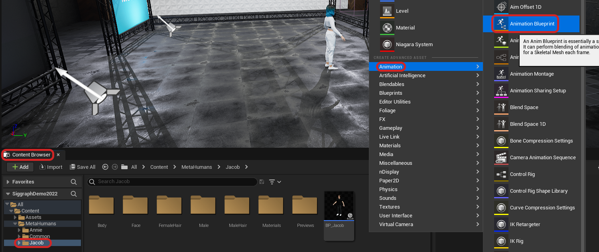

---
metaLinks:
  alternates:
    - >-
      https://app.gitbook.com/s/GaZwzcsVav6zPBRZpapU/plugins/optitrack-unreal-engine-plugin/unreal-engine-optitrack-live-link-plugin
---

# Unreal Engine: OptiTrack Live Link Plugin

## **Overview**

<figure><figcaption></figcaption></figure>

This page provides instructions on how to use the OptiTrack Unreal Engine Live Link plugin. The plugin communicates with Unreal's built-in Live Link system by providing a Live Link source for receiving tracking data streamed from Motive. This plugin can be used for controlling cameras and objects in virtual production applications. When needed, the [OptiTrack Unreal Engine Plugin](../) can also be alongside this plugin. For a specific guide to InCamera VFX (i.e. LED Wall Virtual Production) please see this wiki page [Unreal Engine: OptiTrack InCamera VFX](../../../virtual-production/unreal-engine-optitrack-incamera-vfx.md).

## Setup

**1. \[Motive] Setup Rigid Body streaming in Motive.**

Get Motive streaming with at least one Rigid Body or Skeleton asset. Make sure the [Streaming](../../../motive/data-streaming.md) settings are configured correctly, and the asset is active under the [Assets pane](../../../motive-ui-panes/assets-pane.md).

**2. \[UE] Install the OptiTrack plugins in Unreal Engine (UE).**

You can install the OptiTrack Unreal Engine plugin by putting the plugin files into one of the following directories:

* A global engine plugin can be placed in `C:\Program Files\Epic Games\ [Engine Version]\ Engine\ Plugins\ Marketplace`
* A project-specific plugin can be placed in `[Project Directory]\Plugins`

**3. \[UE] Enable the plugins in UE project.**

Go to _Edit → Plugins_ and enable two of the required plugins. First one is the **OptiTrack - Live Link** plugin under _Installed_ group, and the second one is the built-in **Live Link** plugin under Built-In group.

.png>)

.png>)

**4. \[UE] Open the LiveLink pane**

Open the LiveLink pane from _Window → Virtual Production → Live Link_ in the toolbar.

.png>)

.png>)

**5. \[UE] Configure and create a new OptiTrack source**

In the LiveLink pane under _Source_ options, go to the OptiTrack Source menu and configure the proper connection settings and click _Create_. Please make sure to use matching network settings configured from the Streaming pane in Motive.

.png>)

**6. \[UE] Check the Connection.**

If the streaming settings are correct and the connection to Motive server is successful, then the plugin will list out all of the detected assets. They should have green dots next to them indicating that the corresponding asset has been created and is receiving data. If the dots are yellow, then it means that the client has stopped receiving data. In this case, check if Motive is still tracking or if there is a connection error.

.png>)

## Using the Plugin

### Static Meshes or Camera Actors

**1. Add the camera object or static mesh object that you wish to move**

Add a camera actor from the Place Actors pane or a static mesh from the project into your scene. For the static meshes, make sure their Mobility setting is set to _Movable_ under the Transform properties.

.png>) .png>)

**2. Add a LiveLinkController Component**

Select an actor you want to animate. In the **Details** tab select your "actor" (Instance). In the search bar, type in Live Link. Then click on the _Live Link Controller_ from the populated list.

.png>)

**3. Select the target Rigid Body**

Under the Live Link properties in the Details tab click in the **Subject Representation** box and select the target Rigid Body.

.png>)

**4. Check**

Once the target Rigid Body is selected, each object with the Live Link Controller component attached and configured will be animated in the scene.

### Timecode Setup

When the camera system is synchronized to another master sync device and a timecode signal is feeding into [eSync 2](../../../virtual-reality/synchronization-hardware/external-device-sync-guide-esync-2.md), then the received timecode can be used in UE project through the plugin.

**1. Set Timecode Provider under project settings**

From _Edit → Project Settings_, search timecode and under Engine - General settings, you should find settings for the timecode. Here, set the the Timecode Provider to LiveLinkTimeCodeProvider.

.png>)

**2. Set OptiTrack source in the Live Link pane as the Timecode Provider**

Open the Live Link pane, and select the OptiTrack subject that we created when first setting up the plugin connection. Then, under its properties, check the Timecode Provider box.

.png>)

**3. Check**

The timecode from Motive should now be seen in the Take Recorder pane. Take Recorder pane can be found under Window → Cinematics → Take Recorder in the toolbar.

.png>)

### Skeletons and Metahumans

For detailed instructions on streaming skeleton data into Unreal Engine, please see the [Metahumans section](quick-start-guide-real-time-retargeting-in-unreal-engine-with-live-link-content.md#retargeting-to-metahumans) in our [Quick Start Guide: Real-Time Retargeting in Unreal Engine with Live Link Content](quick-start-guide-real-time-retargeting-in-unreal-engine-with-live-link-content.md) page.&#x20;

## Standalone Game Mode

For testing the project in standalone game mode, or when developing an nDislay application, the Live Link plugin settings must be saved out and selected as the default preset to be loaded onto the project. If this is not done, the configured settings may not get applied. After configuring the LiveLink plugin settings, save out the preset from the Live Link pane first. Then, open the Project Settings and find Live Link section in the sidebar. Here, you can select the default Live Link preset to load onto the project, as shown in the screenshot below. Once the preset is properly saved and loaded, the corresponding plugin settings will be applied to the standalone game mode.

If all the configuration is correct, the actors will get animated in the newly opened game window when playing the project in the standalone game mode.

.png>)

.png>)

.png>)

## MotionBuilder Retargeting

Another path to get data into Unreal Engine is to stream data from Motive -> MotionBuilder (using the OptiTrack MotionBuilder Plugin) -> Unreal Engine (using the Live Link plugin for MotionBuilder). This has the benefit of using the Human IK (HIK) retargeting system in MotionBuilder, which will scale characters of very different sizes/dimensions better than the base Live Link plugin. More information can be found by consulting [Unreal Engine's Live Link to MotionBuilder documentation](https://docs.unrealengine.com/4.27/en-US/AnimatingObjects/SkeletalMeshAnimation/LiveLinkPlugin/ConnectingLiveLinktoMobu/).

## Troubleshooting

<strong>Q - Trying to add more than 64 frames in the same frame. Oldest frames will be discarded.</strong>

A - This notification message may appear at the bottom of the Live Link pane if the frame rate in the data stream doesn't match the rendering frame rate inside UE. This is within notification within the Engine only, so it should not interfere with the project. If this notification must be removed, you can go to the Project Settings → Engine → General Settings → Framerate section, check _Use Fixed Frame Rate_ option, and set the Fixed Frame Rate to be the same rate as the Motive frame rate.

