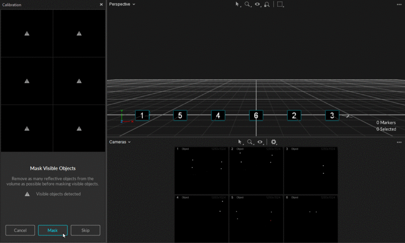
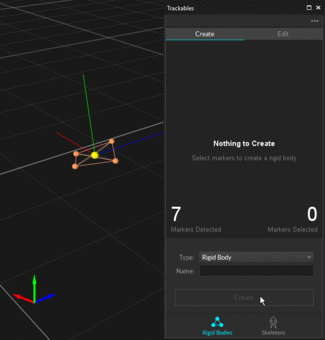

# Quick Start Guide: Getting Started

Welcome to the **Quick Start Guide: Getting Started**!

\
This guide provides a quick walk-through of installing and using OptiTrack motion capture systems. Key concepts and instructions are summarized in each section of this page to help you get familiarized with the system and get you started with the capture experience.

Note that Motive offers features far beyond the ones listed in this guide, and the capability of the system can be further optimized to fit your specific capture applications using the additional features. For more detailed information on each workflow, read through the corresponding workflow pages in this wiki: [hardware setup](../hardware/) and [software setup](../motive/).



## Hardware Setup

### Preparing the Capture Area

For best tracking results, you need to prepare and clean up the capture environment before setting up the system. First, remove unnecessary objects that could block the camera views. Cover open windows and minimize incoming sunlight. Avoid setting up a system over reflective flooring since IR lights from cameras may get reflected and add noise to the data. If this is not an option, use rubber mats to cover the reflective area. Likewise, items with reflective surfaces or illuminating features should be removed or covered with non-reflective materials in order to avoid extraneous reflections.

.png>)

**Key Checkpoints for a Good Capture Area**

* Minimize ambient lights, especially sunlight and other infrared light sources.
* Clean capture volume. Remove unnecessary obstacles within the area.
* Tape, or Cover, remaining reflective objects in the area.

**See Also:** [Hardware Setup](../hardware/) workflow pages.

### Cabling and Load Balancing

#### Ethernet Camera System

_Ethernet Camera Models: PrimeX series and SlimX 13 cameras. Follow the below wiring diagram and connect each of the required system components._



.png>)

* **Connect PoE Switch(s) into the Host PC:** Start by connecting a PoE switch into the host PC via an Ethernet cable. Since the camera system takes up a large amount of data bandwidth, the Ethernet camera network traffic must be separated from the office/local area network. If the computer used for capture is connected to an existing network, you will need to use a second Ethernet port or add-on network card for connecting the computer to the camera network. When you do, make sure to turn off your computer's firewall for the particular network under Windows Firewall settings.
* **Connect the Ethernet Cameras to the PoE Switch(s):** Ethernet cameras connect to the host PC via PoE/PoE+ switches using Cat 6, or above, Ethernet cables.
* **Power the Switches:** The switch must be powered in order to power the cameras. To completely shut down the camera system, the network switch needs to be powered off.
* **Ethernet Cables:** Ethernet cable connection is subject to the limitations of the PoE (Power over Ethernet) and Ethernet communications standards, meaning that the distance between camera and switch can go up to about 100 meters when using Cat 6 cables (Ethernet cable type Cat5e or below is not supported). For best performance, do not connect devices other than the computer to the camera network. Add-on network cards should be installed if additional Ethernet ports are required.


**Ethernet Cable Requirements**

**Cable Type**

There are multiple categories for Ethernet cables, and each has different specifications for maximum data transmission rate and cable length. For an Ethernet based system, category 6 or above Gigabit Ethernet cables should be used. 10 Gigabit Ethernet cables – Cat6a or above— are recommended in conjunction with a 10 Gigabit uplink switch for the connection between the uplink switch and the host PC in order to accommodate for the high data traffic.

**Electromagnetic Shielding**

Also, please use a cable that has electromagnetic interference shielding on it. If cables without the shielding are used, cables that are close to each other could interfere and cause the camera to stall in Motive.


* **External Sync:** If you wish to connect external devices, use the eSync synchronization hub. Connect the eSync into one of the PoE switches using an Ethernet cable, or if you have a multi-switch setup, plug the eSync into the aggregation switch.



.png>)

* **Uplink Switch:** For systems with higher camera counts that uses multiple PoE switches, use an uplink Ethernet switch to link and connect all of the switches to the Host PC. In the end, the switches must be connected in a star topology with the uplink switch at the central node connecting to the host PC. **NEVER** daisy chain multiple PoE switches in series because doing so can introduce latency to the system.
* **High Camera Counts:** For setting up more than 24 Prime series cameras, we recommend using a 10 Gigabit uplink switch and connecting it to the host PC via an Ethernet cable that supports 10 Gigabit transfer rate — Cat6a or above. This will provide larger data bandwidth and reduce the data transfer latency.



.png>)

* **PoE switch requirement:** The PoE switches must be able to provide 15.4W power to every port simultaneously. PrimeX 41, PrimeX 22, and Prime Color camera models run on a high power mode to achieve longer tracking ranges, and they require 30W of power from each port. If you wish to operate these cameras at standard PoE mode, set the [LLDP (PoE+) Detection](../motive-ui-panes/settings/settings-general.md) setting to false under the application settings. For network switches provided by OptiTrack, refer to the label for the number of cameras supported for each switch.



**See Also:** [Network setup](../hardware/cabling-and-wiring/) page.

### Placing and Aiming Cameras

Optical motion capture systems utilize multiple 2D images from each camera to compute, or [reconstruct](../motive/reconstruction-and-2d-mode.md), corresponding 3D coordinates. For best tracking results, cameras must be placed so that each of them captures unique vantage of the target capture area. Place the cameras circumnavigating around the capture volume, as shown in the example below, so that markers in the volume will be visible by at least two cameras at all times. Mount cameras securely onto stable structures (e.g. truss system) so that they don't move throughout the capture. When using tripods or camera stands, ensure that they are placed in stable positions. After placing cameras, aim the cameras so that their views overlap around the region where most of the capture will take place. Any significant camera movement after system calibration may require [re-calibration](../motive/calibration/). Cable strain-relief should be used at the camera end of camera cables to prevent potential damage to the camera.

_See Also:_ [Camera Placement](../hardware/camera-placement.md) and [Camera Mount Structures](../hardware/camera-mount-structures.md) pages.

 (1) (1) (1) (1) (1) (1) (1) (1).png>) .png>) .png>)

### Lens Focus

In order to obtain accurate and stable tracking data, it is very important that all of the cameras are correctly focused to the target volume. This is especially important for close-up and long-range captures. For common tracking applications in general, focus-to-infinity should work fine, however, it is still important to confirm that each camera in the system is focused.

To adjust or to check camera focus, place some markers on the target tracking area. Then, set the camera to raw grayscale mode, increase the exposure and LED settings, and then Zoom onto one of the retroreflective markers in the capture volume and check the clarity of the image. If the image is blurry, adjust the camera focus and find the point where the marker is best resolved.

_See Also:_ [Aiming and Focusing](../hardware/aiming-and-focusing.md) page.

.png>)  (1).png>) .png>)

## Software Setup

### Host PC Requirements

In order to properly run a motion capture system using Motive, the host PC must satisfy the minimum system requirements. Required minimum specifications vary depending on sizes of mocap systems and types of cameras used. Consult our [Sale Engineers](http://optitrack.com/contact/), or use the [Build Your Own feature](http://optitrack.com/systems/) on our website to find out host PC specification requirements.

### Motive Installation

Motive is a software platform designed to control motion capture systems for various tracking applications. Motive not only allows the user to calibrate and configure the system, but it also provides interfaces for both capturing and processing of 3D data. The captured data can be recorded or live-streamed into other pipelines.

_If you are new to Motive, we recommend you to read through_ [_Motive Basics_](../motive/motive-basics.md) _page after going through this guide to learn about basic navigation controls in Motive._

**Motive Activation Requirements**

The following items are required to activate Motive. Please note that the valid duration of the Motive license must be later than the release date of the version that you are activating. If the license is expired, please update the license or use an older version of Motive that was released prior to the license expiration date.

* Motive 3.x license
* USB Security or Hardware Key

**Host PC Requirements**

Required PC specifications may vary depending on the size of the camera system. Generally, you will be required to use the recommended specs with a system with more than 24 cameras.

| Recommended                                                                                                                                                                                                                                                                                                       | Minimum                                                                                                                                                                                                                                                  |
| ----------------------------------------------------------------------------------------------------------------------------------------------------------------------------------------------------------------------------------------------------------------------------------------------------------------- | -------------------------------------------------------------------------------------------------------------------------------------------------------------------------------------------------------------------------------------------------------- |
| <ul><li>OS: Windows 10, 11 (64-bit)</li><li>CPU: Intel i7 or better, 3+ GHz</li><li>RAM: 16GB of memory</li><li>GPU: GTX 1050 or better with the latest drivers and support for OpenGL 3.2+</li><li>USB Port: For a Security Key, USB C or USB A with an adapter. For a Hardware Key, USB A is required</li></ul> | <ul><li>OS: Windows 10, 11 (64-bit)</li><li>CPU: Intel i7, 3+ GHz</li><li>RAM: 8GB of memory</li><li>GPU that supports OpenGL 3.2+</li><li>USB Port: For a Security Key, USB C or USB A with an adapter. For a Hardware Key, USB A is required</li></ul> |


The PC specifications are going to heavily depend on the intensity of your application (i.e. animation vs. movement sciences, etc.). If you're unsure of whether or not your computer specifications are adequate for your application, please reach out to either our [Sales ](https://optitrack.com/contact/)or [Support](https://optitrack.com/support/#contact-support) teams.&#x20;


**Download and Install**

To install Motive, download the Motive software installer from the [Motive Download Page](http://www.naturalpoint.com/optitrack/downloads/motive.html), then run the installer and follow its prompts.


**Note:** Anti-virus software can interfere with Motive's ability to communicate with cameras or other devices, and it may need to be disabled or configured to allow the device communication to properly run the system.


**License Activation Steps**

1. Insert the **USB Security Key** into a USB-C port on the computer. If needed, you can also use a USB-A adapter to connect. If using a **USB Hardware Key**, insert it into a USB-A port.&#x20;
2. Launch Motive.
3. Activate your software using the _License Tool_, which can be accessed in the Motive splash screen. You will need to input the License Serial Number and the Hash Code for your license.
4. After activation, the License tool will place the license file associated to the USB Security Key in the License folder. For more license activation questions, visit [Licensing FAQs](http://optitrack.com/support/faq/licensing.html) or contact our [Support](http://optitrack.com/support/).


When connecting either the Security Key or Hardware Key into the computer, please avoid sharing the USB controller with other USB devices that may transmit a large amount of data frequently. For example, if you have external devices (e.g. Force Plates, NI-DAQ) that communicate via USB, connect those devices to a separate USB controller so they don't interfere with the Security or Hardware Key.


## First Launch

By default, Motive will start on the calibration layout with all the necessary panes open. Using this layout, you can calibrate the camera system and construct a 3D tracking volume. The layout may be slightly different for certain camera models or software licenses.

.png>)

The following panes will be open:

| UI Name                                                                                 | Description                                                                                                                                                                                                                                                                                                                                                                                                                                                                                                                                                                                                                                                                                                                                                                                                                                                                                                                                                                                                                                                                                                                                                                                                                                                                                                                                   |
| --------------------------------------------------------------------------------------- | --------------------------------------------------------------------------------------------------------------------------------------------------------------------------------------------------------------------------------------------------------------------------------------------------------------------------------------------------------------------------------------------------------------------------------------------------------------------------------------------------------------------------------------------------------------------------------------------------------------------------------------------------------------------------------------------------------------------------------------------------------------------------------------------------------------------------------------------------------------------------------------------------------------------------------------------------------------------------------------------------------------------------------------------------------------------------------------------------------------------------------------------------------------------------------------------------------------------------------------------------------------------------------------------------------------------------------------------- |
| [**Devices Pane**](../motive-ui-panes/devices-pane.md)                                  | Connected cameras will be listed under the [Devices pane](../motive-ui-panes/devices-pane.md). This panel is where we can configure settings (FPS, exposure, LED, and etc.) for each camera and decide whether to use selected cameras for 3D tracking  or reference  videos. Only the cameras that are set to tracking mode will contribute to reconstructing 3D coordinates. Cameras in [reference mode](../motive/camera-video-types.md) capture grayscale images for reference purposes only. The Devices pane can be accessed under the View tab in Motive or by clicking  icon on the main toolbar.                                                                                                                                                                                                                               |
| [**Properties pane**](../motive-ui-panes/properties-pane/)                              | 
When an object is selected in Motive, all of its related properties will be listed under the <a href="../motive-ui-panes/properties-pane/">Properties pane</a>. For example, when a <a href="../motive/skeleton-tracking.md">skeleton asset</a> is selected in the 3D viewport, its corresponding <a href="../motive-ui-panes/properties-pane/properties-pane-skeleton.md">skeleton properties</a> will get listed in this pane, and we can view the settings and configure them as needed.

Likewise, this pane is also used to view the properties of the cameras and any other connected devices that are listed in the <a href="../motive-ui-panes/devices-pane.md">Devices pane</a>.

and recorded <em>Takes</em> to view and configure their properties.

This pane will be used in almost all of the workflows. The Devices pane can be accessed under the View tab in Motive or by clicking  icon from the main toolbar.
                                                                                                                                                                      |
| [**View pane (Perspective Viewport)**](../motive-ui-panes/viewport.md#perspective-view) | 
The top <a href="../motive-ui-panes/viewport.md">viewport</a> is where 3D data is shown in Motive. Here, you can view and analyze 3D data within a calibrated capture volume. This panel will be used during the live capture and also in the playback of recorded data. In the perspective viewport, you can select any objects in the capture volume, use the context menu to perform actions, or use the <a href="../motive-ui-panes/properties-pane/">Properties pane</a> to view and modify the associated properties.

You can use the dropdown menu at the top-left corner to switch between different viewports, and you can also use the  button at the top-right corner to split the viewport into multiple. If desired, an additional View pane can be open by opening up a Viewer pane under the <a href="../motive-ui-panes/toolbar-command-bar.md">View tab</a> or by clicking  icons on the main toolbar.
 |
| [**View pane (Cameras Viewport)**](../motive-ui-panes/viewport.md#cameras-view)         | The bottom viewport is the Cameras viewport. Here, you can monitor the view of each camera in the system and apply [_mask filters_](../motive/calibration/). This pane is also used to examine markers, or IR lights, seen by the cameras in order to examine how the 2D data is processed and reconstructed into 3D coordinates.                                                                                                                                                                                                                                                                                                                                                                                                                                                                                                                                                                                                                                                                                                                                                                                                                                                                                                                                                                                                             |
| [**Calibration pane**](../motive-ui-panes/calibration-pane.md)                          | The Calibration pane is used in camera calibration process. In order to compute 3D coordinates from captured 2D images, the camera system needs to be calibrated first. All tools necessary for calibration is included within the Calibration pane, and it can also be accessed under the [View tab](../motive-ui-panes/toolbar-command-bar.md) or by clicking  icon on the main toolbar.                                                                                                                                                                                                                                                                                                                                                                                                                                                                                                                                                                                                                                                                                                                                                                                |
| [**Control Deck**](../motive-ui-panes/control-deck.md)                                  | The Control Deck, located at bottom of Motive, is where you can control recording (Live Mode) or playback (Edit Mode) of capture data. In the Live mode, you can use the control deck to start recording and assign filename for the capture. In the Edit mode, you can use this pane to control the playback of recorded _Take(s)_.                                                                                                                                                                                                                                                                                                                                                                                                                                                                                                                                                                                                                                                                                                                                                                                                                                                                                                                                                                                                          |


**See Also:** List of UI pages from the [Motive ](../motive/)section of the wiki.


### Viewport Navigation

Use the following controls for navigating throughout the 2D and 3D viewports in Motive. Most of the navigation controls are customizable, including both mouse actions and [hotkeys](../motive/motive-hotkeys.md). These mouse and keyboard controls can be customized through the [Application Settings](../motive-ui-panes/settings/) panel.

| Function                        | Default Control             |
| ------------------------------- | --------------------------- |
| Rotate view                     | Right + Drag                |
| Pan view                        | Middle (wheel) click + drag |
| Zoom in/out                     | Mouse Wheel                 |
| Select in View                  | Left mouse click            |
| Toggle selection in View        | CTRL + left mouse click     |
| Show one viewport               | Shift + 1                   |
| Horizontally split the viewport | Shift + 2                   |

### Camera Settings

Now that the cameras are connected and showing up in Motive, the next step is to configure the camera settings. Appropriate camera settings will vary depending on various factors including the capture environment and tracked objects. The overall goal is to configure the settings so that the marker reflections are clearly captured and distinguished in the 2D view of each camera. For a detailed explanation on individual settings, please refer to the [Devices pane](../motive-ui-panes/devices-pane.md) page.

To check whether the camera setting is optimized, it is best to check both the grayscale mode images and tracking mode (Object or Precision) images and make sure the marker reflection stands out from the image. You switch a camera into grayscale mode either in Motive or by using the [Aim Assist](../hardware/aiming-and-focusing.md) button for supported cameras. In Motive, you can right-click on the [Cameras Viewport](../motive-ui-panes/viewport.md) and switch the video mode in the context menu, or you can also change the video mode through the [Properties pane](../motive-ui-panes/properties-pane/).

**Exposure Setting**

The exposure setting determines how long the camera imagers are exposed per each frame of data. With longer the exposure, more light will be captured by the camera, creating the brighter images that can improve visibility for small and dim markers. However, high exposure values can introduce false markers, larger marker blooms, and marker blurring – all of which can negatively impact marker data quality. It is best to minimize the exposure setting as long as the markers are clearly visible in the captured images.

.png>) .png>)

## System Calibration


**Tip:** For the calibration process, click the _Layout → Calibrate_ menu (CTRL + 1) to access the calibration layout.


In order to start tracking, all cameras must first be calibrated. Through the camera calibration process, Motive computes position and orientation of cameras (extrinsic) as well as amounts of lens distortions in captured images (intrinsics). Using the calibration results, Motive constructs a 3D capture volume, and within this volume, motion tracking is accomplished. All of the calibration tools can be found under the [Calibration pane](../motive/calibration/). Read through the [Calibration](../motive/calibration/) page to learn about the calibration process and what other tools are available for more efficient workflows.

**See Also:** [Calibration](../motive/calibration/) page.


**Duo/Trio Tracking Bars:** The camera calibration is not needed for Duo/Trio Tracking bars. The cameras are pre-calibrated using the fixed camera placements. This allows the tracking bars to work right out of the box without the calibration process. To adjust the ground plane, used the [Coordinate System Tools](../hardware/cameras/usb-cameras/v120-duo/adjusting-global-origin-for-tracking-bars.md) in Motive.


### Calibration Steps

**Starting a Calibration**

To start a system calibration, open the [Calibration Pane](../motive/calibration/). Under the Calibration pane, you can choose to start a new calibration or to modify the existing one. For this guide, click New Calibration for a fresh calibration.

.png>)

**Masking**

Before the system calibration, any extraneous reflections or unnecessary markers should ideally be removed or covered so that they are not seen by the cameras. However, it may not always be possible to remove all of them. In this case, these extraneous reflections can be ignored by applying masks over them during the calibration.

1. Check the calibration pane to see if any of the cameras are seeing extraneous reflections or noise in their view. A warning sign will appear over these cameras.
2. Check the [camera view](../motive-ui-panes/viewport.md) of the corresponding camera to identify where the extraneous reflection is coming from, and if possible, remove them from the capture volume or cover them so that the cameras do not see them.
3. If reflections still exist, click _Mask_ to automatically apply masks over all of the reflections detected in the camera views.
4. Once all of the reflections have been masked or removed, click _Continue_ to proceed to the wanding step.

**Wanding**

In the wanding stage, we will use the Calibration Wand to collect wanding samples that will be used for calibrating the system.

1. Set the [Calibration Type](../motive/calibration/) to _Full_.
2. Under the Wand settings, specify the wand that you will be used to calibrate the volume. _It is very important to input the matching wand size here. When an incorrect dimension is given to Motive, the calibrated 3D volume will be scaled incorrectly._
3. Click _Start Wanding_ to start collecting the wanding sample.
4. Once the wanding process starts. Bring your calibration wand into the capture volume and start waving the wand gently across the entire capture volume. Gently draw figure-eight repetitively with the wand to collect samples at varying orientations and cover as much space as possible for sufficient sampling. Wanding trails will be shown in colors on the [2D View](../motive-ui-panes/viewport.md). A grid/table displaying the status of the wanding process will show up in the Calibration pane to monitor the progress.
5. As each camera collects the wanding samples, the camera grid representing the wanding status of each camera will start changing its color to bright green. This provides visual feedback on whether sufficient samples have been collected by each camera. Wave the wand until all boxes are filled with bright green color.
6. Once enough samples have been collected, press the Start Calculation button to start calibrating. The calculation may take a few minutes to complete.
7. When the calculation is finished, its results will get displayed. If the overall result is acceptable, click _Continue_ to proceed to setting up the ground. If the result is not satisfactory, click _Cancel_ and go through the wanding once more.


**Wanding tips**

* For best results, collect wand samples evenly and comprehensively throughout the volume, covering both low and high elevations. If you wish to start calibrating inside the volume, cover one of the markers and expose it wherever you wish to start wanding. When at least two cameras detect all the three markers while no other reflections are present in the volume, the wand will be recognized, and Motive will start collecting samples.
* Sufficient sample count for the calibration may vary for different sized volumes, but in general, collect 2500 \~ 6000 samples for each camera. Once a sufficient number of samples has been collected, press the button under the Calibration section.
* During the wanding process, each camera needs to see only the 3-markers on the calibration wand. If any of the cameras are detecting extraneous reflections, go back to the masking step to mask them.
*


**Setting the Ground Plane**

Now that all of the cameras have been calibrated, the next step is to define the ground plane of the capture volume.

1. Place a [Calibration Square](../motive/calibration/calibration-squares.md) inside the capture volume. Position the square so that the vertex marker is placed directly over the desired global origin.
2. Orient the calibration square so that the longer arm is directed towards the desired +Z axes and the shorter arm is directed towards the desired +X axes of the volume. Motive uses the y-up right-hand coordinate system.
3. Level the calibration square parallel to the ground plane.
4. At this point, the Calibration pane should detect which calibration square has been placed in the tracking volume. If not, you may want to specifically select the three markers on the calibration square from the [3D view](../motive-ui-panes/viewport.md) in Motive.
5. Click _Set Ground Plane_ to complete the calibration.

## Capture Setup

Once the camera system has been calibrated, Motive is ready to collect data. But before doing so, let's prepare the session folders for organizing the capture recordings and define the trackable assets, including Rigid Body and/or Skeletons.

### Set Up for Capture Session

**Motive Recordings**

Each capture recording will be saved in a **Take** (TAK) file and related _Take_ files can be organized in **session folders**. Start your capture by first creating a new _Session_ folder. Create a new folder in the desired directory of the host computer and load the folder onto the [Data pane](../motive-ui-panes/data-pane.md) by either clicking on the  icon OR just by drag-and-dropping them onto the data management pane. If no session folder is loaded, all of the recordings will be saved onto the default folder located in the user documents directory (Documents\OptiTrack\Default). All of the newly recorded _Takes_ will be saved within the currently selected session folder which will be marked with the  symbol.

**See Also:** [Motive Basics](../motive/motive-basics.md) page.

.png>) .png>)

**Motive Profiles**

Motive's software configurations are saved to _Motive Profiles_ (\*.motive extension). All of the application-related settings can be saved into the Motive profiles, and you can export and import these files and easily maintain the same software configurations.

### Marker Up

Place the retro-reflective markers onto subjects (Rigid Body or Skeleton) that you wish to track. Double-check that the markers are attached securely. For skeleton tracking, open the [Builder pane](../motive-ui-panes/builder-pane.md), go to skeleton creation options, and choose a marker set you wish to use. Follow the skeleton avatar diagram for placing the markers. If you are using a mocap suit, make sure that the suit fits as tightly as possible. Motive derives the position of each body segment from related markers that you place on the suit. Accordingly, it is important to prevent the shifting of markers as much as possible. Sample marker placements are shown below.

**See Also:** [Markers](../motive/markers.md) page for marker types, or [Rigid Body Tracking](../motive/rigid-body-tracking/) and [Skeleton Tracking](../motive/skeleton-tracking.md) page for placement directions.

.png>) .png>) .png>) .png>)

### Define Skeletons and Rigid Bodies


**Tip:** For creating trackable assets, click the _Layout → Create_ menu item to access the model creation layout.


**Create Rigid Body**

To define a Rigid Body, simply select three or more markers in the Perspective View, right-click, and select _Rigid Body → Create Rigid Body_ From Selected. You can also utilize CTRL+T hotkey for creating Rigid Body assets. You can also use the [Builder pane](../motive-ui-panes/builder-pane.md) to define the Rigid Body.

**Create Skeleton**

To define a skeleton, have the actor enter the volume with markers attached at appropriate locations. Open the [Builder pane](../motive-ui-panes/builder-pane.md) and select _Skeleton_ and _Create_. Under the marker set section, select a marker set you wish to use, and a corresponding model with desired marker locations will be displayed. After verifying that the marker locations on the actor correspond to those in the Builder pane, instruct the actor to strike the [calibration pose](../motive/skeleton-tracking.md). Most common calibration pose used is the T-pose. The T-pose requires a proper standing posture with back straight and head looking directly forward. Then, both arms are stretched to sides, forming a “T” shape. While in T-pose, select all of the markers within the desired skeleton in the 3D view and click _Create_ button in the [Builder pane](../motive-ui-panes/builder-pane.md). In some cases, you may not need to select the markers if only the desired actor is in view.

**See Also:** [Rigid Body Tracking](../motive/rigid-body-tracking/) page and [Skeleton Tracking](../motive/skeleton-tracking.md) page.

.png>)

### Record Data


**Tip:** For recording capture, access the _Layout → Capture_ menu item, or the to access the capture layout


Once the volume is calibrated and skeletons are defined, now you are ready to capture. In the [Control Deck](../motive-ui-panes/control-deck.md) at the bottom, press the dimmed red record button or simply press the spacebar when in the [Live mode](../motive/motive-basics.md) to begin capturing. This button will illuminate in bright red to indicate recording is in progress. You can stop recording by clicking the record button again, and a corresponding capture file (TAK extension), also known as capture _Take_, will be saved within the current session folder. Once a _Take_ has been saved, you can playback captures, reconstruct, edit, and export your data in a variety of formats for additional analysis or use with most 3D software.

When tracking skeletons, it is beneficial to start and end the capture with a T-pose. This allows you to recreate the skeleton in post-processing when needed.

**See Also:** [Data Recording](../motive/data-recording/) page.

## Post-Capture

### Data Editing

After capturing a _Take_. Recorded 3D data and its trajectories can be post-processed using the [Data Editing](../motive/data-editing.md) tools, which can be found in the [Edit Tools pane](../motive-ui-panes/edit-tools-pane.md). Data editing tools provide post-processing features such as deleting unreliable trajectories, smoothing select trajectories, and interpolating missing (occluded) marker positions. Post-editing the 3D data can improve the quality of tracking data.


**Tip:** For data editing, access the _Layout → Edit_ menu item, or the to access the capture layout


**General Editing Steps**

1. Skim through the overall frames in a Take to get an idea of which frames and markers need to be cleaned up.
2. Refer to the [Labels pane](../motive-ui-panes/labels-pane.md) and inspect gap percentages in each marker.
3. Select a marker that is often occluded or misplaced.
4. Look through the frames in the [Graph pane](../motive-ui-panes/graph-view-pane.md), and inspect the gaps in the trajectory.
5. For each gap in frames, look for an unlabeled marker at the expected location near the solved marker position. Re-assign the proper marker label if the unlabeled marker exists.
6. Use Trim Tails feature to trim both ends of the trajectory in each gap. It trims off a few frames adjacent to the gap where tracking errors might exist. This prepares occluded trajectories for Gap Filling.
7. Find the gaps to be filled, and use the Fill Gaps feature to model the estimated trajectories for occluded markers.
8. Re-Solve assets to update the solve from the edited marker data

### Marker Labeling

Markers detected in the camera views get trajectorized into 3D coordinates. The reconstructed markers need to be labeled for Motive to distinguish different trajecectories within a capture. Trajectories of annotated reconstructions can be exported individually or used (solved altogether) to track the movements of the target subjects. Markers associated with Rigid Bodies and Skeletons are labeled automatically through the auto-labeling process. Note that Rigid Body and Skeleton markers can be auto-labeled both during Live mode (before capture) and Edit mode (after capture). Individual markers can also be labeled, but each marker needs to be manually labeled in post-processing using [assets](../motive/assets/) and the [Labeling pane](../motive-ui-panes/labels-pane.md). These manual [Labeling](../motive/labeling.md) tools can also be used to correct any labeling errors. Read through the [Labeling](../motive/labeling.md) page for more details in assigning and editing marker labels.

* **Auto-label:** Automatically label sets of Rigid Body markers and skeleton markers using the corresponding asset definitions.
* **Manual Label:** Labeling individual markers manually using the [Labeling](../motive/labeling.md), assigning labels defined in the Marker Set, Rigid Body, or Skeleton assets.

**See Also:** [Labeling](../motive/labeling.md) page.

.png>) .png>) .png>)


**Changing Marker Labels and Colors**

When needed, you can use the [Constraints pane](../motive-ui-panes/constraints-pane/) to adjust marker labels for both Rigid Body and Skeleton markers. You can also adjust markers sticks and marker colors as needed.


## Data Export

Motive exports reconstructed 3D tracking data in various file formats, and exported files can be imported into other pipelines to further utilize capture data. Supported formats include CSV and C3D for **Motive: Tracker**, and additionally, FBX, BVH, and TRC for **Motive: Body**. To export tracking data, select a Take to export and open the export dialog window, which can be accessed from _File → Export Tracking Data_ or _right-click on a Take → Export Tracking data_ from the [Data pane](../motive-ui-panes/data-pane.md). Multiple _Takes_ can be selected and exported from Motive or by using the [Motive Batch Processor](../motive/motive-batch-processor.md). From the export dialog window the frame rate, measurement scale, and frame range of exported data can be configured. Frame ranges can also be specified by selecting a frame range in the [Graph View pane](../motive-ui-panes/graph-view-pane.md) before exporting a file. In the export dialog window, corresponding export options are available for each file format.

**See Also:** [Data Export](../motive/data-export/) page.

.png>)

## Data Streaming

Motive offers multiple options to stream tracking data onto external applications in real-time. Tracking data can be streamed in both Live mode and Edit mode. Streaming plugins are available for Autodesk Motion Builder, Visual3D, The MotionMonitor, Unreal Engine 4, 3ds Max, Maya (VCS), and VRPN, and they can be downloaded from the [OptiTrack website](http://optitrack.com/downloads/plugins.html). For other streaming options, the NatNet SDK enables users to build custom client and server applications to stream capture data. Common motion capture applications rely on real-time tracking, and the OptiTrack system is designed to deliver data at an extremely low latency even when streaming to third-party pipelines. Detailed instructions on specific [streaming protocols](quick-start-guide-getting-started.md) are included in the PDF documentation that ships with the respective plugins or SDK's.

**See Also:** [Data Streaming](../motive/data-streaming.md) page

.png>)
