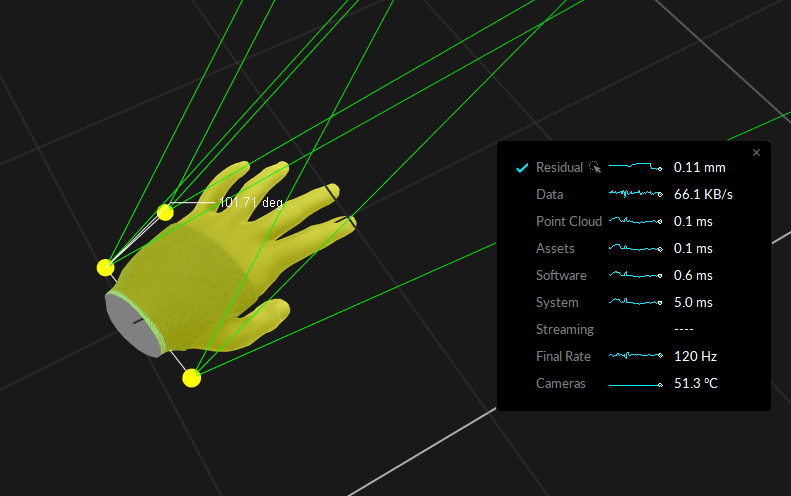
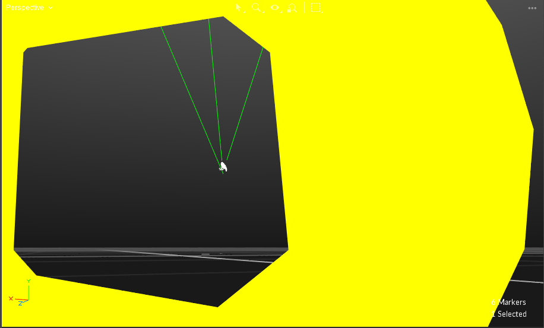

---
metaLinks:
  alternates:
    - >-
      https://app.gitbook.com/s/GaZwzcsVav6zPBRZpapU/quick-start-guides/quick-start-guide-precision-capture
---

# Quick Start Guide: Precision Capture

With an optimized system setup, motion capture systems are capable of obtaining extremely accurate tracking data from a small to medium sized capture volume. This quick start guide includes general tips and suggestions on precision capture system setups and important cautions to keep in mind. This page also covers some of the precision verification methods in Motive. For more general instructions, please refer to the [Quick Start Guide: Getting Started](quick-start-guide-getting-started.md) or corresponding workflow pages.

## Residual Value

Before going into details on precision tracking with an OptiTrack system, let's start with a brief explanation of the _residual_ value, which is the key [reconstruction](../motive/reconstruction-and-2d-mode.md) output for monitoring the system precision. The [residual](../motive/reconstruction-and-2d-mode.md) value is an average offset distance, in mm, between the converging rays when reconstructing a marker; hence indicating preciseness of the reconstruction. A smaller residual value means that the tracked rays converge more precisely and achieve more accurate 3D reconstruction. A well-tracked marker will have a sub-millimeter average residual value. In Motive, the tolerable residual distance is defined from the [Reconstruction Settings](../motive/reconstruction-and-2d-mode.md) under the Application Settings panel.

When one or more markers are selected in the Live mode or from the [2D Mode](../motive/reconstruction-and-2d-mode.md) of capture data, the corresponding mean residual value is displayed over the [Status Panel](../motive-ui-panes/status-panel.md) located at the bottom-right corner of Motive.

 

## Capture Volume

First of all, optimize the capture volume for the most precise and accurate tracking results. Avoid a populated area when setting up the system and recording a capture. Clear any obstacles or trip hazards around the capture volume. Physical impacts on the setup will distort the calibration quality, and it could be critical especially when tracking at a sub-millimeter accuracy. Lastly, for best results, routinely recalibrate the capture volume.

### Infrared Black Background Objects

Motion capture cameras detect reflected infrared light. Thus, having other reflective objects in the volume will alter the results negatively, which could be critical especially for precise tracking applications. If possible, have background objects that are IR black and non-reflective. Capturing in a dark background provides clear contrast between bright and dark pixels, which could be less distinguishable in a white background.

.png>)

## Camera Placement

Optimized camera placement techniques will greatly improve the tracking result and the measurement accuracy. The following guide highlights important setup instructions for the small volume tracking. For more details on general system setup, read through the [Hardware Setup](../hardware/) pages.

**Mounting Locations**

For precise tracking, better results will be obtained by placing cameras closer to the target object (adjusting focus will be required) in a sphere or dome-shaped camera arrangement, as shown in the images on the right. Good positional data in all dimensions (X, Y, and Z axis) will be attained only if there are cameras contributing to the calculation from a variety of different locations; each unique vantage adds additional data.

.png>) .png>)

**Mount Securely**

For most accurate results, cameras should be perfectly stationary, securely fastened onto a truss system or an extremely rigid object. Any slight deformation or fluctuation to the mount structures may affect the result in sub-millimeter tracking applications. A small-sized truss system is ideal for the setup. Take extreme caution when mounting onto speed rails attached to a wall, because the building may fluctuate on hot days.

.png>) .png>)

## Focus and Aiming

.png>)

#### **F-stop**

Increase the f-stop higher (smaller aperture) to gain a larger depth of field. Increased depth of field will make the greater portion of the capture volume in-focus and will make measurements more consistent throughout the volume.

#### **Aim and Focus**

Especially for close-up captures, camera aim and focus should be adjusted precisely. Aim the cameras towards the center of the capture volume. Optimize the camera focus by zooming into a marker in Motive, and rotating the focus knob on the camera until the smallest marker is captured with clearest image contrast. To zoom in and out from the camera view, place the mouse cursor over the [2D camera preview](../motive-ui-panes/viewport.md) window in Motive and use the mouse-scroll.

For more information, please read through the [Aiming and Focusing](../hardware/aiming-and-focusing.md) workflow page.

## Motive Settings

The following sections cover key configuration settings which need to be optimized for the precision tracking.

### Camera Settings

Camera settings are configured using the [Devices pane](../motive-ui-panes/devices-pane.md) and the [Properties pane](../motive-ui-panes/properties-pane/) both of which can be opened under the [view tab](../motive-ui-panes/toolbar-command-bar.md) in Motive.

.png>)

| Setting                  | Default Value        | Description                                                                                                                                                                                                                                                                      |
| ------------------------ | -------------------- | -------------------------------------------------------------------------------------------------------------------------------------------------------------------------------------------------------------------------------------------------------------------------------- |
| **Details**              |                      |                                                                                                                                                                                                                                                                                  |
| **Number**               | Varies               | Denotes the number that Motive has assigned to that particular camera.                                                                                                                                                                                                           |
| **Device Type**          | Varies               | Denotes which type of camera Motive has detected (PrimeX 41, PrimeX 13W, etc.)                                                                                                                                                                                                   |
| **Serial Number**        | Varies               | Denotes the serial number of the camera. This information uniquely identifies the camera.                                                                                                                                                                                        |
| **Focal Length**         | Varies               | Denotes the distance between the camera's image sensor and its lens.                                                                                                                                                                                                             |
| **General**              |                      |                                                                                                                                                                                                                                                                                  |
| **Enabled**              | Toggle 'On'          | When Enabled is toggled on, the camera is active and able to collect marker data.                                                                                                                                                                                                |
| Rate                     | Maximum FPS          | Set the system frame rate (FPS) to its maximum value. If you wish to use slower frame rate, use the maximum frame rate during calibration and turn it down for the actual recording.                                                                                             |
| Reconstruction           | Toggle 'On'          | Denotes when camera is participating in 3D construction.                                                                                                                                                                                                                         |
| Rate Multiplier          | x1 (120Hz)           | Denotes the rate multiplier. This setting is for syncing external devices with the camera system                                                                                                                                                                                 |
| Exposure                 | 250 μs               | Denotes the exposure of the camera. The higher the number, the more microseconds a camera's sensor is exposed to light. If you're having issue with seeing markers, raise the exposure. If there is too much reflection data in the volume, lower the exposure.                  |
| Threshold (THR)          | 200                  | Do not bother changing the Threshold (THR) or LED values, keep them at their default settings. The Values EXP and LED are linked so change only the EXP setting for brighter images. If you turn the EXP higher than 250, make sure to wand extra slow to avoid blurred markers. |
| LED                      | Toggle 'On'          | 
In some instances you may want to turn off the IRLEDs on a particular camera. i.e. using an active wand for calibration reduces extraneous reflections from influencing a calibration.
                                                                                 |
| Video Mode               | Default: Object Mode | Changes video mode of the camera. For more information regarding camera video types, please see: [Camera Video Types](../motive/camera-video-types.md).                                                                                                                          |
| IR Filter                | Toggle 'On'          | \*Special to PrimeX 13/13W, SlimX 13, and Prime Color FS cameras. Toggles from using 850 nm IR filter which allows for only 850 nm IR light to be visible. When toggled off, all light will be visible to the camera's image sensor.                                             |
| Gain                     | 1: Low (Short Range) | Set the Gain setting to low for all cameras. Higher gain settings will amplify noise in the image.                                                                                                                                                                               |
| **Display**              |                      |                                                                                                                                                                                                                                                                                  |
| Show Field of View       | Toggle 'Off'         | When toggled on this shows the camera's field of view. This is particularly useful when [aiming and focusing](../hardware/aiming-and-focusing.md) upon setting up a camera volume.                                                                                               |
| Show Frame Delivery Info | Toggle 'Off'         | When toggled on, this setting shows the frame delivery info for all the cameras in the system overlaid on the selected camera's [camera viewport.](../motive-ui-panes/viewport.md#cameras-view)                                                                                  |

### Live-Reconstruction Settings

Live-reconstruction settings can be configured under the [application settings](../motive-ui-panes/settings/settings-live-pipeline.md) panel. These settings determine which data gets reconstructed into the 3D data, and when needed, you can adjust the filter thresholds to prevent any inaccurate data from reconstructing. Read through the [Application Settings](../motive-ui-panes/settings/settings-live-pipeline.md) page for more details on each setting. For the precision tracking applications, the key settings and the suggested values are listed below:

.png>)

| Setting                                                                                                            | Value  | Description                                                                                                                                                                                                                                                                      |
| ------------------------------------------------------------------------------------------------------------------ | ------ | -------------------------------------------------------------------------------------------------------------------------------------------------------------------------------------------------------------------------------------------------------------------------------- |
| 
Solver Tab: [<a href="../motive-ui-panes/settings/#advanced-options">Advanced Setting</a>] Residual (mm)
 | < 2.00 | Set the allowable [residual](../motive-ui-panes/settings/settings-live-pipeline.md) value smaller for the precision volume tracking. Any offset above 2.00 mm will be considered as inaccurate, and the corresponding 2D data will be excluded from reconstruction contribution. |
| 
Solver Tab: Minimum Rays to Start
                                                                        | ≥ 3    | Set the minimum required number of rays higher. More accurate reconstruction will be achieved when more rays converge within the allowable residual offset.                                                                                                                      |
| 
Camera Tab: Minimum Pixel Threshold
                                                                      | ≥ 3    | Since cameras are placed more close to the tracked markers, each marker will appear bigger in camera views. The minimum number of threshold pixels can be increased to filter out small extraneous reflections if needed.                                                        |
| 
Camera Tab: Circularity
                                                                                  | ≥ 3    | Increasing the circularity value will filter out non-marker reflections. Furthermore, it prevents collecting data from [merged reflections](quick-start-guide-precision-capture.md) where the calculated centroid is no longer reliable.                                         |

## Calibration

The following calibration instructions are specific to precision tracking. For more general information, refer to the [Calibration](../motive/calibration/) page.

### Wands

For calibrating small capture volumes for precision tracking, we recommend using a Micron Series wand, either the CWM-250 or CWM-125. These wands are made of invar alloy, very rigid and insensitive to temperature, and they are designed to provide a precise and constant reference dimension during calibration. At the bottom of the wand head, there is a label which shows a factory-calibrated wand length with a sub-millimeter accuracy. In the [Calibration pane](../motive/calibration/), select Micron Series under the [OptiWand](../motive/calibration/) dropdown menu, and define the exact length under the _Wand Length_.

.png>) .png>)

The CW-500 wand is designed for capturing medium to large volumes, and it is not suited for calibrating small volumes. Not only it does not have the indication on the factory-calibrated length, but it is also made of aluminum, which makes it more vulnerable to thermal expansions. During the wanding process, Motive references the wand length for calibrating the capture volume, and any distortions in the wand length would cause the calibrated capture volume to be scaled slightly differently, which can be significant when capturing precise measurements. For this reason, a micron series wand is suitable for precision tracking applications.

Note: **Never** touch the marker on the CWM-250 or CWM-125 since any changes can affect the calibration and overall data.


**Precision Capture Calibration Tips**

* **Wand slowly**. Waving the wand around quickly at high exposure settings will blur the markers and distort the centroid calculations, at last, reducing the quality of your calibration.
* **Avoid occluding any of the calibration markers while wanding.** Occluding markers will reduce the quality of the calibration.
* **A variety of unique samples is needed to achieve a good calibration.** Wand in a three-dimensional volume, wave the wand in a variety of orientations and throughout the volume.
* Extra wanding in the target area you wish to capture will improve the tracking in the target region.
* Wanding the edges of the volume helps improve the lens distortion calculations. This may cause Motive to report a slightly worse overall calibration report, but will provide better quality calibration; explained below.
* Starting/stopping the calibration process with the wand in the volume may help avoid getting rough samples outside your volume when entering and leaving.


### Calibration Results

Calibration reports and analyzing the reported error is a complicated subject because the calibration process uses its own samples for validation. For example, sampling near the edge of the volume may improve the accuracy of the system but provide slightly worse calibration results. This is because the samples near the edge will have more errors to be corrected. Acceptable mean error varies based on the size of your volume, the number of cameras, and desired accuracy. The key metrics to keep an eye on are the Mean 3D Error for the _Overall Reprojection_ and the _Wand Error_. Generally, use calibrations with the Mean 3D Error less than 0.80 mm and the Wand Error less than 0.030 mm. These numbers may be hard to reproduce in regular volumes. Again, the acceptable numbers are subjective, but lower numbers are better in general.

## Tracking

### Marker Type

In general, passive retro-reflective markers will provide better tracking accuracy. The boundary of the spherical marker can be more clearly distinguished on passive markers, and the system can identify an accurate position of the marker centroids. The active markers, on the other hand, emit light and the illumination may not appear as spherical on the camera view. Even if a spherical diffuser is used, there can be situations where the light is not evenly distributed. This could provide inaccurate centroid data. For this reason, passive markers are preferred for precision tracking applications.

### Marker Placement

For close-up capture, it could be inevitable to place markers close to one another, and when markers are placed in close vicinity, their reflections may be merged as seen by the camera’s imager. Merged reflections will have an inaccurate centroid location, or they may even be completely discarded by the [circularity filter](../motive-ui-panes/settings/settings-live-pipeline.md) or the [intrusion detection](../motive-ui-panes/settings/settings-live-pipeline.md#intrusion-band) feature. For best results, keep the circularity filter at a higher setting (>0.6) and decrease the intrusion band in the camera group [2D filter settings](../motive-ui-panes/settings/settings-live-pipeline.md#filter-type) to make sure only relevant reflections are reconstructed. The optimal balance will depend on the number and arrangement of the cameras in the setup.

There are editing methods to discard or modify the missing data. However, for most reliable results, such marker intrusions should be prevented before the capture by separating the marker placements or by optimizing the camera placements.

.png>)

### Refine Rigid Body Definition

Once a Rigid Body is defined from a set of reconstructed points, utilize the Rigid Body Refinement feature to further refine the Rigid Body definition for precision tracking. The tool allows Motive to collect additional samples in the live mode for achieving more accurate tracking results.

See: [Rigid Body Refinement](../motive/rigid-body-tracking/)


Using the Rigid Body Refinement tool for improving asset definitions.


## Camera Temperature

.png>)

In a mocap system, camera mount structures and other hardware components may be affected by temperature fluctuations. Refer to linear thermal expansion coefficient tables to examine which materials are susceptible to temperature changes. Avoid using a temperature sensitive material for mounting the cameras. For example, aluminum has relatively high thermal expansion coefficient, and therefore, mounting cameras onto aluminum mounting structures may distort the calibration quality. For best accuracy, routinely recalibrate the capture volume, and take the temperature fluctuation into an account both when selecting the mount structures and before collecting data.

### Ambient Temperature

An ideal method of avoiding influence from environmental temperature is to install the system in a temperature controlled volume. If such option is unavailable, routinely calibrate the volume before capture, and recalibrate the volume in between sessions when capturing for a long period. The effects are especially noticeable on hot days and will significantly affect your results. Thus, consistently monitor the average residual value and how well your rays converge to individual markers.

### Camera Heat

The cameras will heat up with extended use, and change in internal hardware temperature may also affect the capture data. For this reason, avoid capturing or calibrating right after powering the system. Tests have found that the cameras need to be warmed up in Live mode for about an hour until it reaches a stable temperature. Typical stable temperatures are between 40-50 degrees Celsius or 25 degree Celsius above the ambient temperature. For Ethernet camera models, camera temperatures can be monitored from the [Cameras View](../motive-ui-panes/viewport.md) in Motive (Cameras View > Eye Icon > Camera Info).


If a camera exceeds 80 degrees Celsius, this can be a cause for concern. It can cause frame drops and potential harm to the camera. If possible, keep the ambient temperature as low, dry, and consistent as possible.


## Attention: Vibrations

Especially for measuring at sub-millimeters, even a minimal shift of the setup can affect the recordings. Re-calibrate the capture volume if your average residual values start to deviate. In particular, watch out for the following:

* Avoid touching the cameras and the camera mounts.
* Keep the capture area away from heavy foot traffic. People shouldn't be walking around the volume while the capture is taking place.
* Closing doors, even from the outside, may be noticeable during recording.

## Reconstruction Verification

The following methods can be used to check the tracking accuracy and to better optimize the [reconstructions settings](../motive/reconstruction-and-2d-mode.md) in Motive.

#### Verification Method 1

First, go into the [perspective view pane](../motive-ui-panes/viewport.md) > select a marker, then go to the [Camera Preview pane](../motive-ui-panes/viewport.md) > Eye Button  > Set Marker Centroids: True. Make sure the cameras are in the object mode, then zoom into the selected marker in the 2D view. The marker will have two crosshairs on it; one white and one yellow. The amount of offset between the crosshairs will give you an idea of how closely the calculated 2D centroid location (thicker white line) aligns with the reconstructed position (thinner yellow line). Switching between the grayscale mode and the object mode will make the errors more distinguishable. The below image is an example of a poor calibration. A good calibration should have the yellow and white lines closely aligning with each other.

.png>)

#### Verification Method 2

The calibration quality can also be analyzed by checking the convergence of the tracked rays into a marker. This is not as precise as the first method, but the tracked rays can be used to check the calibration quality of multiple cameras at once. First of all, make sure tracked rays are visible; [Perspective View pane](../motive-ui-panes/viewport.md) > Eye button > Tracked Rays. Then, select a marker in the perspective view pane. Zoom all the way into the marker (you may need to zoom into the sphere), and you will be able to see the tracking rays (green) converging into the center of the marker. A good calibration should have all the rays converging into approximately one point, as shown in the following image. Essentially, this is a visual way of examining the average residual offset of the converging rays.

.png>)

## Continuous Calibration

In Motive 3.0, a new feature was introduced called **Continuous Calibration**. This can aid in keeping your precision for longer in between calibrations. For more information regarding continuous calibration please refer to our Wiki page [Continuous Calibration](../motive/calibration/continuous-calibration.md).
