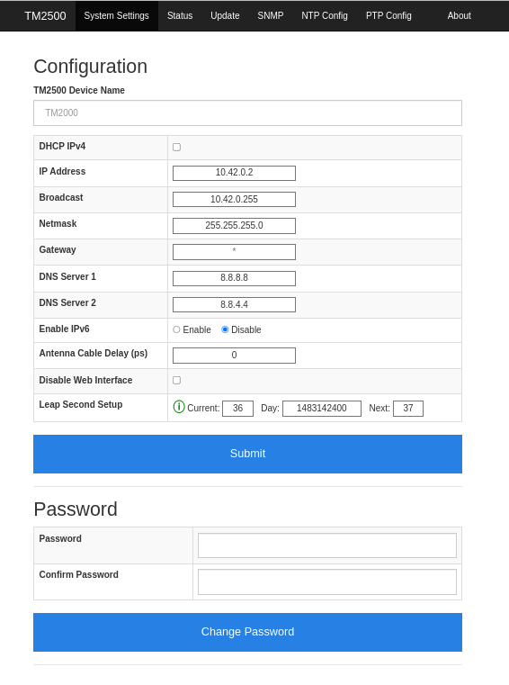
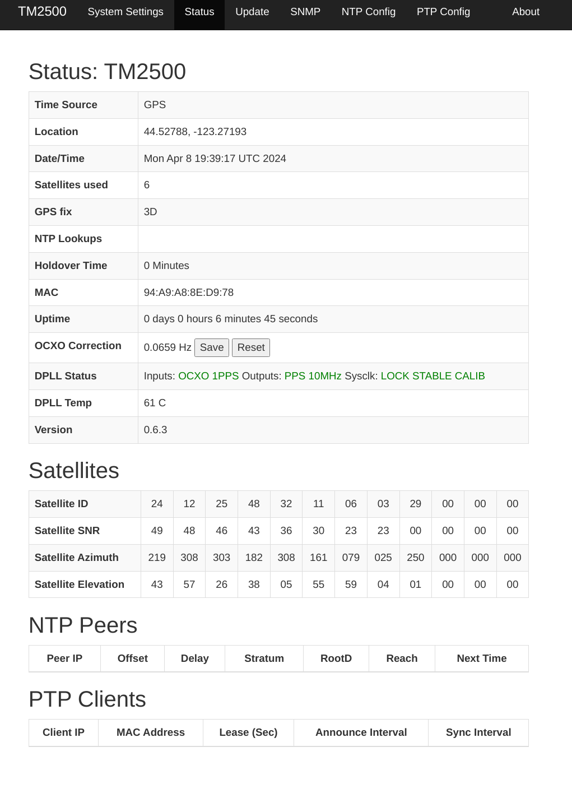
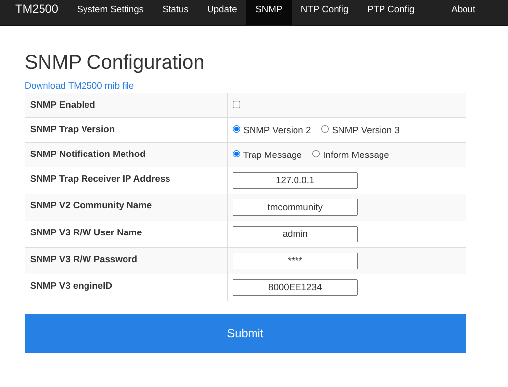
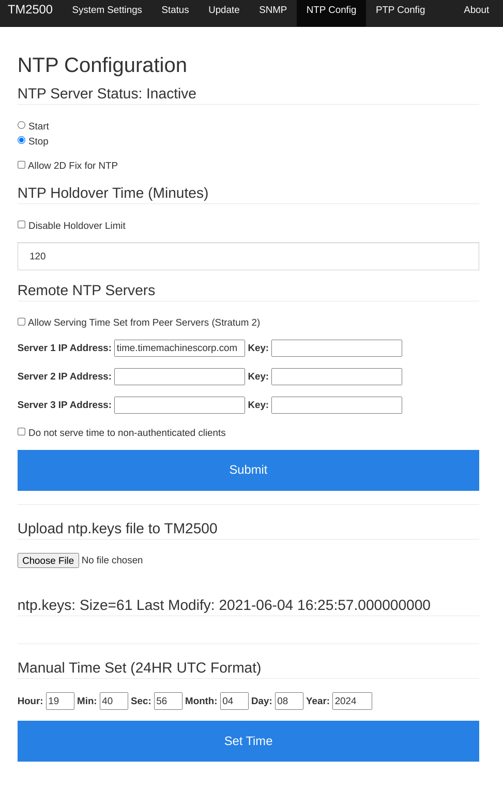
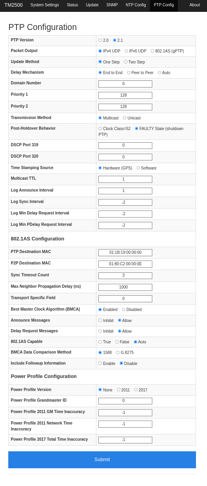

# External Device Sync Guide: eSync 2

## Overview

The eSync 2 is a synchronization hub that allows advanced users to integrate external systems into OptiTrack motion capture systems. With proper sync chain setups, you can have another (parent) system control the mocap system, or have the mocap system control other (child) systems, or both. Note that the setup may change depending on the type and number of the external devices as well as the characteristics of the communicated sync signals. Use this guide for understanding the general idea of how external devices are implemented and apply the knowledge for your needs.

### **External Device Synchronization**

With the eSync 2, Prime series mocap systems can work together with other systems to perform precisely synchronized operations and data collections. This offers benefits in a wide range of applications. Reference video cameras, [NI-DAQ](../../movement-sciences/movement-sciences-hardware/ni-daq-setup.md) devices, [Force Plates](../../movement-sciences/), and recording triggers are examples of commonly synchronized external devices.

The eSync 2 synchronization hub has multiple sync input and output ports. In general, a parent device connects to the input ports for controlling the mocap system, and the child devices connect to output ports to be controlled by the mocap system. Once the devices are connected to the eSync 2, the input and output signal characteristics need to be specified and configured under the eSync 2's [device properties](../../motive-ui-panes/properties-pane/properties-pane-esync2.md) in Motive.

\
**Requirements**

* Ethernet Camera System (PrimeX series or SlimX 13)
* The eSync 2
* External Devices (child / parent)
* Sync Cables: BNC or other sync cables with BNC adapters.

.png>)

.png>)


Ports A (3.3V input sync), C (Isolated Sync In), D (Video Genlock In), E (SMPTE Time Code In), and I (3.3V output sync) are all BNC female ports.


## The eSync 2


For eSync 2 technical specifications please visit our [eSync 2 Support](https://optitrack.com/support/hardware/esync-2.html) webpage.


## Synchronization Setup


_For general instructions on setting up the mocap system, refer to the_ [_Hardware Setup_](../../hardware/) _pages. This guide assumes the camera system and the eSync 2 have been already set up._


#### Plan the Setup

Before setting up, draw out the schematic for which devices will be the parent or child of the synchronization chain in respect to the mocap system.

#### Connect External Devices

* Child Devices (e.g. Force Plates): Connect _Output_ ports of the eSync 2 to sync input ports of the child devices.
* Parent Device (e.g. Genlock): Connect the sync output of a parent device into one of the _Input_ ports of the eSync 2. For integrating Genlock, VESA Stereo In, or SMPTE timecode signals, connect them to the corresponding labeled input ports of the eSync 2.

#### Configure eSync 2 Properties in Motive

Select the eSync 2 in the [Devices pane](../../motive-ui-panes/devices-pane.md) to display its properties in the [Properties pane](../../motive-ui-panes/properties-pane/). Update the following **Sync Input Settings**:

* Select the desired sync **Source** for the camera system to synchronize to from the list of available devices. Read more under the [Input Source Setup](external-device-sync-guide-esync-2.md#input-source-setup) section of this page.
* Configure the **Input Divider/Multiplier settings**, and/or the **clock frequency settings** (only when using the Internal Clock source), to set the camera rate. The resulting frame rate of the camera system will be displayed next to _Camera Rate_ property or in the [Devices pane](../../motive-ui-panes/devices-pane.md).
* Configure the **eSync 2 Outputs**. Output ports of the eSync 2 are used to tell connected child devices what Motive is doing. Read more under the [Output Signal Setup](external-device-sync-guide-esync-2.md#output-source-setup) section of this page.
* To set up a recording trigger device, connect it to an input port and designate the port under the **Recording Trigger** section of the [eSync 2 properties](../../motive-ui-panes/properties-pane/properties-pane-esync2.md). Read more under the [Recording Trigger Setup](external-device-sync-guide-esync-2.md#recording-gate-and-recording-start-stop-pulse) section of this page.

Once everything is setup, check the _Monitor_ section of the Properties pane to make sure all signals are detected properly.

<figure><figcaption>
Monitor section of the eSync 2 Properties.
</figcaption></figure>

## Input Source Setup

Once you have connected the external devices to the eSync 2, the first step is to select and configure the **sync source** under the [eSync 2 properties](../../motive-ui-panes/properties-pane/properties-pane-esync2.md). The selected source will become the parent sync of both the camera system and other external devices. There are multiple sync source options to choose from under the drop-down menu. Ultimately, only _one_ sync source can be selected and used to synchronize the cameras and subsequent child devices for any particular configuration.

### Sync Input: Select the Sync Source

The first step is to define a parent sync source for the camera system. This is configured in the _Sync Input → Source_ entry under the [eSync 2 properties](../../motive-ui-panes/properties-pane/properties-pane-esync2.md).

.png>)

**Internal Free Run**

By default, the sync input source is set to **Internal Free Run**, meaning that the camera system is sampling at a frame rate defined in the [Devices pane](../../motive-ui-panes/devices-pane.md). In this mode, Prime series cameras are synchronized by communicating the time information with each other through the camera network itself using a high-precision algorithm for timing synchronization. This is the default synchronization protocol for Ethernet camera systems without an eSync 2.

**Internal Clock**

To use the internal clock of the eSync 2 as the parent sync source for both the camera system and the subsequent child devices, set the sync input source to **Internal Clock**. When selected, the clock frequency can be adjusted in _Sync Input → Clock Freq (Hz)_ settings.

**Input Signal**

To use an external sync signal as the parent sync source, set the sync input source to the corresponding input port where the parent device is connected. See the [specifications](https://optitrack.com/support/hardware/esync-2.html) for more details on each of the input ports, from left to right:&#x20;

* SMPTE Timecode
* Video Genlock In&#x20;
* Isolated Input port: VIH(max): 12V
* VESA Stereo Input port: VIH(max): 3.3V
* High Impedance Ports (1-3) VIH(max): 3.3V

### Sync Input: Set the Input Trigger

Once the input source is set, the next step is to define an appropriate _trigger event_. Under the _Sync Input → Input Trigger_ option, pick a signal morphology (Either Edge, Rising Edge, or Falling Edge) for the desired trigger event. Note that the suitable event will vary depending on characteristics of the received signal and how you want the system to synchronize with it. The following diagrams show how the camera system responds to received signal triggers. When configured properly, the camera system will expose in respect to the sync signal from the parent device.

#### **Rising Edge:**

Every rising edge of the sync input signal defines either the start or the end of a frame, consecutively.

.png>)

**Falling Edge:**

Every falling edge of the sync input signal defines either the start or the end of a frame, consecutively.

.png>)

**Either Edge:**

Every rising or falling edge of the sync input signal defines either the start or the end of a frame, consecutively. When using both of the edges as the input trigger, the input signal must have 50% duty cycle for the cameras to synchronize properly.

.png>)

### Set the Input Divider/Multiplier

.png>)

The frame rate of the camera system is determined by the selected sync input source. When the frequency of the sync source is higher than the supported frame rate, use input dividers and multiplier to adjust the signal frequency for synchronizing the camera system. The resulting framerate is displayed as the _Camera Rate_ at the bottom of the _Sync Input Settings_ so you can monitor it as you adjust the Divider or Multiplier values. When the customized sync configurations are applied at the end of the setup, the cameras will start to capture at this final frame rate.

### Advanced Settings

Click the  icon at the top, and select _Show Advanced_ to view advanced settings.&#x20;

#### Set Sync Offset

This setting applies a delay (in microseconds) to the camera exposure from the input trigger. Typically, it's used to synchronize other infrared systems with the camera system to avoid IR interference with each other.

#### Sync Input Trigger and Exposure Timing

Camera exposures are always positioned at the center of every frame periods, and the precise moment of the camera exposure does not exactly coincide with the trigger event. When synchronizing the camera exposure timing with the sync input signal triggers, make sure this gap is taken into account. To precisely align the input signal trigger with the exposure timing, an offset delay, in microseconds, of half of the frame period plus half of the camera exposure must be applied in the _Sync Input → Sync Offset (us)_. The camera exposure is measured in microseconds on the Ethernet cameras.

.png>)

### Precision Time Protocol (PTP)&#x20;

Precision Time Protocol tracks time down to the nanosecond, employing GPS to achieve the most precise synchronization possible.&#x20;

<figure><figcaption>
PTP timecode in the Motive Viewport.
</figcaption></figure>

Beginning with version 3.1.1, Motive supports PTP devices as the Sync Source for the camera system. This section provides instructions to connect and configure a PTP generator device to synchronize your camera system.&#x20;

#### Equipment Needed

* PTP device.&#x20;


The [TM 2500C from Time Machines](https://timemachinescorp.com/product/gps-ntpptp-network-time-server-10mz-output-tm2500/) is currently the only PTP device supported by Motive.&#x20;


#### PTP Setup

* Install Motive 3.1.1, or a more recent version.
* Connect the eSync2 and PTP generator device to the Ethernet switch.
* Connect the PTP devices PPS port to the _Input 1_ port of the eSync2.
* Connect the GPS port to the antenna and place the antenna outdoors.

<figure><figcaption>
Connecting the PTP to the eSync2.
</figcaption></figure>

* Connect the device to a standard power source.
* In Motive, select the eSync2 in the Device Pane to display its properties.&#x20;
* Set the Sync Input Source to _PTP Precision Timestamp._

<figure><figcaption></figcaption></figure>

* To display PTP timestamp data, click the  button to open the Application Settings panel. On the [Views tab](../../motive-ui-panes/settings/settings-views.md), go to [_3D -> Heads Up Display -> Timecode_](../../motive-ui-panes/settings/settings-views.md#timecode) and select either _Show Precision Timestamp in 3D View_ or _Show Precision Timestamp in Control Deck_. The example below shows the the PTP displayed in the Viewport.&#x20;

<figure><figcaption>
Motive Viewport with the PTP timecode displayed.
</figcaption></figure>


You can also access the PTP start time in the Take properties.


#### Configure the PTP Device

Open a web browser and enter the device's IP address to access the system configuration panel. The default login values are listed in the table below. We recommend that you note any changes made to the default values for your records.&#x20;

| Parameter  | Default Value |
| ---------- | ------------- |
| IP Address | 192.168.1.20  |
| Username   | admin         |
| password   | tmachine      |


The device can be reset to factory defaults if the IP address is unknown or the admin password is lost.&#x20;

To reset, insert a paperclip or other similar object into the small hole on the front of the device until the button depresses. Hold the button in for three (3) seconds, then release.&#x20;


The following screenshots show the [TM 2500C from Time Machines](https://timemachinescorp.com/product/gps-ntpptp-network-time-server-10mz-output-tm2500/) as our example. Click the tabs at the top of the screen to move between the pages. Click the tabs below for configuration examples.



Update the IP information and the administrator password.&#x20;

<figure><figcaption>
TM 2500C Configuration settings.
</figcaption></figure>



Display information about the connection.&#x20;

<figure><figcaption>
TM 2500C Status page.
</figcaption></figure>



Set the Trap Version and notification method.&#x20;

<figure><figcaption>
TM 2500C SNMP Configuration page.
</figcaption></figure>



Network Time Protocol settings.&#x20;

<figure><figcaption>
TM 2500C NTP settings.
</figcaption></figure>



Precision Time Protocol settings.&#x20;

<figure><figcaption>
TM 2500C PTP settings.
</figcaption></figure>



Download log files or restart the device from this screen.

<figure><figcaption>
TM 2500C About screen.
</figcaption></figure>



## Output Source Setup

The eSync 2 has a total 4 output ports (3.3 V). To setup the camera system as parent to the other systems, connect the child devices into the _Output_ ports of the eSync to receive the reference sync signals.&#x20;

Once the devices are connected, you can configure the output signal source under the[ eSync 2 properties](../../motive-ui-panes/properties-pane/properties-pane-esync2.md). Know what type of sync signals are expected by the child devices, and configure the sources accordingly so that appropriate signals are outputted.

.png>)

**The eSync 2 can output the following types of signals:**

* Exposure Time
* Recording Gate
* Record Start/Stop Pulse
* Gated Exposure Time
* Gated Internal Clock
* Selected Sync
* Adjusted Sync
* Input signals: Relaying input signals.
  * Selected Sync: Raw input signal.
  * Adjusted Sync: Adjusted (offset, multiplier, and divider) signal.


**Note:** All output signals can be inverted by setting the _Output → Polarity_ to _Inverted_.


#### **Gated Output Signal (eSync 2):**

The gated (while-recording) output signal from the eSync 2 is frame-synchronous with the recorded mocap data. In live mode, the cameras are continuously shuttering and capturing frames at a defined frame rate. If the recording trigger is received in the middle of a frame period, the eSync waits until the next frame to start recording and asserting gated output signal. This mechanism ensures that the recorded mocap data and the gated output signals are precisely synchronized.

### Exposure Time / Gated Exposure Time

Exposure Time/Gated Exposure Time output signals indicate when the cameras are exposing.

When the _Output: Type_ is set to Exposure Time, a _high voltage_ (3.3V) signal will be outputted from the corresponding output port whenever the camera system is exposing, or shuttering, in the [Live Mode](../../motive-ui-panes/control-deck.md#live-and-edit-mode). The Gated Exposure Time signal works similarly, but the signal will be sent out only when Motive is recording.

.png>)

.png>)

### Recording Gate & Recording Start/Stop Pulse

Recording gate/pulse output signals can be used to tell the child device when Motive is recording or not. When configured to Recording Gate, the eSync 2 will output a constant high voltage signal when Motive is recording. When configured to Recording Start/Stop Pulse, the sync hub will output a pulse signal when Motive either starts or stops recording.

.png>)

.png>)

### Gated Internal Clock

When configured to Gated Internal Clock, the eSync 2 outputs its internal clock signal while Motive is recording. The internal clock signal has a 50% duty cycle with the signal frequency defined under the _Sync Input → Clock Freq (Hz)_ section.

.png>)

**Using Internal Clock Signal to drive both the camera system and external devices**

To achieve per-frame synchronization between the camera system and an external device (e.g. force plates, NI-DAQ), the internal clock signal from the eSync 2 can be used to drive both the camera system as well as the external device. _This is possible only if the external device has the capability of receiving external clock signal._ When the external system runs at a higher sampling rate, a **divisor** or a **multiplier** must be applied to the clock signal to achieve the desired framerate on the camera system. Here, please note that depending on the applied divisor/multiplier, the alignment of the outputted signal may vary. The exposure timing of the camera system will always be aligned at the center of the divided or multiplied signal, and whether the exposure timing aligns with the rising edge or falling edge of the output signal may vary depending on the applied divisor. Please see the below image:

.png>)

## Hardware Recording Trigger Setup

With the eSync 2, external triggering devices (e.g. remote start/stop button) can integrate into the camera system and set to trigger the recording start and stop events in Motive. Such devices will connect to input ports of the eSync 2 and configured under the Record Triggering section of the [eSync 2 properties](../../motive-ui-panes/properties-pane/properties-pane-esync2.md).

By default, the remote trigger source is set to _Software_, which is the record start/stop button click events in Motive. Set the trigger source to the corresponding input port and select an appropriate trigger edge when an external trigger source (Trigger Source → isolated or input) is used. Available trigger options include _Rising Edge_, _Falling Edge_, _High Gated_, or _Low Gated_. The appropriate trigger option will depend on the signal morphology of the external trigger. After the trigger setting have been defined, **press the recording button in advance**. It sets Motive into a standby mode until the trigger signal is detected through the eSync 2. When the trigger signal is detected, Motive will start the actual recording. The recording will be stopped and return to the 'armed' state when the second trigger signal, or the falling edge of the gated signal, is detected.

_Note: For capturing multiple recordings via recording trigger, only the first_ TAK _will contain the 3D data. For the subsequent_ TAKs, the 3D data must be reconstructed through the [_post-processing reconstruction_](../../motive/reconstruction-and-2d-mode.md#post-processing-reconstruction) _pipeline._

**Steps**

1. Open the [Devices pane](../../motive-ui-panes/devices-pane.md) and the [Properties pane](../../motive-ui-panes/properties-pane/) to access the [eSync 2 properties](../../motive-ui-panes/properties-pane/properties-pane-esync2.md).
2. Under the **Record Triggering** section, set the source to the respective input port where the trigger signal is inputted.
3. Choose an appropriate trigger option, depending on the morphology of the trigger signal.
4. Press the record button in Motive, which prepares Motive for recording. Motive waits for an incoming trigger signal.
5. When the first trigger is detected, Motive starts recording.
6. When the second trigger is detected, Motive stops recording and awaits the next trigger for repeated recordings. For High Gated and Low Gated trigger options, Motive will record during respective gated windows.
7. Once the recording is finished, press the stop button to disarm Motive.

.png>)

## Troubleshooting

<strong>Q : I have set up a custom synchronization chain from a mocap system (parent) to a third-party device (child) that uses a third-party software package to operate, but somehow I am seeing a timing offset between the two recorded data sets. What's happening here?</strong>

A: The observed offset is likely due to a time delay from the third party system receiving the signal and initiating the recording. This is a common source of confusion especially for syncing devices that runs on third-party software packages.

The eSync and the OptiHub can be configured to output signals at specified events (e.g. exposure timing, recording pulse, etc.). However, this configuration solely will not accomplish precise synchronization of the two systems because it does not take account the time delay for the third party system to receive and react to the signal.

To achieve fully precise synchronization, please follow our devicespecific sync setup guides, if applicable, or take this offset into consideration.

