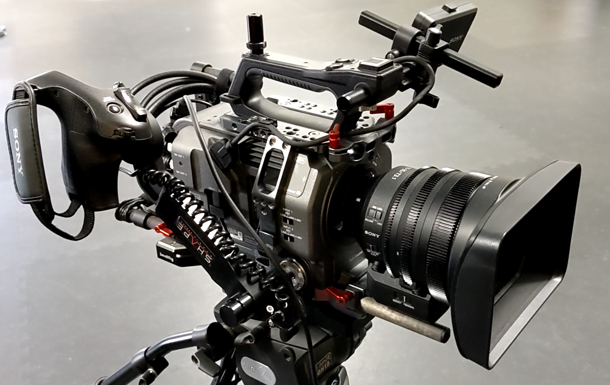
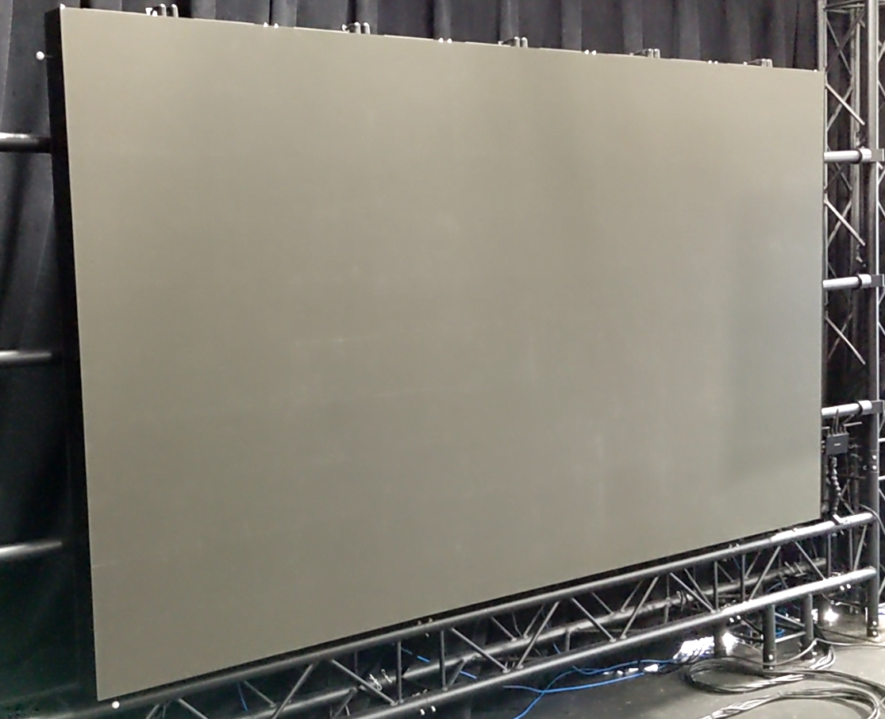
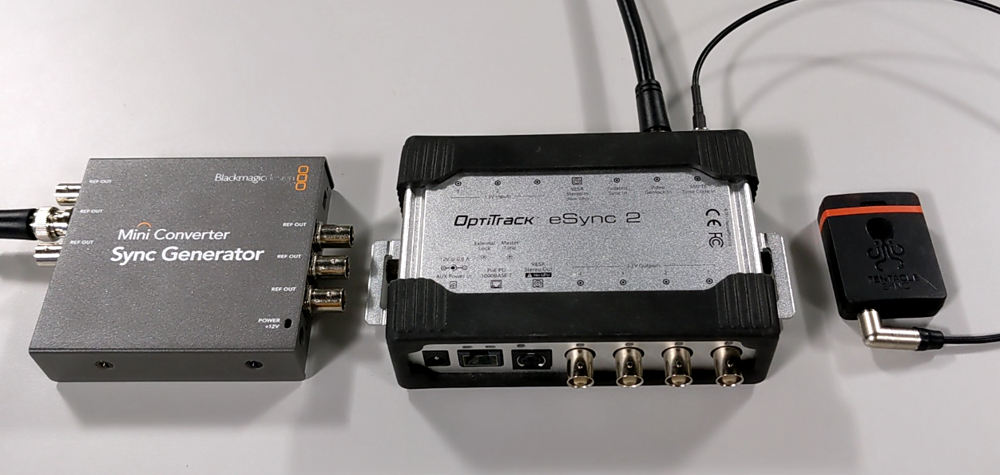
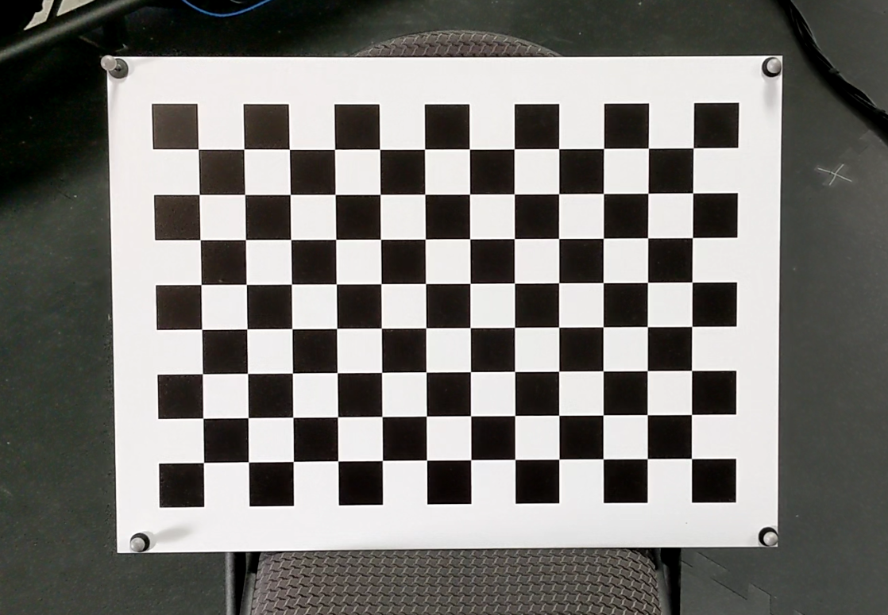
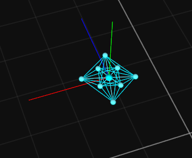
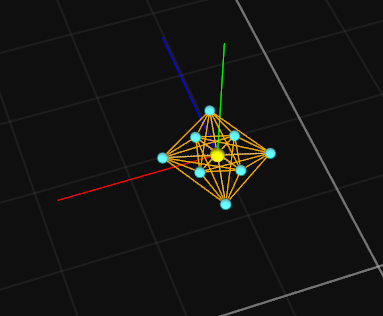
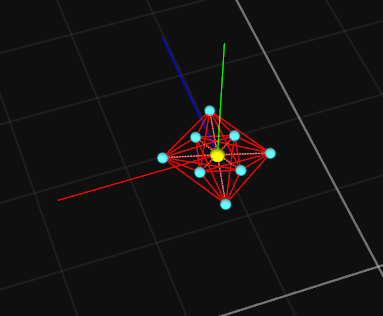
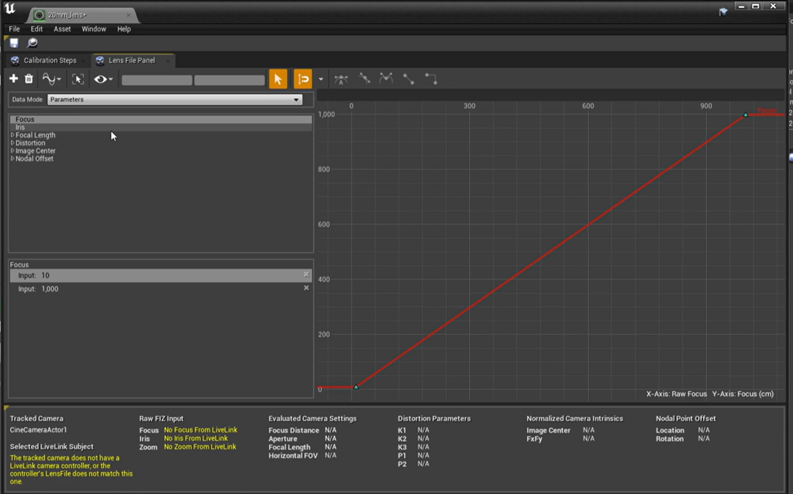

# Unreal Engine: OptiTrack InCamera VFX

## **Overview**



This page is an introduction showing how to use OptiTrack cameras to set up an LED Wall for Virtual Production. This process is also called In-Camera Virtual Effects or InCam VFX. This is an industry technique used to simulate the background of a film set to make it seem as if the actor is in another location.


This tutorial requires Motive 2.3.x, Unreal Engine 4.27, and the [Unreal Engine: OptiTrack Live Link Plugin](../plugins/optitrack-unreal-engine-plugin/unreal-engine-optitrack-live-link-plugin/).


## Hardware

This is a list of required hardware and what each portion is used for.

### OptiTrack System

The OptiTrack system is used to track the camera, calibration checkerboard, (optional) LED Wall, and (optional) any other props or additional cameras. As far as OptiTrack hardware is concerned, you will need all of the typical hardware for a motion capture system plus an eSync2, BaseStation, CinePuck, Probe, and a few extra markers. Please refer to the [Quick Start Guide](../quick-start-guides/quick-start-guide-getting-started.md) for instructions on how to do this.

### Computers

#### Motive and Unreal Engine Computers

You will need one computer to drive Motive/OptiTrack and another to drive the Unreal Engine System.

* **Motive PC** - The CPU is the most important component and should use the latest generation of processors.
* **Unreal Engine PC** - Both the CPU and GPU is important. However, the GPU in particular needs to be top of the line to render the scene, for example a RTX 3080 Ti. Setups that involve multiple LED walls stitched together will require graphics cards that can synchronize with each other such as the NVIDIA A6000.

#### SDI Card

The Unreal Engine computer will also require an SDI input card with both SDI and genlock support. We used the BlackMagic Decklink SDI 4K and the BlackMagic Decklink 8K Pro in our testing, but other cards will work as well.

### Studio Camera and Accessories

#### **Studio Camera**

You will need a studio video camera with SDI out, timecode in, and genlock in support. Any studio camera with these BNC ports will work, and there are a lot of different options for different budgets. Here are some suggestions:

* [Sony PXW-FS7](https://pro.sony/ue_US/products/handheld-camcorders) (What we use internally)
* [Canon EOS Series](https://www.usa.canon.com/internet/portal/us/home/products/professional-video-solutions/cinema-eos)
* Etc...

Cameras without these synchronization features can be used, but may look like they are stuttering due to frames not perfectly aligning.

#### Camera Movement Device

A camera dolly or other type of mounting system will be needed to move and adjust the camera around your space, so that the movement looks smooth.

#### **Camera Cage**

Your studio camera should have a cage around it in order to mount objects to the outside of it. You will need to rigidly mount your CinePuck to the outside. We used SmallRig NATO Rail and Clamps for the cage and rigid body mounting fixtures.

#### **Cables**

You’ll also need a variety of cables to connect from camera back to where the Computers are located. This includes things such as power cables, BNC cables, USB extension cables (optional for powering the CinePuck), etc... These will not all be listed here, since they will depend on the particular setup for your system.

#### **Lens Encoder (Optional)**

Many systems will want a lens encoder in the mix. This is only necessary if you plan on zooming your lens in/out between shoots. We do not use this device in this example for simplicity.

### LED Wall

In order to run your LED wall, you will need two things an LED Wall and a Video Processor.

For large walls composed of LED wall subsections you will need an additional video processor and an additional render PC for each wall as well as an SDI splitter. We are using a single LED wall for simplicity.

#### **LED Wall**

The LED Wall portion contains the grid of LED light, the power structure, and ways to connect the panels into a video controller, but does not contain the ability to send an HDMI signal to the wall.

We used Planar TVF 125 for our video wall, but there are many other options out there depending on your needs.

#### **Video Processor**

The video processor is responsible for taking an HDMI/Display Port/SDI signal and rendering it on the LED wall. It's also responsible for synchronizing the refresh rate of the LED wall with external sources.

The video processor we used for controlling the LED wall was the Color Light Z6. However, Brompton Technology video processors are a more typical film standard.

### Timecode and Genlock Generators

You will either need a timecode generator AND a genlock generator or a device that does both. Without these devices the exposure of your camera will not align with when the LED wall renders and you may see the LED wall rendering. These signals are used to synchronize Motive, the cinema camera, LED Walls, and any other devices together.

#### **Setup Instructions**

* **Timecode** - The timecode signal should be fed into Motive and the Cinema camera. The SDI signal from the camera will plug into the SDI card, which will carry the timecode to the Unreal Engine computer as well.
* **Genlock** - The genlock should be fed into Motive, the cinema camera, and the Video Processor(s).

#### **Timecode**

Timecode is for frame alignment. It allows you to synchronize data in post by aligning the timecode values together. (However, it does not guarantee that the cameras expose and the LED wall renders at the same time). There are a variety of different manufactures that will work for timecode generators. Here are some suggestions:

* [Evertz HD9010TM](https://evertz.com/products/HD9010TM)
* [Tentacle Sync](https://www.tentaclesync.com/)
* [UltraSync One](https://www.timecodesystems.com/products-home/ultrasync-one-2/)
* Etc...

#### **Genlock**

Genlock is for frame synchronization. It allows you to synchronize data in real-time by aligning the times when a camera exposes or an LED Wall renders its image. (However, it does not align frame numbers, so one system could be on frame 1 and another on frame 23.) There are a variety of different manufactures that will work for genlock generators. Here are some suggestions:

* [Evertz HD9010TM](https://evertz.com/products/HD9010TM)
* [BlackMagic Sync Generator](https://www.blackmagicdesign.com/products/miniconverters/techspecs/W-CONM-15)
* [AJA Gen10](https://www.aja.com/products/gen10)
* Etc...

#### **Genlock and Timecode Hardware Connections**

Below is a diagram that shows what devices are connected to each other. Both Genlock and Timecode are connected via BNC ports on each device.

* Plug the Genlock Generator into:
  * eSync2's **Genlock-In** BNC port
  * Any of the Video Processor's BNC ports
  * Studio Video Camera's **Genlock** port
* Plug the TimeCode Generator into:
  * eSync2's **Timecode-In** BNC port
  * Studio Video Camera's **TC IN** BNC port
* Plug the Studio Video Camera into:
  * Unreal Engine PC **SDI IN** port for Genlock via the **SDI OUT** port on the Studio Video Camera
  * Unreal Engine PC **SDI IN** port for Timecode via the **SDI OUT** port on the Studio Video Camera

### Checkerboard

#### Checkerboard

A rigid board with a black and white checkerboard on it is needed to calibrate the lens characteristics. This object will likely be replaced in the future.

### Hardware Checklist

There are a lot of hardware devices required, so below is a rough list of required hardware as a checklist.

#### **OptiTrack**

* Truss or other mounting structure
* Prime/PrimeX Cameras
* Ethernet Cables
* Network Switches
* Calibration Wand
* Calibration Square
* Motive License
* License Dongle
* Computer (for Motive)
* Network Card for the Computer
* CinePuck
* BaseStation (for CinePuck)
* eSync2
* BNC Cables (for eSync2)
* Timecode Generator
* Genlock Generator
* Probe (optional)
* Extra markers or trackable objects (optional)

#### **Cinema Camera**

* Cinema/Broadcast Camera
* Camera Lens
* Camera Movement Device (ex. dolly, camera rails, etc...)
* Camera Cage
* Camera power cables
* BNC Cables (for timecode, SDI, and Genlock)
* USB C extension cable for powering the CinePuck (optional)
* Lens Encoder (optional)

#### **LED Wall**

* Truss or mounting system for the LED Wall
* LED Wall
* Video Processor
* Cables to connect between the LED Wall and Video Processor
* HDMI or other video cables to connect to Unreal PC
* Computer (for Unreal Engine)
* SDI Card for Cinema Camera input
* Video splitters (optional)
* Video recorder (for recording the camera's image)

#### **Other**

* Checkerboard for Unreal calibration process
* Non-LED Wall based lighting (optional)

## Motive

Next, we'll cover how to configure Motive for tracking.

We assume that you have already set up and calibrated Motive before starting this video. If you need help getting started with Motive, then please refer to our [Getting Started](../quick-start-guides/quick-start-guide-getting-started.md) wiki page.

### IMU Hardware

After calibrating Motive, you'll want to set up your active hardware. This requires a BaseStation and a CinePuck.

#### **BaseStation**

* Plug the BaseStation into a Power over Ethernet (PoE) switch just like any other camera.

**CinePuck**

* Firmly attach the CinePuck to your Studio Camera using your SmallRig NATO Rail and Clamps on the cage of the camera.
* The CinePuck can be mounted anywhere on the camera, but for best results put the puck closer to the lens.
* Turn on your CinePuck, and let it calibrate the IMU bias by waiting until the flashing red and orange lights turn into flashing green lights.
* It is recommended to power the CinePuck using a USB connection for the duration of filming a scene to avoid running out of battery power; a light should turn on the CinePuck when the power is connected.

#### **Motive Settings**

* Change the tracking mode to **Active + Passive**.
* Create a rigid body out of the CinePuck markers.
* For active markers, turning up the residual will usually improve tracking.
* Go through a refinement process in the Builder pane to get the highest quality rigid body.
* Show advanced settings for that rigid body, then input the Active Tag ID and Active RF (radio frequency) Channel for your CinePuck.
* If you don’t have this information, then consult the IMU tag instructions found here [Active Marker Tracking: IMU Setup](../virtual-reality/active-marker-tracking/active-marker-tracking-imu-setup.md) .


If you input the IMU properties incorrectly or it is not successfully connecting to the BaseStation, then your rigid body will turn red. If you input the IMU properties correctly and it successfully connects to the BaseStation, then it will turn orange and need to go through a calibration process. Please refer to the table below for more detailed information.


You will need to move the rigid body around in each axis until it turns back to the original color. At this point you are tracking with both the optical marker data and the IMU data through a process called sensor fusion. This takes the best aspects of both the optical motion capture data and the IMU data to make a tracking solution better than when using either individually. As an option, you may now turn the minimum markers for your rigid body down to 1 or even 0 for difficult tracking situations.

#### **IMU Rigid Body Status**

<table><thead><tr><th>Connected</th><th>Calibrating</th><th>No Incoming Data</th><th data-hidden>Status</th></tr></thead><tbody><tr><td></td><td></td><td></td><td>Viewport</td></tr><tr><td>When the color of rigid body is the same as the assigned rigid body color, it indicates Motive is connected to the IMU and receiving data.</td><td>If the color is orange, it indicate the IMU is attempting to calibrate. Slowly rotate the object until the IMU finishes calibrating.</td><td>If the color is red, it indicates the rigid body is configured for receiving IMU data, but no data is coming through the designated RF channel. Make sure Active Tag ID and RF channel values mat the configuration on the active Tag/Puck.</td><td>Description</td></tr></tbody></table>

### LED Wall and Calibration Board

After Motive is configured, we'll need to setup the LED Wall and Calibration Board as trackable objects. This is not strictly necessary for the LED Wall, but will make setup easier later and make setting the ground plane correctly unimportant.

Before configuring the LED Wall and Calibration Board, you'll first want to create a probe rigid body. The probe can be used to measure locations in the volume using the calibrated position of the metal tip. For more information for using the probe measurement tool, please feel free to visit our wiki page [Measurement Probe Kit Guide](../motive/measurement-probe-kit-guide.md).\\

#### **LED Wall**

* Place four to six markers on the LED Wall without covering the LEDs on the Wall.
* Use the probe to sample the corners of the LED Wall.
* You will need to make a simple plane geometry that is the size of your LED wall using your favorite 3D editing tool such as Blender or Maya. (A sample plane comes with the Unreal Engine Live Link plugin if you need a starting place.)
* If the plane does not perfectly align with the probe points, then you will need to use the gizmo tool to align the geometry. If you need help setting up or using the Gizmo tool please visit our other wiki page [Gizmo Tool: Translate, Rotate, and Scale Gizmo](../motive/assets/gizmo-tool-translate-rotate-and-scale.md).
* Any changes you make to the geometry will need to be on the rigid body position and not the geometry offset.
* You can make these adjustments using the Builder pane, then zeroing the **Attach Geometry** offsets in the **Properties** pane.

#### **Calibration Board**

* Place four to six markers without covering the checkered pattern.
* Use probe to sample the bottom left vertex of the grid.
* Use the gizmo tool to orient the rigid body pivot and place pivot in the sampled location.

### Genlock and Timecode

Next, you'll need to make sure that your eSync is configured correctly.

#### Setup Instructions

* If not already done, plug your genlock and timecode signals into the appropriately labeled eSync input ports.
* Select the eSync in the **Devices** pane.
* In the Properties pane, check to see that your timecode and genlock signals are coming in correctly at the bottom.
* Then, set the **Source** to **Video Genlock In**, and set the **Input Multiplier** to a value of **4** if your genlock is at **30 Hz** or **5** if your genlock is at a rate of roughly **24 Hz**.
* Your cameras should stop tracking for a few seconds, then the rate in the **Devices** pane should update if you are configured correctly.

Make sure to turn on **Streaming** in Motive, then you are all done with the Motive setup.

## Unreal Engine

Start Unreal Engine and choose the default project under the “Film, Television, and Live Events” section called “InCamera VFX”

### Plugins

Before we get started verify that the following plugins are enabled:

* Camera Calibration (Epic Games, Inc.)
* OpenCV Lens Distortion (Epic Games, Inc.)
* OptiTrack - LiveLink (OptiTrack)
* Media Player Plugin for your capture card (For example, Blackmagic Media Player)
* Media Foundation Media Player
* WMF Media Player

Many of these will be already enabled.

### Main Setup

The main setup process consists of four general steps:

* 1\. Setup the video media data.
* 2\. Setup FIZ and Live Link Sources
* 3\. Track and calibrate the camera in Unreal Engine
* 4\. Setup nDisplay

### 1. Setup the Video Media Data

#### Video Data Source

* Right click in the Content Browser Panel > Media > Media Bundle and name the Media Bundle something appropriate.
* Double click the Media Bundle you just created to open the properties for that object.
* Set the **Media Source** to the **Blackmagic Media Source**, the **Configuration** to the resolution and frame rate of the camera, and set the **Timecode Format** to **LTC** (Linear Timecode).
* Drag this Media Bundle object into the scene and you’ll see your video appear on a plane.

#### Video Data Other Sources

* You’ll also need to create two other video sources doing roughly the same steps as above.
* Right click in the Content Browser Panel > Media > Blackmagic Media Source.
* Open it, then set the configuration and timecode options.
* Right click in the Content Browser Panel > Media > Media Profile.
* Click **Configure Now**, then **Configure**.
* Under Media Sources set one of the sources to **Blackmagic Media Source**, then set the correct configuration and timecode properties.

#### Timecode and Genlock

Before we set up timecode and genlock, it’s best to have a few visual metrics visible to validate that things are working.

* In the **Viewport** click the triangle dropdown > Show FPS and also click the triangle dropdown > Stat > Engine > Timecode.
* This will show timecode and genlock metrics in the 3D view.
* If not already open you’ll probably want the Window > Developer Tools > Timecode Provider and Window > Developer Tools > Genlock panels open for debugging.
* You should notice that your timecode and genlock is noticeably incorrect which will be corrected in later steps below.
* The timecode will probably just be the current time.

#### Timecode Blueprint

* To create a timecode blueprint, right click in the Content Browser Panel > Blueprint > BlackmagicTimecodeProvider and name the blueprint something like “BM\_Timecode”.
* The settings for this should match what you did for the Video Data Source.
* Set the Project Settings > Engine General Settings > Timecode > **Timecode Provider** = “BM\_Timecode”.
* At this point your timecode metrics should look correct.

#### Genlock Blueprint

* Right click in the Content Browser Panel > Blueprint > BlackmagicCustomTimeStep and name the blueprint something like “BM\_Genlock”.
* The settings for this should match what you did for the Video Data Source.
* Set the Project Settings > Engine General Settings > Framerate > **Custom TimeStep** = “BM\_Genlock”.
* Your genlock pane should be reporting correctly, and the FPS should be roughly your genlock rate.


**Debugging Note:** Sometimes you may need to close then restart the MediaBundle in your scene to get the video image to work.


### 2. Setup FIZ and Live Link Sources


**Shortcut:** There is a shortcut for setting up the basic Focus Iris Zoom file and the basic lens file. In the Content Browser pane you can click **View Option** and **Show Plugin Content**, navigate to the **OptiTrackLiveLink** folder, then copy the contents of this folder into your main content folder. Doing this will save you a lot of steps, but we will cover how to make these files manually as well.


#### FIZ Data

We need to make a blueprint responsible for controlling our lens data.

* Right click the Content Browser > Live Link > Blueprint Virtual Subject, then select the LiveLinkCameraRole in the dropdown.
* Name this file something like “FIZ\_Data”.
* Open the blueprint. Create two new objects called **Update Virtual Subject Static Data** and **Update Virtual Subject Frame Data**.
* Connect the **Static Data** one to **Event on Initialize** and the **Frame Data** one to **Event on Update**.
* Right click on the blue **Static Data** and **Frame Data** pins and **Split Struct Pin**.

In the **Update Virtual Subject Static Data** object:

* Disable **Location Supported** and **Rotation Support**, then Enable the **Focus Distance Supported**, **Aperture Supported**, and **Focal Length Supported** options.
* Create three new float variables called **Zoom**, **Iris**, and **Focus**.
* Drag them into the Event Graph and select **Get** to allow those variables to be accessed in the blueprint.
* Connect **Zoom** to **Frame Data Focal Length**, connect **Iris** to **Frame Data Aperture**, and connect **Focus** to **Frame Data Focus Distance**.
* Compile your blueprint.
* Select your variables and set the default value to the lens characteristics you will be using.
* For our setup we had used:
  * Zoom is **20 mm**, Iris is **f/2.8** , and the Focus is **260 cm**.
* Compile and save your FIZ blueprint.

 

#### Lens Data

Both **Focus** and **Iris** graphs should create an elongated "S" shape based on the two data points provided for each above.

* To create a lens file right click the Content Browser > Miscellaneous > Lens File, then name the file appropriately.
* Double click the lens file to open it.
* Switch to the **Lens File Panel**.
* Click the **Focus** parameter.
* Right click in the graph area and choose **Add Data Point**, click **Input Focus** and enter 10, then enter 10 for the **Encoder** mapping.
* Repeat the above step to create a second data point, but with values of 1000 and 1000.
* Click the **Iris** parameter.
* Right click in the graph area and choose **Add Data Point**.
* Click **Input Iris** and enter 1.4, then enter 1.4 for the **Encoder** mapping.
* Repeat the above step to create a second data point, but with values of 22 and 22.
* Save your lens file.


The above process is to set up the valid ranges for our lens focus and iris data. If you use a lens encoder, then this data will be controlled by the input from that device.


#### Live Link

* In the Window > Live Link pane, click the **+ Source** icon, then **Add Virtual Subject**.
* Choose the **FIZ\_Data** object that we created above in the FIZ Data section of this OptiTrack Wiki page and add it.
* Click the **+ Source** icon, navigate to the OptiTrack source, and click **Create**.
* Click **Presets** and create a new preset.
* Edit > Project Settings and Search for **Live Link** and set the preset that you just created as the **Default Live Link Preset**.

You may want to restart your project at this point to verify that the live link pane auto-populates on startup correctly. Sometimes you need to set this preset twice to get it to work.

### 3. Track and Calibrate the Camera in Unreal Engine

#### Camera Setup

* From the **Place Actors** window create an **Empty Actor** this will act as a camera parent.
* Add it to the **nDisplay\_InCamVFX\_Config** object.
* Create another actor object and make it a child of the camera parent actor.
* Zero out the location of the camera parent actor from the **Details** pane under **Transform**.

For out setup, in the image to the right, we have labeled the empty actor “Cine\_Parent” and its child object “CineCameraActor1” .

* Select the default “CineCameraActor1” object in the **World Outliner** pane.
* In the **Details** pane there should be a total of two **LiveLinkComponentControllers**.
* You can add a new one by using the **+ Add Component** button.

For our setup we have labeled one live link controller “Lens” and the other “OptiTrack”.

#### **OptiTrack Live Link Controller**

* Click **Subject Representation** and choose the rigid body associated with your camera.

#### **Lens Live Link Controller**

* Click **Subject Representation** and choose the virtual camera. Then go to “Lens” Live Link Controller then navigate to Role Controllers > Camera Role > Camera Calibration > Lens File Picker and select the lens file you created. This process allows your camera to be tracked and associates the lens data with the camera you will be using.

#### Tracker Board Setup

* Select the **Place Actors** window to create an **Empty Actor** and add it to the nDisplay\_InCamVFX\_Config object.
* Zero out the location of this actor.

In our setup we have named out Empty Actor "Checkerboard\_Parent"

* From the **Place Actors** window also create a “Camera Calibration Checkerboard” actor for validating our camera lens information later.
* Make it a child of the “Checkerboard” actor from before.
* Configure the **Num Corner Row** and **Num Corner Cols**.
* These values should be one less than the number of black/white squares on your calibration board. For example, if your calibration board has 9 rows of alternating black and white squares and 13 columns across of black and white squares, you would input 8 in the **Num Corner Row** field and 12 in the **Num Corner Cols** field.
* Also input the **Square Side Length** which is the measurement of a single square (black or white).
* Set the **Odd Cube Materials** and **Even Cube Materials** to solid colors to make it more visible.
* Select "Checkerboard\_Parent" and **+ Add Component** of a **Live Link Controller**.
* Add the checkerboard rigid body from Motive as the **Subject Representation**.
* At this point your checkerboard should be tracking in Unreal Engine.

#### Lens Information

* Double click the "Lens" file from earlier and go to the **Calibration Steps** tab and the **Lens Information** section.
* On the right, select your Media Source.
* Set the **Lens Model Name** and **Serial Number** to some relevant values based on what physical lens you are using for your camera.
* The **Sensor Dimensions** is the trickiest portion to get correct here.
* This is the physical size of the image sensor on your camera in millimeters.
* You will need to consult the documentation for your particular camera to find this information.
* For example, the Sony FS7 is 1920x1080 which we'd input X = 22.78 mm and Y = 12.817 mm for the **Sensor Dimensions**.

#### Lens Distortion

The lens information will calculate the intrinsic values of the lens you are using.

* Choose the **Lens Distortion Checkerboard** algorithm and choose the checkerboard object you created above.
* The **Transparency** slider can be adjusted between showing the camera image, 3D scene, or a mix of both. Show at least some of the raw camera image for this step.
* Place the checkerboard in the view of the camera, then click in the 2D view to take a sample of the calibration board.
* You will want to give the algorithm a variety of samples mostly around the edge of the image.
* You will also want to get some samples of the calibration board at two different distances. One closer to the camera and one closer to where you will be capturing video.
* Taking samples can be a bit of an art form.
* You will want somewhere around 15 samples.
* Once you are done click **Add to Lens Distortion Calibration**.

With an OptiTrack system you are looking for a RMS Reprojection Error of around 0.1 at the end. Slightly higher values can be acceptable as well, but will be less accurate.

#### Nodal Offset

The **Nodal Offset** tab will calculate the extrinsics or the position of the camera relative to the OptiTrack rigid body.

* Select the **Nodal Offset Checkerboard** algorithm and your checkerboard from above.
* Take samples similar to the Lens Distortion section.
* You will want somewhere around 5 samples.
* Click **Apply to Camera Parent**.
* This will modify the position of the “Cine\_Parent" actor created above.

#### Last Steps

* Set the **Transparency** to 0.5.

This will allow you to see both the direct feed from the camera and the 3D overlay at the same time. As long as your calibration board is correctly set up in the 3D scene, then you can verify that the 3D object perfectly overlays on the 2D studio camera image.

### 4. Setup nDisplay

In the **World Outliner**, Right click the **Edit nDisplay\_InCameraVFX\_Config** button. This will load the controls for configuring nDisplay.

For larger setups, you will configure a display per section of the LED wall. For smaller setups, you can delete additional sections (VP\_1, VP\_2, and VP\_3) accordingly from the 3D view and the **Cluster** pane.

**For a single display:**

* Select VP\_0 and in the **Details** pane set the **Region** > W and H properties to the resolution of your LED display.
* Do the same for Node\_0 (Master).
* Select VP\_0 and load the plane mesh we created to display the LED wall in Motive.


An example file for the plane mesh can be found in the Contents folder of the OptiTrack Live Link Plugin. This file defines the physical dimensions of the LED wall.


* Select the "ICVFXCamera" actor, then choose your camera object under In-Camera VFX > Cine Camera Actor.
* Compile and save this blueprint.
* Click **Export** to save out the nDisplay configuration file. (This file is what you will be asked for in the future in an application called Switchboard, so save it somewhere easy to find.)

#### Live Link nDisplay Setup

* Go back to your main Unreal Engine window and click on the nDisplay object.
* Click **+ Add Component** and add a Live Link Controller.
* Set the **Subject Representation** to the rigid body for your LED Wall in Motive and set the **Component to Control** to “SM\_Screen\_0”.
* At this point your LED Wall should be tracked in the scene, but none of the rendering will look correct yet.
* To validate that this was all setup correctly you can turn off **Evaluate Live Link** for your CineCamera and move it so that it is in front of the nDisplay LED Wall.
* Make sure to re-enable **Evaluate Live Link** afterwards.

#### Reference Object

The next step would be to add whatever reference scene you want to use for your LED Wall Virtual Production shoot. For example, we just duplicated a few of the color calibrators (see image to the right) included with the sample project, so that we have some objects to visualize in the scene.

#### Save All

If you haven’t already you will need to go to File > Save All at this point. Ideally, you should save frequently during the whole process to make sure you don’t lose your data.

#### nDisplay Listener

Click the double arrows above the 3D Viewport >> and choose Switchboard > Launch Switchboard Listener. This launches an application that listens for a signal from Switchboard to start your experience.

#### Start Switchboard

* Click the double arrows above the 3D Viewport >> and choose **Launch Switchboard**.
* If this is your first time doing this, then there will be a small installer that runs in the command window.
* A popup window will appear.
* Click the **Browse** button next to the **uProject** option and navigate to your project file (.uproject).
* Then click **Ok** and the Switchboard application will launch.
* In Switchboard click **Add Device**, choose nDisplay, click **Browse** and choose the nDisplay configuration file (.ndisplay) that you created previously.
* In Settings, verify that the correct project, directories and nDisplay are being referenced.
* Click the power plug icon to **Connect all devices**.
* Make sure to save and close your Unreal Engine project.
* Click the up arrow button to **Start All Connected Devices**.

The image on the LED wall should look different when you point the camera at it, since it is calculating for the distortion and position of the lens. From the view of the camera it should almost look like you are looking through a window where the LED wall is located.

#### Optimize the Camera's View

You might notice that the edge of the camera’s view is a hard edge. You can fix this and expand the field of view slightly to account for small amounts of lag by going back to your Unreal Engine project into the **nDisplay** object.

* Select the "ICVFXCamera" object in the Components pane.
* In the Details pane set the **Field of View Multiplier** to a value of about 1.2 to account for any latency, then set the Soft Edge > **Top and Bottom** and **Sides** properties to around .25 to blur the edges.

## Final Product

.png>)

From an outside perspective, the final product will look like a static image that updates based on where the camera is pointing. From the view of the cameras, it will essentially look like you are looking through a window to a different world.

In our example, we are just tracking a few simple objects. In real productions you’ll use high quality 3D assets and place objects in front of the LED wall that fit with the scene behind to create a more immersive experience, like seen in the image to the right. With large LED walls, the walls themselves provide the natural lighting needed to make the scene look realistic. With everything set up correctly, what you can do is only limited by your budget and imagination.

## Troubleshooting

<strong>Q - Trying to add more than 64 frames in the same frame. Oldest frames will be discarded.</strong>

A - This notification message may appear at the bottom of the Live Link pane if the frame rate in the data stream doesn't match the rendering frame rate inside UE. This is within notification within the Engine only, so it should not interfere with the project. If this notification must be removed, you can go to the Project Settings → Engine → General Settings → Framerate section, check _Use Fixed Frame Rate_ option, and set the Fixed Frame Rate to be the same rate as the Motive frame rate.

\\
